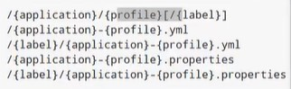

# Config

## 相关依赖

```xml
<!-- 服务端 -->
<dependency>
    <groupId>org.springframework.cloud</groupId>
    <artifactId>spring-cloud-config-server</artifactId>
</dependency>
<!-- 客户端 -->
<dependency>
    <groupId>org.springframework.cloud</groupId>
    <artifactId>spring-cloud-starter-config</artifactId>
</dependency>
<!-- 2020版本SpringCloud读取bootstrap.yml -->
<dependency>
    <groupId>org.springframework.cloud</groupId>
    <artifactId>spring-cloud-starter-bootstrap</artifactId>
</dependency>
```

## 不使用 Eureka 做配置中心

### 服务端配置

```yaml
server:
  port: 8848
spring:
  cloud:
    config:
      server:
        git:
          password: 06050704zxl
          uri: https://gitee.com/pidehen2/spring-cloud-config-learn.git
          username: 1658272229@qq.com
  application:
    name: config-server
```

在主启动类上添加 `@EnableConfigServer` 注解开启服务。

### 查看仓库中配置文件内容的可选路径



application 是 yaml 中定义的 `spring.application.name` 的值，profile 是 yaml 中定义的 `spring.config.active.on-profile`，label 为分支名。

### 客户端配置

application.yml (用户级配置，优先级低于 bootstrap.yml)：

```yaml
spring:
  application:
    name: config-client
```

bootstrap.yml (系统级配置，优先级高于 application.yml 低于 git 仓库)：

```yaml
spring:
  cloud:
    config:
      uri: http://localhost:8848 #Config服务地址
      label: master #分支
      name: application #git仓库中文件名
      profile: dev #选择环境
server:
  port: 90 # 端口号，若git中没有配置端口号，这里才会生效
```

编写 Controller 测试：

```java
@RestController
@RefreshScope
public class TestController {

    @Value("${teacher.name}")
    private String name;

    @RequestMapping("/test")
    public String test(){
        return name;
    }
}
```

## 使用 Eureka

### 服务端配置

```yaml
server:
  port: 8848
spring:
  cloud:
    config:
      server:
        git:
          password: 06050704zxl
          uri: https://gitee.com/pidehen2/spring-cloud-config-learn.git
          username: 1658272229@qq.com
  application:
    name: config-server
eureka:
  client:
    service-url:
      defaultZone: http://localhost:7001/eureka/,http://localhost2:7002/eureka/
  instance:
    instance-id: config-server
    prefer-ip-address: true
info:
  app.name: config-server
```

### 客户端配置

bootstrap.yml：

```yaml
spring:
  cloud:
    config:
      label: master
      discovery:
        enabled: true
        service-id: config-server
  application:
    name: application
eureka:
  client:
    service-url:
      defaultZone: http://localhost:7001/eureka/,http://localhost2:7002/eureka/
  instance:
    instance-id: config-client
    prefer-ip-address: true
info:
  app.name: config-client
```

## 手动刷新

### 添加依赖

```xml
<dependency>
    <groupId>org.springframework.boot</groupId>
    <artifactId>spring-boot-starter-actuator</artifactId>
</dependency>
```

### 修改 bootstrap.yml

```yaml
management:
  endpoints:
    web:
      exposure:
        include: '*' # 类似Hystrix，将刷新接口暴露
```

### 修改要刷新的类

在需要刷新的类上使用 `@RefreshScope` 注解。

### 刷新

修改 Git 中的配置文件后，向 `[IP]:[port]/actuator/refresh` 发送 POST 请求，即可实现手动刷新。
