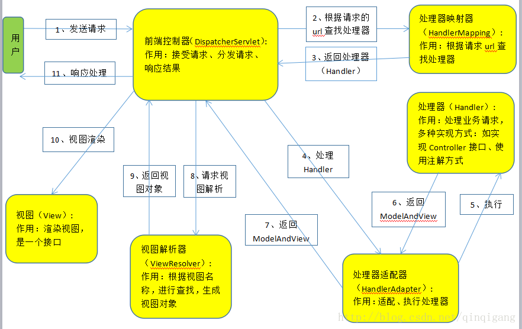

# Controller

## SpringMVC 工作流程



核心：DispatcherServlet。

## web.xml 配置

```xml
<?xml version="1.0" encoding="UTF-8"?>
<web-app xmlns="http://xmlns.jcp.org/xml/ns/javaee"
         xmlns:xsi="http://www.w3.org/2001/XMLSchema-instance"
         xsi:schemaLocation="http://xmlns.jcp.org/xml/ns/javaee http://xmlns.jcp.org/xml/ns/javaee/web-app_4_0.xsd"
         version="4.0">
    <servlet>
        <servlet-name>springmvc</servlet-name>
        <servlet-class>org.springframework.web.servlet.DispatcherServlet</servlet-class>
        <init-param>
            <param-name>contextConfigLocation</param-name>
            <!-- Spring的配置文件 -->
            <param-value>classpath:springmvc-servlet.xml</param-value>
        </init-param>
        <load-on-startup>1</load-on-startup>
    </servlet>
    <servlet-mapping>
        <servlet-name>springmvc</servlet-name>
        <!-- 拦截所有请求 -->
        <url-pattern>/</url-pattern>
    </servlet-mapping>
</web-app>
```

## Spring 配置

```xml
<?xml version="1.0" encoding="UTF-8"?>
<beans xmlns="http://www.springframework.org/schema/beans"
       xmlns:xsi="http://www.w3.org/2001/XMLSchema-instance"
       xsi:schemaLocation="http://www.springframework.org/schema/beans
        http://www.springframework.org/schema/beans/spring-beans.xsd">


    <bean class="org.springframework.web.servlet.handler.BeanNameUrlHandlerMapping"/>

    <bean class="org.springframework.web.servlet.mvc.SimpleControllerHandlerAdapter"/>

    <bean class="org.springframework.web.servlet.view.InternalResourceViewResolver">
        <!-- 自动拼接 -->
        <!-- 前缀 -->
        <property name="prefix" value="/WEB-INF/jsp/"/>
        <!-- 后缀 -->
        <property name="suffix" value=".jsp"/>
    </bean>
    <!-- 注册自定义的Controller类 -->
    <bean class="controller.HelloController" id="/hello"/>
</beans>
```

- `BeanNameUrlHandlerMapping`：

    处理器映射器的一种，根据请求的 url 与 Spring 容器中定义的处理器 bean 的 id 属性值进行匹配，这种方式中 bean 的 id 属性必须以`'/'`开头。

- `SimpleControllerHandlerAdapter`：

处理器适配器的一种，这个实现类将 HTTP 请求适配到一个控制器的实现进行处理。`SimpleControllerHandlerAdapter` 将会调用处理器的 handleRequest 方法进行功能处理，该处理方法返回一个 ModelAndView 给 DispatcherServlet。

- `InternalResourceViewResolver`：

视图解析器的一种，`InternalResourceViewResolver` 不管能不能解析它都不会返回 null，也就是说它拦截了所有的逻辑视图，让后续的解析器得不到执行，所以 `InternalResourceViewResolver` 优先级必须放在最后。

## 实现 Controller (非注解)

通过实现 Controller 接口，并重写其中的 handleRequest 方法实现定义 Controller，这种方法意味着每一个 url 都要对应一个 Controller，每个 Controller 单独成类，且都要在 Spring 容器中注册，效率极低。

```java
public class HelloController implements Controller {
    @Override
    public ModelAndView handleRequest(HttpServletRequest httpServletRequest, HttpServletResponse httpServletResponse) throws Exception {
        ModelAndView modelAndView=new ModelAndView();
        modelAndView.addObject("msg","Hello Controller");
        modelAndView.setViewName("hello");
        return modelAndView;
    }
}
```

## 使用注解实现 Controller (仅 Controller 使用注解)

web.xml 配置无变化。

Spring 配置如下：

```xml
<?xml version="1.0" encoding="UTF-8"?>
<beans xmlns="http://www.springframework.org/schema/beans"
       xmlns:xsi="http://www.w3.org/2001/XMLSchema-instance"
       xmlns:context="http://www.springframework.org/schema/context"
       xmlns:mvc="http://www.springframework.org/schema/mvc"
       xsi:schemaLocation="http://www.springframework.org/schema/beans
        http://www.springframework.org/schema/beans/spring-beans.xsd http://www.springframework.org/schema/context https://www.springframework.org/schema/context/spring-context.xsd http://www.springframework.org/schema/mvc https://www.springframework.org/schema/mvc/spring-mvc.xsd">

    <!-- 开启自动扫描包：controller包 -->
    <context:component-scan base-package="controller"/>
    <!-- 开启Spring注解支持 -->
    <context:annotation-config/>
    <!-- 开启默认处理器，防止静态资源404 -->
    <mvc:default-servlet-handler/>
    <!-- 开启mvc的注解支持 -->
    <mvc:annotation-driven/>
    <!-- 视图解析器 -->
    <bean class="org.springframework.web.servlet.view.InternalResourceViewResolver" id="internalResourceViewResolver">
        <property name="prefix" value="/WEB-INF/jsp/"/>
        <property name="suffix" value=".jsp"/>
    </bean>
</beans>
```

Controller:

```java
@Controller//表示此类为Controller类
public class HelloController {

    @GetMapping("/hello")//仅支持GET方式请求
    public String hello1(Model model){
        model.addAttribute("msg","Hello SpringMVC-Annotation!");

        return "hello";
    }

    @RequestMapping("/wuhu")//同时支持GET和POST
    public ModelAndView hello2(HttpServletRequest request){
        String username = request.getParameter("username");
        System.out.println(username);
        ModelAndView modelAndView = new ModelAndView();
        modelAndView.addObject("msg",username);
        modelAndView.setViewName("hello");
        return modelAndView;
    }
}
```

## RestFul 风格

通过 `@PathVariable` 注解与 `@RequestMapping` 中 url 一一对应实现。

```java
@RequestMapping("/add/{a}/{b}")
public String test(Model model, @PathVariable("a")int a,@PathVariable("b") int b){
    int integer = a + b;
    String msg= Integer.toString(integer);
    model.addAttribute("msg",msg);
    return "hello";
}
```

## 重定向与转发

- 重定向：request 不再是原先的 request，两个请求之间相互独立。
- 转发：前后的 request 相同。

重定向：

```java
@RequestMapping("redirect")
public void test2(HttpServletResponse response,HttpServletRequest request) throws IOException {
    response.sendRedirect("/index.jsp");
}

@RequestMapping("redirect2")
public String test5(){
    //显式指定redirect或forward后，既可以跳转controller，也可以直接访问web路径下的静态资源
    return "redirect:https://www.baidu.com";
}
```

转发：

```java
@RequestMapping("/forward")
public void test(HttpServletRequest request, HttpServletResponse response) throws ServletException, IOException {
    request.setAttribute("msg","forward");
    request.getRequestDispatcher("/WEB-INF/jsp/hello.jsp").forward(request,response);
}


@RequestMapping("/forward2")
public String test3(){
    //使用视图解析器相当于访问对应的controller
    return "/hello";
    //return "/index.jsp";文件[/WEB-INF/jsp/index.jsp.jsp] 未找到
    //若不使用视图解析器，需要返回全路径，以web文件夹为根目录
}


@RequestMapping("/forward3")
public String test4(){
    return "forward:/hello";
    //相当于访问controller
    //return "froward:/index.jsp";直接从web文件夹下寻找
}
```

## 乱码问题

- 情况一，jsp、html 等静态页面没有设置 UTF-8，或者文件格式不是 UTF-8：

    解决：添加头部指定编码格式为 UTF-8。

- 情况二，调试中，控制台输出乱码：

    解决：在 Tomcat 的启动参数中添加 `-Dfile.encoding=UTF-8`，指定 jvm 以 UTF-8 启动。**注意：此项设置需要重启IDE方可生效**。

- 情况三：浏览器前端界面乱码：

    解决：在 web.xml 中配置 Spring 的 `CharacterEncodingFilter` 即可：

    ```xml
        <filter>
        <filter-name>spring</filter-name>
        <filter-class>org.springframework.web.filter.CharacterEncodingFilter</filter-class>
        <init-param>
            <param-name>encoding</param-name>
            <param-value>UTF-8</param-value>
        </init-param>
    </filter>
    <filter-mapping>
        <filter-name>spring</filter-name>
        <!-- /*表示还要过滤静态文件 -->
        <url-pattern>/*</url-pattern>
    </filter-mapping>
    ```
