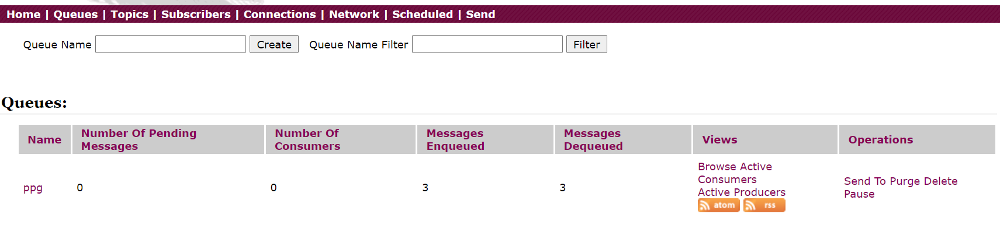

# Java 编码实现 MQ 通讯(Queue)

一对一模型中目的地称为队列 Queue。

## 依赖

```xml
<!-- https://mvnrepository.com/artifact/org.apache.activemq/activemq-all -->
<dependency>
    <groupId>org.apache.activemq</groupId>
    <artifactId>activemq-all</artifactId>
    <version>5.16.3</version>
</dependency>
<!-- https://mvnrepository.com/artifact/org.apache.xbean/xbean-spring -->
<dependency>
    <groupId>org.apache.xbean</groupId>
    <artifactId>xbean-spring</artifactId>
    <version>4.20</version>
</dependency>
<!-- https://mvnrepository.com/artifact/org.slf4j/slf4j-api -->
<dependency>
    <groupId>org.slf4j</groupId>
    <artifactId>slf4j-api</artifactId>
    <version>1.7.32</version>
</dependency>
<!-- https://mvnrepository.com/artifact/ch.qos.logback/logback-classic -->
<dependency>
    <groupId>ch.qos.logback</groupId>
    <artifactId>logback-classic</artifactId>
    <version>1.2.5</version>
    <scope>test</scope>
</dependency>
<!-- https://mvnrepository.com/artifact/junit/junit -->
<dependency>
    <groupId>junit</groupId>
    <artifactId>junit</artifactId>
    <version>4.13.2</version>
    <scope>test</scope>
</dependency>
<!-- https://mvnrepository.com/artifact/org.projectlombok/lombok -->
<dependency>
    <groupId>org.projectlombok</groupId>
    <artifactId>lombok</artifactId>
    <version>1.18.20</version>
    <scope>provided</scope>
</dependency>
```

## 发送端

```java
private static final String URL="tcp://150.158.153.216:61616";

public static void main(String[] args) throws JMSException {
    //        创建连接工厂并传入URL
    ActiveMQConnectionFactory activeMQConnectionFactory = new ActiveMQConnectionFactory(URL);
    //        建立连接
    Connection connection = activeMQConnectionFactory.createConnection();
    //        开启连接
    connection.start();
    //        创建会话
    Session session = connection.createSession(false, Session.AUTO_ACKNOWLEDGE);
    //        点对点通信创建queue
    Queue queue = session.createQueue("ppg");
    //        创建这个queue对应的消息发送对象
    MessageProducer producer = session.createProducer(queue);
    //        循环发送三次消息
    for (int i = 0; i < 3; i++) {
        //            创建一个消息对象
        TextMessage textMessage = session.createTextMessage("msg--->" + i);
        //            发送消息
        producer.send(textMessage);
    }
    //        先开后关
    producer.close();
    session.close();
    connection.close();
}
```

## 接收端

```java
private static final String URL="tcp://150.158.153.216:61616";

public static void main(String[] args) throws JMSException {
    //        创建连接工厂并传入URL
    ActiveMQConnectionFactory activeMQConnectionFactory = new ActiveMQConnectionFactory(URL);
    //        建立连接
    Connection connection = activeMQConnectionFactory.createConnection();
    //        开启连接
    connection.start();
    //        创建会话
    Session session = connection.createSession(false, Session.AUTO_ACKNOWLEDGE);
    //        点对点通信创建queue
    Queue queue = session.createQueue("ppg");
    //        创建消费者
    MessageConsumer consumer = session.createConsumer(queue);
    while (true){
        //            接收与发送的类型要一致
        TextMessage receive = (TextMessage) consumer.receive();
        if (receive!=null){
            System.out.println("收到消息-->"+receive.getText());
        }else {
            break;
        }
    }
    //        先开后关
    consumer.close();
    session.close();
    connection.close();
}
```

查看 ActiveMQ 控制台：



点击上方 Queues 进入 queue 队列的监控界面，name 表示 queue 的名字，此后紧跟着待消费的消息数量、已连接的消费者数量、消息入队数量、消息出队数量。

### 接收端设置接收延迟，短阻塞

```java
TextMessage receive = (TextMessage) consumer.receive(1000);
```

### MessageListener 消息监听器

```java
consumer.setMessageListener(message -> {

    try {
        TextMessage textMessage = (TextMessage) message;
        System.out.println("收到"+textMessage.getText());
    } catch (JMSException e) {
        e.printStackTrace();
    }
});
System.in.read();
```
