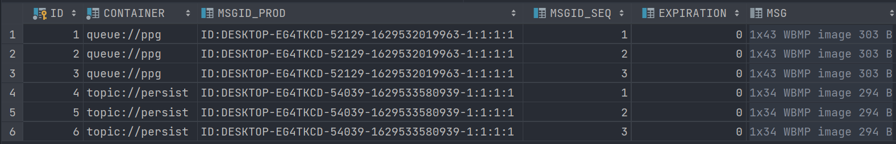
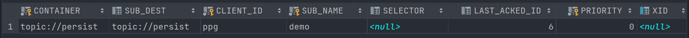

# ActiveMQ 持久化

为了避免意外宕机以后丢失信息,需要做到重启后可以恢复消息队列,消息系统一般都会采用持久化机制。

ActiveMQ 的消息持久化机制有 JDBC,AMQ, KahaDB 和 LeveIDB,无论使用哪种持久化方式,消息的存储逻辑都是一致的。
就是在发送者将消息发送出去后,消息中心首先将消息存储到本地数据文件、内存数据库或者远程数据库等再试图将消息发送给接收
者,成功则将消息从存储中删除,失败则继续尝试发送。
消息中心启动以后首先要检査指定的存储位置,如果有未发送成功的消息,则需要把消息发送出去。

## AMQ

AMQ 是一种文件存储形式,它具有写入速度快和容易恢复的特点。消息存储在一个个文件中,文件的默认大小为 32M,当一个存储文件中的消息已经全部被消费,那么这个文件将被标识为可删除,在下一个清除阶段,这个文件被删除。AMQ 适用于 ActiveMQ5.3 之前的版本。

## KahaDB

基于日志文件,从 ActiveMQ5.4 开始默认的持久化插件。
消息存储使用一个*事务日志*和仅仅用一个*索引文件*来存储它所有的地址。KahaDB 是一个专门针对消息持久化的解决方案,它对典型的消息使用模式进行了优化，数据被追加到 data logs 中。当不再需要 log 文件中的数据的时候 log 文件会被丢弃。

KahaDB 的文件组成：

- db-i.log：kahaDB 存储消息到预定义大小的数据记录文件中,文件命名为 db-i.log。当数据文件已满时,一个新的文件会随之创建, i数值也会随之递增,它随着消息数量的增多,如每 32M 一个文件,文件名按照数字进行编号,如 db-1.log、db-2.log、db-3.log…。当不再有引用到数据文件中的任何消息时,文件会被删除或归档。
- db.data：该文件包含了持久化的 BTree索引,索引了消息数据记录中的消息,它是消息的索引文件,本质上是 B-Tree(B树),使用 B-Tree 作为索引指向 `db-< Number>.log` 里面存储的消息。
- db. free：当前 db.data 文件里哪些页面是空闲的,文件具体内容是所有空闲页的ID。
- db.redo：用来进行消息恢复，如果 KahaDB 消息存储在强制退出后启动，用于恢复BTree索引。
- lock：文件锁，表示当前获取 KahaDB 读写权限的 Broker。

KahaDB配置：[KahaDB](https://activemq.apache.org/kahadb)

## JDBC

### 配置 ActiveMQ

将 `mysql-connector-java-8.0.21.jar` MySQL Java 驱动包存放到 ActiveMQ 的 lib 文件夹中。

修改 conf 目录下的 `activemq.xml`，将默认 KahaDB 注释，添加 jdbc 标签 dataSource 指定为接下来要创建的 bean 的 id。

默认情况下，启动 ActiveMQ 之后会自动创建表，如果在 jdbc 标签中指定 `createTableOnStartup` 为 false 将不会自动创建表，这个属性默认值为 true。

```xml
<persistenceAdapter>
<!--<kahaDB directory="${activemq.data}/kahadb"/>-->
	<jdbcPersistenceAdapter dataSource="#mysql"/>
</persistenceAdapter>
```

创建数据源bean：

在 `</broker>` 结束标签后添加：

```xml
<bean id="mysql" class="org.apache.commons.dbcp2.BasicDataSource" destroy-method="close">
    <property name="driverClassName" value="com.mysql.cj.jdbc.Driver"/>
    <property name="url" value="jdbc:mysql://39.107.112.172:3306/mq?relaxAutoCommit=true&amp;erverTimezone=UTC"/>
    <property name="username" value="root"/>
    <property name="password" value="123456"/>
    <property name="poolPreparedStatements" value="true"/>
</bean>
```

::: warning 注意
注意在xml文件中特殊字符的替换。
:::

- `&` 替换为 `&amp;`
- `>` 替换为 `&gt;`
- `<` 替换为 `&lt;`
- `"` 替换为 `&quot;`
- `'` 替换为 `&apos;`

::: warning 注意
后面的分号要加上去！
:::

### 三个表说明

- ACTIVEMQ_MSGS：

```sql
create table ACTIVEMQ_MSGS
(
    ID         bigint       not null
        primary key,
    CONTAINER  varchar(250) not null,
    MSGID_PROD varchar(250) null,
    MSGID_SEQ  bigint       null,
    EXPIRATION bigint       null,
    MSG        blob         null,
    PRIORITY   bigint       null,
    XID        varchar(250) null
);
```

ID：数据库主键。

CONTAINER：消息的目的地。

MSGID_PROD：消息发送者的主键。

MSGID_SEQ：发送消息的顺序，MSGID_PROD+MSGID_SEQ 可以组成 JMS 的 MessageID。

EXPIRATION：消息的过期时间，存储的是 1970-01-01 到指定时间的毫秒数。

MSG：消息本体的 Java 序列化对象的二进制数据。

PRIORITY：优先级，从 0-9，数值越大优先级越高。



队列模式中，如果 DeliveryMode 设置为 NON_PERSISTENT，发送的消息只会存储在内存中，如果设置为 PERSISTENT 则会存储在数据库表中，消费完成后会从表中删除。

- ACTIVEMQ_ACKS：

```sql
create table ACTIVEMQ_ACKS
(
    CONTAINER     varchar(250)     not null,
    SUB_DEST      varchar(250)     null,
    CLIENT_ID     varchar(250)     not null,
    SUB_NAME      varchar(250)     not null,
    SELECTOR      varchar(250)     null,
    LAST_ACKED_ID bigint           null,
    PRIORITY      bigint default 5 not null,
    XID           varchar(250)     null,
    primary key (CONTAINER, CLIENT_ID, SUB_NAME, PRIORITY)
);
```

ACTIVEMQ_ACKS 用于存储订阅关系。如果是持久化 Topic,订阅者和服务器的订阅关系在这个表保存。数据库字段如下:

- CONTAINER：消息的 Destination。
- SUB_DEST：如果是使用 Static 集群,这个字段会有集群其他系统的信息。
- CLIENT_ID：每个订阅者都必须有一个唯一的客户端 ID 用以区分。
- SUB_NAME：订阅者名称。
- SELECTOR：选择器,可以选择只消费满足条件的消息。条件可以用自定义属性实现,可支持多属性 AND 和 OR 操作。
- LAST_ACKED_ID：记录消费过的消息的 ID。



- ACTIVEMQ_LOCK：

表 ACTIVEMQ_LOCK 在集群环境中才有用,只有一个 Broker 可以获得消息,称为 Master Broker,其他的只能作为备份等待 Master Broke 不可用,才可能成为下一个 Master Broker。这个表用于记录哪个 Broker 是当前的 MasterBroker。

### 下划线报错问题

`java.lang.IllegalStateException: BeanFactory not initialized or already closed`。

这是因为操作系统的机器名中有`_`符号。请更改机器名并且重启后即可解决问题。

## JDBC with Journal

这种方式克服了 JDBC Store 的不足,JDBC 每次消息过来,都需要去写库和读库。
ActiveMQ Journal,使用高速缓存写入技术,大大提高了性能。
当消费者的消费速度能够及时跟上生产者消息的生产速度时, journal 文件能够大大减少需要写入到 DB 中的消息。

举个例子：

生产者生产了 1000 条消息,这 1000 条消息会保存到 journa 文件,如果消费者的消费速度很快的情况下,在 journal 文件还没有同步到 DB 之前,消费者已经消费了 90% 的以上的消息,那么这个时候只需要同步剩余的 10% 的消息到 DB。如果消费者的消费速度很慢,这个时候 journa 文件可以使消息以批量方式写到 DB。

修改 `activemq.xml`，将 persistenceAdapter 注释掉：

```xml
<persistenceFactory>
    <journalPersistenceAdapterFactory
                                      journalLogFiles="5"
                                      dataDirectory="${activemq.data}/journal"
                                      dataSource="#mysql"
                                      journalLogFileSize="32768"
                                      useJournal="true"
                                      useQuickJournal="true"
                                      />
</persistenceFactory>
```

参数分别为文件个数、数据文件目录、数据源、文件大小、是否使用 journal 与是否使用快速 journal。


::: tip
发送消息后，一段时间后，没有消费的消息才会被写入 MySQL。
:::
