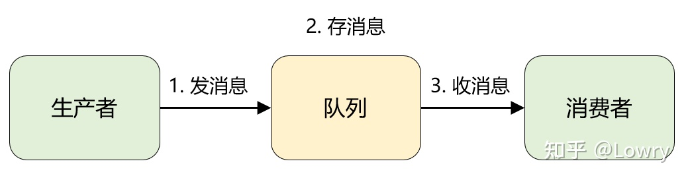
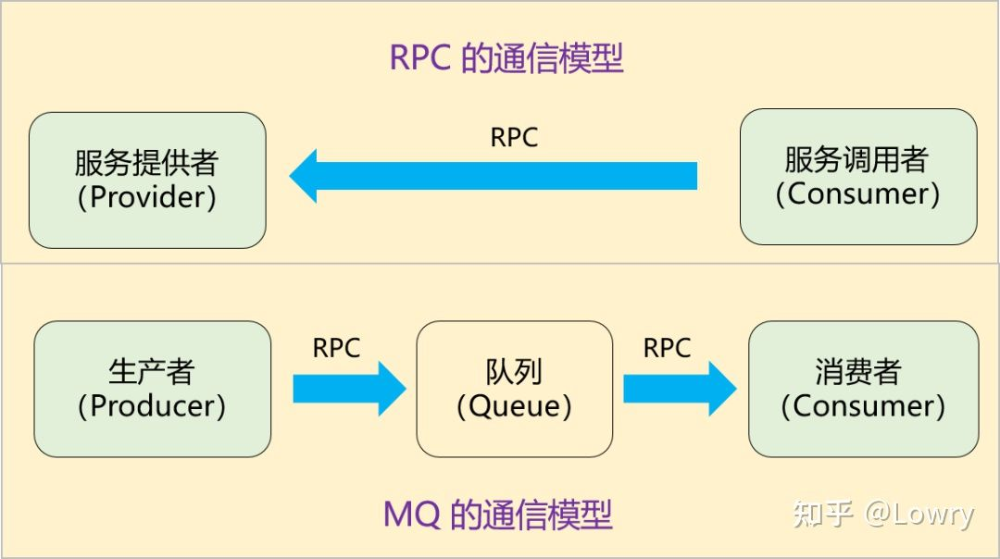
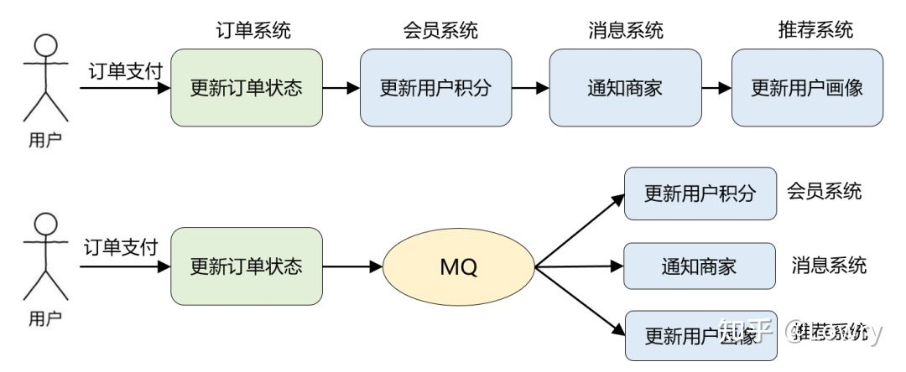

---
prev:
  text: 首页
  link: /activemq
---

# 基本概念

## 什么是 MQ

消息队列就是一个转发器，且实现了异步非阻塞与解耦合，消费者不再需要直接面对生产者，也就是说，消息队列解决的还是生产者、消费者的通信问题。

## 消息队列模型的演化

::: tip
架构从来不是设计出来的，而是演进而来的。
:::

### 队列模型

这便是队列模型：它允许多个生产者往同一个队列发送消息。但是，如果有多个消费者，实际上是竞争的关系，也就是一条消息只能被其中一个消费者接收到，读完即被删除。

### 发布-订阅模型

在发布-订阅模型中，存放消息的容器变成了 “主题”，订阅者在接收消息之前需要先 “订阅主题”。最终，每个订阅者都可以收到同一个主题的全量消息。生产者就是发布者，队列就是主题，消费者就是订阅者，无本质区别。唯一的不同点在于：一份消息数据是否可以被多次消费。

## MQ 的应用场景

### MQ 与 RPC

- 引入 MQ 后，由之前的一次 RPC 变成了现在的两次 RPC，而且生产者只跟队列耦合，它根本无需知道消费者的存在。
- 多了一个中间节点*队列*进行消息转储，相当于将同步变成了**异步**。

### 举例：订单支付场景

未引入消息队列前，订单支付需要一步一步的调用其他系统完成处理，引入MQ后，只需要聚焦于更新订单状态这一个流程即可，其他事务由MQ通知其他系统，这就完成了**解耦**，而且后续对业务再进行拓展也不涉及订单系统。

## MQ 的三大目标

- **系统解耦**：当新模块加入时，可以做到代码改动最小
- **削峰**：让后端系统按照自身吞吐能力进行消费，不被冲垮
- **异步**：将非关键调用链路的操作异步化并提升系统吞吐能力

## MQ 的关注点

- 发送和接收。
- 高可用。
- 集群和容错。
- 持久化。
- 延时发送/定时投递。
- 签收机制。
