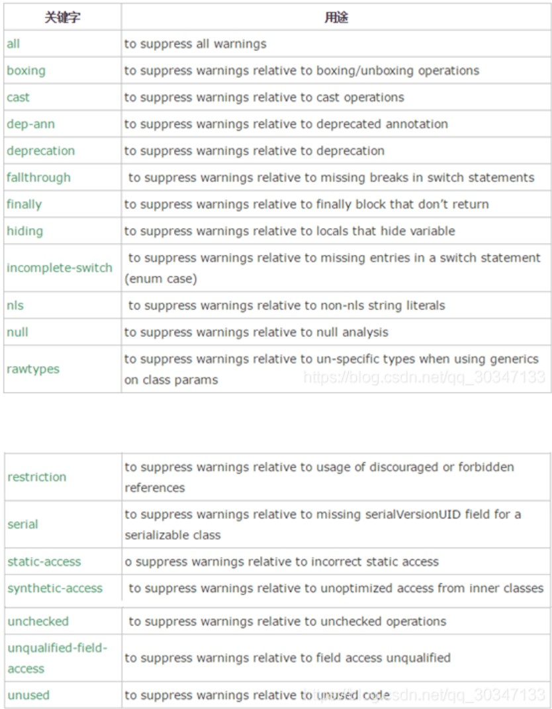

---
prev:
  text: 首页
  link: /annotation-and-reflection
---

# 内置注解

## @Override

表示当前方法覆盖了父类的方法。

此注释只适用于修饰方法，表示一个方法声明打算重写超类中的另一个方法声明。如果方法利用此注释类型进行注解但没有重写超类方法，则编译器会生成一条错误消息。

## @Deprecated

表示方法已经过时,方法上有横线，使用时会有警告。

此注释可用于修饰方法、属性、类，表示不鼓励程序员使用这样的元素，通常是因为它很危险或存在更好的选择。在使用不被赞成的程序元素或在不被赞成的代码中执行重写时，编译器会发出警告。

## @SuppressWarings

用来抑制编译时的警告信息。与前两个注释有所不同，你需要添加一个参数才能正确使用，这些参数值都是已经定义好了的，我们选择性的使用就好了



例如：

```java
@SuppressWarnings(value={“unchecked”, “deprecation”})
```
