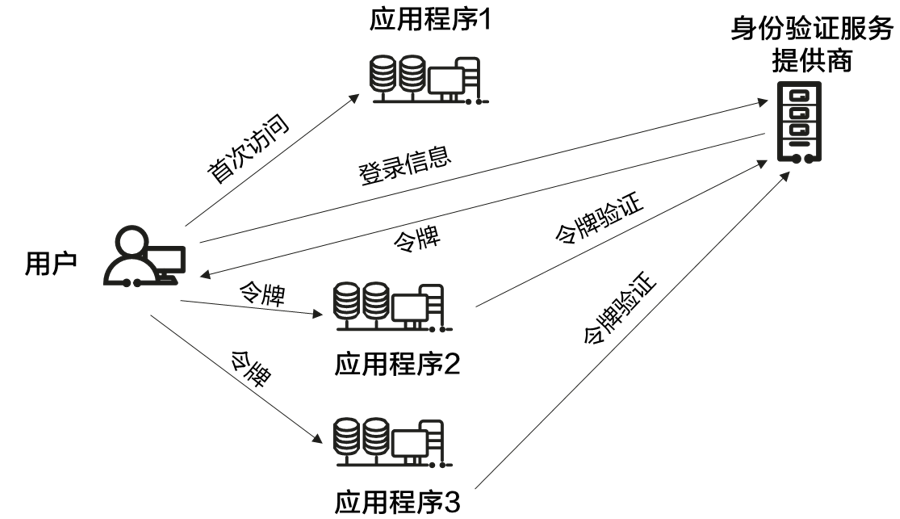

---
category:
  - Web
  - 安全
---

# SSO 单点登录

## 什么是 SSO

随着系统数量的增加，用户需要在多个系统中进行登录，SSO(Single Sign On) 单点登录是一种身份验证机制，用户只需要登录一次就可以访问多个相互信任的系统。

## 原理

SSO 基于服务提供商（APP、网站等）与身份提供商（Idp）之间的信任关系。

一般来说，SSO 的流程是：

- 用户认证：
    - 用户首先访问一个系统，进行登录。
    - 登录请求被发送到 Idp，用户在 Idp 上进行身份验证。
- 令牌发放与验证：
    - 如果验证成功，Idp 会签发一个安全令牌，这个令牌被返回给原始登录的系统。
    - 当用户访问其他受信系统时，令牌随着请求传递给这个系统，这个系统向 Idp 验证令牌的合法性。
    - 如果令牌有效 Idp 将返回确认信息。



## SSO 相关技术

### SAML/SAML2.0

安全断言标记语言是一种基于 XML 的标准，用在不同安全域之间进行身份验证和授权。它允许用户在一个应用程序中进行登录，然后使用 SAML 令牌访问其他应用程序。

### OAuth/OAuth2.0

开放式授权是一种开放式标准协议，可以在应用程序之间交换授权数据而不会泄露用户密码。

### OpenID Connect(OIDC)

OIDC 是另一种开放式标准协议，使用 REST API 和 JSON 身份验证令牌，支持网站或应用程序通过其他 Idp 进行身份验证。

OIDC 位于 OAuth 之上，是一种轻量方式。

## SSO 优缺点

### 优点

- 提升用户体验。
- 解决了用户需要管理若干密码的问题。
- 减少密码泄露的风险。

### 缺点

- 单点故障：如果 SSO 系统发生故障，所有依赖 SSO 的系统都会受到影响，可能导致业务中断。
- 安全风险：如果 SSO 系统被攻破，所有依赖 SSO 的系统都会受到影响，可能导致用户信息泄露。
- 实施成本高：需要投入较多资源进行系统集成和测试。

## 一个实现 SSO 的例子

接下来将会实现一个基于 SAML2.0 的 SSO 实例，包含 Idp 和 SP 两个部分。

### SAML2 综述

在 SAML 中，涉及到两个主体：

- Service Provider(SP)：服务提供商，即需要进行单点登录的系统。
- Identity Provider(Idp)：身份提供商，即进行用户认证的系统。Idp 能够向 SP 发送身份断言，所谓身份断言就是能够标识用户身份的 XML 数据。

SP 提供服务就需要知道用户的身份，因此需要向 Idp 询问，Idp 知道用户的身份，当用户在 Idp 登录成功后，Idp 就将用户身份以 SAML 断言的形式发送给 SP，SP 收到 SAML 断言后，就能够知道用户的身份，从而提供服务。

#### Request

当用户的身份无法确认时，SP 会向 Idp 发送 SAML Request（通过浏览器），请求 Idp 鉴定用户身份，例如将用户重定向到下面这样一个 URL：

```text
https://demo.com/sso?SAMLRequest=fxxx
```

SAMLRequest 就是 SAML 认证请求消息，通过 Base64 编码的 XML 格式，例如一个消息可能 belike：

```xml
<?xml version="1.0" encoding="UTF-8"?>
<saml2p:AuthnRequest AssertionConsumerServiceURL="https://signin.aliyun.com/saml/SSO" Destination="https://core.authing.cn/v2/api/saml-idp/5e10927e4ecfd464fb4edaf6" ForceAuthn="false" ID="a2eg9c2gjji188814h7j2d7358fh3g9" IsPassive="false" IssueInstant="2020-09-28T13:09:57.896Z" ProtocolBinding="urn:oasis:names:tc:SAML:2.0:bindings:HTTP-POST" Version="2.0"
	xmlns:saml2p="urn:oasis:names:tc:SAML:2.0:protocol">
	<saml2:Issuer
		xmlns:saml2="urn:oasis:names:tc:SAML:2.0:assertion">https://signin.aliyun.com/1374669376572425/saml/SSO
	</saml2:Issuer>
</saml2p:AuthnRequest>
```

其中，

- AssertionConsumerServiceURL：回调地址，Idp 验证成功后，将 SAML Response 发送到这个 URL。
- Destination：Idp 的认证 URL。

#### Response

Idp 收到 SAML Request 后，会弹出登录框要求用户认证，如果已经登录过了，那么会跳过这一步。

当用户登录成功后，Idp 将用户身份断言发送给 SP，身份断言内容 belike：

```xml
<samlp:Response
	xmlns:samlp="urn:oasis:names:tc:SAML:2.0:protocol"
	xmlns:saml="urn:oasis:names:tc:SAML:2.0:assertion" ID="_62b177c1-a919-42f6-9586-47f13b71081f" Version="2.0" IssueInstant="2020-09-28T13:30:31.788Z" Destination="https://signin.aliyun.com/saml/SSO" InResponseTo="a49f8edi31cj0a2a459g0331c3d9c10">
	<saml:Issuer>https://20nqulvoqpbp.authing.cn</saml:Issuer>
	<samlp:Status>
		<samlp:StatusCode Value="urn:oasis:names:tc:SAML:2.0:status:Success"/>
	</samlp:Status>
	<saml:Assertion
		xmlns:xsi="http://www.w3.org/2001/XMLSchema-instance"
		xmlns:xs="http://www.w3.org/2001/XMLSchema"
		xmlns:saml="urn:oasis:names:tc:SAML:2.0:assertion" ID="_fae95b47-cbf3-4a20-add0-99d856b4124e" Version="2.0" IssueInstant="2020-09-28T13:30:31.788Z">
		<saml:Issuer>https://20nqulvoqpbp.authing.cn</saml:Issuer>
		<ds:Signature
			xmlns:ds="http://www.w3.org/2000/09/xmldsig#">
			<ds:SignedInfo>
				<ds:CanonicalizationMethod Algorithm="http://www.w3.org/2001/10/xml-exc-c14n#"/>
				<ds:SignatureMethod Algorithm="http://www.w3.org/2000/09/xmldsig#rsa-sha1"/>
				<ds:Reference URI="#_fae95b47-cbf3-4a20-add0-99d856b4124e">
					<ds:Transforms>
						<ds:Transform Algorithm="http://www.w3.org/2000/09/xmldsig#enveloped-signature"/>
						<ds:Transform Algorithm="http://www.w3.org/2001/10/xml-exc-c14n#"/>
					</ds:Transforms>
					<ds:DigestMethod Algorithm="http://www.w3.org/2000/09/xmldsig#sha1"/>
					<ds:DigestValue>/ol6lC1j+smdonl48+lJTzUeqnw=</ds:DigestValue>
				</ds:Reference>
			</ds:SignedInfo>
			<ds:SignatureValue>awzcE0dp8BzTW4b4PFaRX7NKOC95bLqOnPeAKI/CsDfGaJdmzCK0fVliz+e6XzBluKfBpQtrQonKl7k2vVNaPFx9PpSVzwK91HLGvYQ0qB36uA4HFvm/3M31DL3ZRFPRq68ZaVAG6lMVd0YbiInVv9FWwsi+6jEpF+PRlmkoqAI=</ds:SignatureValue>
			<ds:KeyInfo>
				<ds:X509Data>
					<ds:X509Certificate>MIICQjCCAaugAwIBAgIBADANBgkqhkiG9w0BAQ0FADA+MQswCQYDVQQGEwJ1czESMBAGA1UECAwJ5LqL5a6e5LiKMQwwCgYDVQQKDANzc3MxDTALBgNVBAMMBHNzc3MwHhcNMjAwMTAzMTMxODE0WhcNMjEwMTAyMTMxODE0WjA+MQswCQYDVQQGEwJ1czESMBAGA1UECAwJ5LqL5a6e5LiKMQwwCgYDVQQKDANzc3MxDTALBgNVBAMMBHNzc3MwgZ8wDQYJKoZIhvcNAQEBBQADgY0AMIGJAoGBAMNWlMk4L+TcWwyd9plTPLhHL/UMCPGJgv5Vp8vaAp4WMsGtwOLI1UNWccIqMeU0KasJqrKxHYvq9JzZh4fftFmowBz36vz0eIUsP5PKvFULkC1vjrdn+QJXbJ51alZZKfPgl1HI8w6lh12aWTjaKQ+KemIttqLqJgLWOYAXPIszAgMBAAGjUDBOMB0GA1UdDgQWBBTT104hVYVnPpg7aFrDiXPShbtxUTAfBgNVHSMEGDAWgBTT104hVYVnPpg7aFrDiXPShbtxUTAMBgNVHRMEBTADAQH/MA0GCSqGSIb3DQEBDQUAA4GBAB6+1xK7GMJa5M6Ujg/wd4Etwy8NdTF6ypSqN36Bd5OdPmwU9HzDuGjKi3ZwooPIGRB8piLsKk11M4IhAF4C2R/JsvVYwWOYgojW4H1hR5wk2jn7pltWqRPdfZBl0YfsDysUP7k8/MchOWX7WifNxpe3GdSKN17CkdRjL924bV0l</ds:X509Certificate>
				</ds:X509Data>
			</ds:KeyInfo>
		</ds:Signature>
		<saml:Subject>
			<saml:NameID Format="urn:oasis:names:tc:SAML:1.1:nameid-format:unspecified">yezuwei@authing.onaliyun.com</saml:NameID>
			<saml:SubjectConfirmation Method="urn:oasis:names:tc:SAML:2.0:cm:bearer">
				<saml:SubjectConfirmationData NotOnOrAfter="2020-09-28T14:30:31.788Z" Recipient="https://signin.aliyun.com/saml/SSO" InResponseTo="a49f8edi31cj0a2a459g0331c3d9c10"/>
			</saml:SubjectConfirmation>
		</saml:Subject>
		<saml:Conditions NotBefore="2020-09-28T13:30:31.788Z" NotOnOrAfter="2020-09-28T14:30:31.788Z">
			<saml:AudienceRestriction>
				<saml:Audience>https://signin.aliyun.com/1374669376572425/saml/SSO</saml:Audience>
			</saml:AudienceRestriction>
		</saml:Conditions>
		<saml:AuthnStatement AuthnInstant="2020-09-28T13:30:31.888Z" SessionIndex="ooeumcq6eHjddr1H3Fyzou7Cs-OGTsNl">
			<saml:AuthnContext>
				<saml:AuthnContextClassRef>urn:oasis:names:tc:SAML:2.0:ac:classes:unspecified</saml:AuthnContextClassRef>
			</saml:AuthnContext>
		</saml:AuthnStatement>
		<saml:AttributeStatement>
			<saml:Attribute Name="email" NameFormat="urn:oasis:names:tc:SAML:2.0:attrname-format:basic">
				<saml:AttributeValue
					xmlns:xs="http://www.w3.org/2001/XMLSchema"
					xmlns:xsi="http://www.w3.org/2001/XMLSchema-instance" xsi:type="xs:string">yezuwei@authing.cn
				</saml:AttributeValue>
			</saml:Attribute>
			<saml:Attribute Name="name" NameFormat="urn:oasis:names:tc:SAML:2.0:attrname-format:basic">
				<saml:AttributeValue
					xmlns:xs="http://www.w3.org/2001/XMLSchema"
					xmlns:xsi="http://www.w3.org/2001/XMLSchema-instance" xsi:type="xs:string"/>
				</saml:Attribute>
				<saml:Attribute Name="username" NameFormat="urn:oasis:names:tc:SAML:2.0:attrname-format:basic">
					<saml:AttributeValue
						xmlns:xs="http://www.w3.org/2001/XMLSchema"
						xmlns:xsi="http://www.w3.org/2001/XMLSchema-instance" xsi:type="xs:string">yezuwei@authing.cn
					</saml:AttributeValue>
				</saml:Attribute>
				<saml:Attribute Name="phone" NameFormat="urn:oasis:names:tc:SAML:2.0:attrname-format:basic">
					<saml:AttributeValue
						xmlns:xs="http://www.w3.org/2001/XMLSchema"
						xmlns:xsi="http://www.w3.org/2001/XMLSchema-instance" xsi:type="xs:string">null
					</saml:AttributeValue>
				</saml:Attribute>
			</saml:AttributeStatement>
		</saml:Assertion>
	</samlp:Response>
```

SP 收到响应后，在验证签名等信息无误后，就能够知道用户的身份，从而提供服务。

### 实现 Idp

直接使用现成的库，例如：

```shell
go get github.com/crewjam/saml
```

在 SAML 中，Idp 和 SP 都需要创建私钥和证书，这里使用 openssl 生成：

```shell
openssl req -x509 -newkey rsa:2048 -keyout idp/idp.key -out idp/idp.cert -days 365 -nodes -subj "/CN=myservice.example.com"
```

定义一个 Idp server：

```go
var (
	key  crypto.PrivateKey
	cert *x509.Certificate
)

func init() {
	keyData, err := os.ReadFile("idp/idp.key")
	if err != nil {
		panic(err)
	}
	block, _ := pem.Decode(keyData)
	key, err = x509.ParsePKCS8PrivateKey(block.Bytes)
	if err != nil {
		panic(err)
	}
	certData, err := os.ReadFile("idp/idp.cert")
	if err != nil {
		panic(err)
	}
	block, _ = pem.Decode(certData)
	cert, err = x509.ParseCertificate(block.Bytes)
	if err != nil {
		panic(err)
	}
}

type IdentityProvider struct {
	idp     *samlidp.Server
	baseUrl *url.URL
	store   *samlidp.MemoryStore
}

func NewIdp(baseUrlStr string) (*IdentityProvider, error) {
	baseUrl, err := url.Parse(baseUrlStr)
	if err != nil {
		return nil, err
	}
	store := &samlidp.MemoryStore{}
	return &IdentityProvider{baseUrl: baseUrl, store: store}, err
}
```

这里的 store 是一个接口，用于保存用户、SP、会话等，在稍后使用这个库创建 Idp 时需要传入，这里直接使用内置的内存实现，如果有需要也可以通过自定义实现持久化。

接下来实现手动向 Idp Store 中创建一个用户：

```go
func (idp *IdentityProvider) CreateDefaultUser() {
	password := "123456"
	passwordHash, err := bcrypt.GenerateFromPassword([]byte(password), bcrypt.DefaultCost)
	if err != nil {
		panic(err)
	}
	idp.store.Put("/users/PPG007", samlidp.User{
		Name:           "PPG007",
		Groups:         []string{"admin"},
		Email:          "1658292229@qq.com",
		CommonName:     "PPG007",
		Surname:        "PPG007",
		GivenName:      "PPG007",
		HashedPassword: passwordHash,
	})
}
```

由于 Idp 只给受信的 SP 提供服务，因此需要在 Idp 中注册 SP，在这个库中，SP 是保存在一个 map 里的，要想将 SP 注册到 Idp 中，需要在构造第三方库的 Idp 之前存入 store 中，因为构造时才会从 store 中读取 SP，启动后如果还想添加只能通过接口添加了。

```go
func (idp *IdentityProvider) AddSP(name string, metadata saml.EntityDescriptor) {
	idp.store.Put(fmt.Sprintf("/services/%s", name), samlidp.Service{
		Name:     name,
		Metadata: metadata,
	})
}
```

同样 SP 也需要 Idp 的 metadata 来实现互信，所以再暴露一个获取 Idp metadata 的方法：

```go
func (idp *IdentityProvider) GetMetadata() *saml.EntityDescriptor {
	return idp.idp.IDP.Metadata()
}
```

最后，构造启动方法：

```go
func (idp *IdentityProvider) Start() error {
	idpServer, err := samlidp.New(samlidp.Options{
		URL:         *idp.baseUrl,
		Key:         key,
		Certificate: cert,
		Logger:      logger.DefaultLogger,
		Store:       idp.store,
	})
	if err != nil {
		return err
	}
	idp.idp = idpServer
	http.ListenAndServe(fmt.Sprintf(":%s", idp.baseUrl.Port()), idp.idp)
	return nil
}
```

### 实现 SP

SP 的实现和 Idp 类似，仍然首先创建证书：

```shell
openssl req -x509 -newkey rsa:2048 -keyout sp/sp.key -out sp/sp.cert -days 365 -nodes -subj "/CN=myservice.example.com"
```

定义一个 SP server：

```go
var (
	key  crypto.PrivateKey
	cert *x509.Certificate
)

func init() {
	keyData, err := os.ReadFile("sp/sp.key")
	if err != nil {
		panic(err)
	}
	block, _ := pem.Decode(keyData)
	key, err = x509.ParsePKCS8PrivateKey(block.Bytes)
	if err != nil {
		panic(err)
	}
	certData, err := os.ReadFile("sp/sp.cert")
	if err != nil {
		panic(err)
	}
	block, _ = pem.Decode(certData)
	cert, err = x509.ParseCertificate(block.Bytes)
	if err != nil {
		panic(err)
	}
}

type ServiceProvider struct {
	sp      *samlsp.Middleware
	baseUrl *url.URL
}

func NewSP(baseUrlStr, entityID string) (*ServiceProvider, error) {
	baseUrl, err := url.Parse(baseUrlStr)
	if err != nil {
		return nil, err
	}
	sp, err := samlsp.New(samlsp.Options{
		Key:         key.(*rsa.PrivateKey),
		Certificate: cert,
		URL:         *baseUrl,
		EntityID:    entityID,
	})
	if err != nil {
		return nil, err
	}
	return &ServiceProvider{sp: sp, baseUrl: baseUrl}, nil
}
```

由于需要和 Idp 互信，所以需要支持设置 Idp metadata 同时再暴露 SP metadata：

```go
func (sp *ServiceProvider) SetIdpMetadata(metadata *saml.EntityDescriptor) {
	sp.sp.ServiceProvider.IDPMetadata = metadata
}

func (sp *ServiceProvider) GetSPMetadata() *saml.EntityDescriptor {
	return sp.sp.ServiceProvider.Metadata()
}
```

最后，SP 作为 Service 肯定是要提供一些接口的，这里创建一个简单的接口并启动：

```go
func hello(w http.ResponseWriter, r *http.Request) {
	defer r.Body.Close()
	session := samlsp.SessionFromContext(r.Context())
	if session == nil {
		w.WriteHeader(http.StatusUnauthorized)
		return
	}
	attributes := session.(samlsp.SessionWithAttributes).GetAttributes()
	data, _ := json.Marshal(attributes)
	w.Write(data)
}

func (sp *ServiceProvider) Start() {
	mux := http.NewServeMux()
	mux.Handle("/hello", sp.sp.RequireAccount(http.HandlerFunc(hello)))
	mux.Handle("/saml/", sp.sp)
	http.ListenAndServe(fmt.Sprintf(":%s", sp.baseUrl.Port()), mux)
}
```

::: tip

这里是使用三方库构造的 sp 作为 hello 的中间件，所以在 hello 中才能获取 session。

同时 sp 也提供了其他接口用于重定向与认证，直接暴露到 `/saml/` 路径即可（不要写作 `/saml`，因为涉及到路径拼接）。

:::

### 启动

最后将 Idp 和 SP 在主函数中启动即可，注意方法的调用顺序：

```go
package main

import (
	"sso/idp"
	"sso/sp"
	"time"
)

const (
	IDP_URL      = "http://localhost:8080"
	SP_URL       = "http://localhost:8081"
	SP_ENTITY_ID = "kb"
)

func main() {
	idpServer, err := idp.NewIdp(IDP_URL)
	if err != nil {
		panic(err)
	}
	idpServer.CreateDefaultUser()
	spServer, err := sp.NewSP(SP_URL, SP_ENTITY_ID)
	if err != nil {
		panic(err)
	}
	idpServer.AddSP(SP_ENTITY_ID, *spServer.GetSPMetadata())
	go idpServer.Start()
	time.Sleep(time.Second)
	spServer.SetIdpMetadata(idpServer.GetMetadata())
	spServer.Start()
}
```

接下来在浏览器中访问 `http://localhost:8081/hello` 应该会跳转到 Idp 登录页，登录成功后就能够访问到 hello 接口。

### 将已有的服务改造成 SP

实际开发中往往需要将 SSO 集成到已有的服务中，也就是自己作为 SP，并且路由、认证（例如使用 JWT）等需要自己控制。

修改之前的 SP 代码，使用 JWT 认证：

安装 JWT 的库：

```shell
go get -u github.com/golang-jwt/jwt/v5
```

修改 SP 代码，添加 JWT 认证：

```go
type SPUser struct {
	Name     string `json:"name"`
	Email    string `json:"email"`
	Password string `json:"password"`
}

func (user *SPUser) SignJWT() string {
	tokenStr, _ := jwt.NewWithClaims(jwt.SigningMethodHS256, jwt.MapClaims{
		"name":  user.Name,
		"email": user.Email,
	}).SignedString([]byte(JWT_KEY))
	return tokenStr
}

func GetUserByEmail(email string) *SPUser {
	passwordHash, _ := bcrypt.GenerateFromPassword([]byte("123456"), bcrypt.DefaultCost)
	users := []SPUser{
		{
			Name:     "PPG007",
			Email:    "1658292229@qq.com",
			Password: string(passwordHash),
		},
		{
			Name:     "User no sso",
			Email:    "user_no_sso@example.com",
			Password: string(passwordHash),
		},
	}
	for _, user := range users {
		if user.Email == email {
			return &user
		}
	}
	return nil
}
```

接下来完成一个 JWT 认证的中间件：

```go
func (sp *ServiceProvider) parseJWT(r *http.Request) *jwt.Token {
	tokenStr := r.Header.Get(TOKEN_HEADER_KEY)
	if tokenStr == "" {
		cookie, err := r.Cookie(TOKEN_HEADER_KEY)
		if err != nil {
			return nil
		}
		tokenStr = cookie.Value
	}
	if tokenStr == "" {
		return nil
	}
	token, err := jwt.Parse(tokenStr, func(token *jwt.Token) (interface{}, error) {
		return []byte(JWT_KEY), nil
	})
	if err != nil || !token.Valid {
		return nil
	}
	return token
}

func (sp *ServiceProvider) authWrapper(next http.Handler) http.Handler {
	return http.HandlerFunc(func(w http.ResponseWriter, r *http.Request) {
		token := sp.parseJWT(r)
		if token == nil {
			w.WriteHeader(http.StatusUnauthorized)
			return
		}
		claim := token.Claims.(jwt.MapClaims)
		next.ServeHTTP(
			w,
			r.WithContext(context.WithValue(r.Context(), EMAIL_CONTEXT_KEY, claim["email"])),
		)
	})
}
```

然后再定义几个接口模拟正常的业务：

```go
func (sp *ServiceProvider) hello(w http.ResponseWriter, r *http.Request) {
	email := r.Context().Value(EMAIL_CONTEXT_KEY)
	responseJson(w, map[string]any{
		"email": email,
	})
}
```

由于是修改已有的服务，所以向 Idp 发起验证请求需要自行完成：

```go
func (sp *ServiceProvider) loginWithSSO(w http.ResponseWriter, r *http.Request) {
	if sp.parseJWT(r) != nil {
		w.Header().Set("Location", "/hello")
		w.WriteHeader(http.StatusFound)
		return
	}
	// 这里使用重定向
	idpUrl := sp.sp.ServiceProvider.GetSSOBindingLocation(saml.HTTPRedirectBinding)
	// 构造 SSO 请求
	req, err := sp.sp.ServiceProvider.MakeAuthenticationRequest(idpUrl, saml.HTTPRedirectBinding, saml.HTTPArtifactBinding)
	if err != nil {
		http.Error(w, err.Error(), http.StatusInternalServerError)
		return
	}
	// 跟踪这个请求，跟踪请求可以提高安全性同时在 Idp 验证成功后 SP 能够知道原始请求的 URL
	relayState, err := sp.sp.RequestTracker.TrackRequest(w, r, req.ID)
	if err != nil {
		http.Error(w, err.Error(), http.StatusInternalServerError)
		return
	}
	// 重定向到 Idp
	redirectUrl, err := req.Redirect(relayState, &sp.sp.ServiceProvider)
	if err != nil {
		http.Error(w, err.Error(), http.StatusInternalServerError)
		return
	}
	w.Header().Set("Location", redirectUrl.String())
	w.WriteHeader(http.StatusFound)
}
```

由于这里使用了 JWT 认证，因此 SP 的 session provider 需要自行实现：

```go
package sp

import (
	"errors"
	"net"
	"net/http"

	"github.com/crewjam/saml"
	"github.com/crewjam/saml/samlsp"
)

type mySessionProvider struct {
	domain string
}

func (p *mySessionProvider) CreateSession(w http.ResponseWriter, r *http.Request, assertion *saml.Assertion) error {
	email := ""
	for _, attributeStatement := range assertion.AttributeStatements {
		for _, attribute := range attributeStatement.Attributes {
			if attribute.FriendlyName == "mail" {
				email = attribute.Values[0].Value
			}
		}
	}
	if email == "" {
		return errors.New("email not found")
	}
	user := GetUserByEmail(email)
	if user == nil {
		return errors.New("user not found")
	}
	host, _, _ := net.SplitHostPort(p.domain)
	http.SetCookie(w, &http.Cookie{
		Name:   TOKEN_HEADER_KEY,
		Domain: host,
		Value:  user.SignJWT(),
		Path:   "/",
	})
	return nil
}

func (*mySessionProvider) DeleteSession(w http.ResponseWriter, r *http.Request) error {
	return nil
}

func (*mySessionProvider) GetSession(r *http.Request) (samlsp.Session, error) {
	return "", nil
}
```

然后使用自定义的 session provider 替换默认值：

```go
func NewSP(baseUrlStr, entityID string) (*ServiceProvider, error) {
	baseUrl, err := url.Parse(baseUrlStr)
	if err != nil {
		return nil, err
	}
	sp, err := samlsp.New(samlsp.Options{
		Key:         key.(*rsa.PrivateKey),
		Certificate: cert,
		URL:         *baseUrl,
		EntityID:    entityID,
		CookieName:  TOKEN_HEADER_KEY,
	})
	if err != nil {
		return nil, err
	}
	sp.Session = &mySessionProvider{domain: baseUrl.Host}
	return &ServiceProvider{sp: sp, baseUrl: baseUrl}, nil
}
```

最后，启动这个 SP：

```go
func (sp *ServiceProvider) Start() {
	mux := http.NewServeMux()
	mux.Handle("GET /loginWithSSO", http.HandlerFunc(sp.loginWithSSO))
	mux.Handle("/hello", sp.authWrapper(http.HandlerFunc(sp.hello)))
	// Idp 断言确认仍然使用这个库提供的处理器
	mux.HandleFunc("/saml/acs", sp.sp.ServeACS)
	http.ListenAndServe(fmt.Sprintf(":%s", sp.baseUrl.Port()), mux)
}
```

至此已经完成了将 SAML 集成到已有的服务中，现在启动 Idp 和 SP 后，访问 `/loginWithSSO` 将会跳转到 Idp 登录页，在 Idp 中登录成功后，Idp 将会创建一个 session，此时再次访问 `/loginWithSSO` 将会触发 acs 断言并将 JWT 写入到 cookie 中。

如果希望 Idp 认证完成后直接进行断言而不是重新访问 SP，可以自定义 Idp 的登录接口：

```go
func (idp *IdentityProvider) Start() error {
	idpServer, err := samlidp.New(samlidp.Options{
		URL:         *idp.baseUrl,
		Key:         key,
		Certificate: cert,
		Logger:      logger.DefaultLogger,
		Store:       idp.store,
	})
	if err != nil {
		return err
	}
	idp.idp = idpServer
	mux := http.NewServeMux()
	mux.HandleFunc("/sso", idp.idp.IDP.ServeSSO)
	mux.HandleFunc("/login", func(w http.ResponseWriter, r *http.Request) {
		if err := r.ParseForm(); err != nil {
			http.Error(w, http.StatusText(http.StatusBadRequest), http.StatusBadRequest)
			return
		}
		session := idp.idp.GetSession(w, r, &saml.IdpAuthnRequest{IDP: &idp.idp.IDP})
		if session == nil {
			return
		}
		// after get session, make assertion
		req, err := saml.NewIdpAuthnRequest(&idp.idp.IDP, r)
		if err != nil {
			http.Error(w, http.StatusText(http.StatusBadRequest), http.StatusBadRequest)
			return
		}
		err = req.Validate()
		if err != nil {
			http.Error(w, http.StatusText(http.StatusBadRequest), http.StatusBadRequest)
			return
		}
		maker := saml.DefaultAssertionMaker{}
		err = maker.MakeAssertion(req, session)
		if err != nil {
			http.Error(w, http.StatusText(http.StatusInternalServerError), http.StatusInternalServerError)
			return
		}
		req.WriteResponse(w)
	})
	http.ListenAndServe(fmt.Sprintf(":%s", idp.baseUrl.Port()), mux)
	return nil
}
```

完整代码位置：[sso-demo](https://github.com/PPG007/sso-demo/blob/main/main.go)
