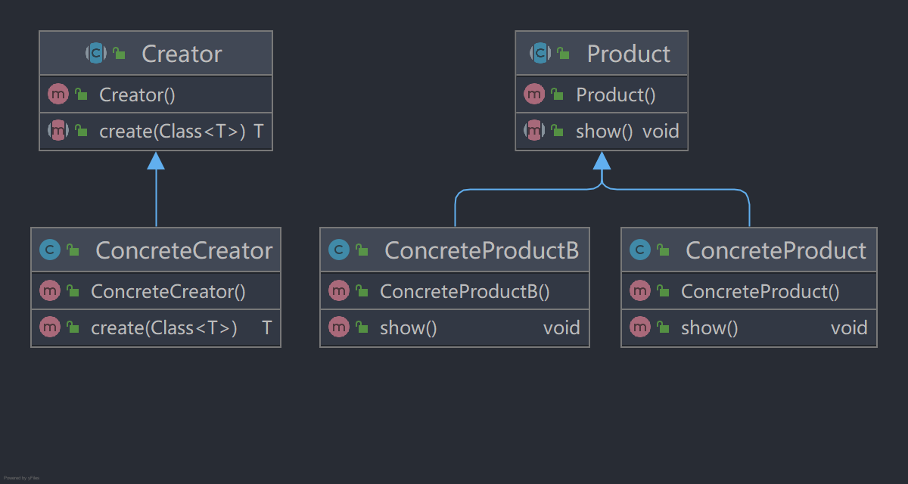

# 工厂方法模式

::: tip 定义
定义一个用于创建对象的接口，让子类决定实例化哪一个类。
:::

::: tip
工厂方法使一个类的实例化延迟到其子类。
:::

## 工厂方法模式的优点

- 良好的封装性，代码结构清晰，调用者只要知道类名就可以生产。
- 扩展性好，在增加产品类的情况下只要适当地修改具体工厂类或扩展一个工厂类即可。
- 屏蔽产品类。只要接口不变，上层模块就不变。
- 解耦。

## 工厂方法模式使用场景

- 所有需要生成对象的地方，但要注意是否需要这么做，避免增加复杂度。
- 需要灵活、可扩展的框架（Spring）。
- 异构项目，减少与外围系统的耦合。
- 测试驱动开发的框架。

## 工厂方法模式的扩展

1. 缩小为简单工厂模式：工厂类不再需要抽象类，且将方法变为静态。
2. 升级为多个工厂类：为每个产品定义一个创造者，每个创造者都对应一种产品。
3. 替代单例模式：工厂持有一个未初始化的单例对象，此单例对象的构造器私有化，单例工厂通过反射生成一个此对象。
4. 延迟初始化：一个对象被消费完毕后不立刻释放，工厂类通过Map等结构缓存，如果再次受到同类资源的请求直接从缓存中获取即可。
