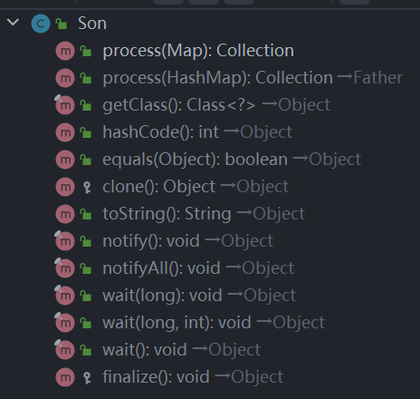

# 里氏替换原则

Liskov Substitution Principle （LSP）。

## 继承

继承的优点：

- 代码共享，减少创建类的工作量。
- 提高代码重用性。
- 子类形似父类但又异于父类。
- 提高代码的可扩展性。
- 提高产品或项目的开放性。

继承的缺点：

- 继承是侵入性的。只要继承就必须拥有父类所有的属性和方法。
- 降低代码的灵活性。子类必须拥有父类的属性和方法。
- 增强了耦合性。当父类的常量、变量和方法被修改时，需要考虑子类的修改。

::: tip 里氏替换原则
所有使用父类的地方必须能够替换成子类且不会出现错误或异常。
:::

## 里氏替换原则四层含义

1. 子类必须完全实现父类的方法，如果子类不能完整地实现父类的方法，或者父类的某些方法在子类中发生畸变，建议断开父子继承关系，采用依赖、聚合、组合等关系替代继承。
2. 子类可以有自己的个性。
3. 覆盖或实现父类的方法时输入的参数可以被放大。
4. 覆写或实现父类的方法时输出的结果可以被缩小。

父类代码如下：

```java
public class Father {
    public Collection process(HashMap map){
        System.out.println("父类被执行");
        return map.values();
    }
}
```

子类代码如下：

```java
public class Son extends Father{

    public Collection process(Map map){
        System.out.println("子类被执行");
        return map.values();
    }
}
```

子类完成了方法的重载而不是重写，且重载方法放大了参数范围，子类方法列表：



主函数：

```java
public class Client {
    public static void main(String[] args) {
        Father father = new Father();
        father.process(new HashMap());

        Son son = new Son();
        son.process(new HashMap());
    }
}
```

在主函数中的两个 process 方法都会输出`父类被执行`。

如果调转过来，父类参数范围更大：即父类方法接收 Map，子类方法接收 HashMap，则子类的 process 方法将会替代继承到的方法被执行，此时方法仍然是重载而不是重写，输出`子类被执行`，这样虽然完成了子类替换，但是效果与父类不同，违背了里氏替换原则。

::: warning 注意
子类中方法的参数必须与超类中覆写的方法的参数相同或更宽松。
:::
