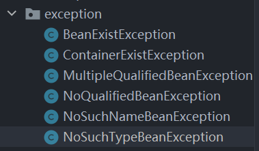
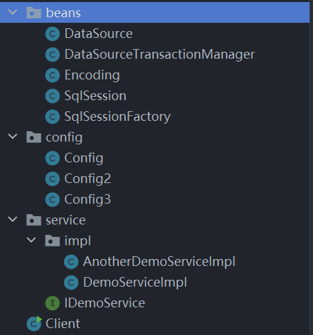

---
prev:
  text: 首页
  link: /design-pattern
---

# 单例模式

## 单例模式通用代码

```java
public class Singleton {
    private static Singleton instance=null;

    private Singleton(){

    }
    public static Singleton getInstance(){
        if (instance==null){
            instance=new Singleton();
        }
        return instance;
    }
}
```

## 单例模式优点

- 减少了内存开支，特别是需要频繁创建销毁的对象。
- 减少了系统的性能开销。
- 避免对资源的多重占用。
- 可以在系统设置全局的访问点，优化和共享资源访问。

## 单例模式的缺点

- 单例模式一般没有接口，扩展困难。
- 单例模式对测试不理。在并行开发中，单里没有完成前不能进行测试，没有接口也不能使用 mock。
- 单例模式与单一职责原则有冲突。一个类应该只实现一个逻辑 ，而不关心它是否是单例的，是不是要单例取决于环境，单例模式把`要单例`和业务逻辑融合在一个类中。

## 单例模式应用场景

- 要求生成唯一序列号的环境。
- 在整个项目中需要一个共享访问点或共享数据。
- 创建一个对象需要消耗的资源过多。
- 需要定义大量的静态常量和静态方法的环境。

## 线程安全的单例模式

```java
public class Singleton {
    private volatile static Singleton instance=null;
    private static final ReentrantLock lock = new ReentrantLock();
    private Singleton(){

    }
    public static Singleton getInstance(){
        if (instance == null) {//第一层判断
            try {
                lock.lock();//上锁
                if (instance == null) {//第二层判断
                    instance=new Singleton();
                }
            }finally {
                lock.unlock();
            }
        }

        return instance;
    }
}
```

## 使用单例模式模拟 Spring 自动装配

### 首先编写自定义注解

```java
@Target(ElementType.METHOD)
@Retention(RetentionPolicy.RUNTIME)
public @interface Bean {
    String name() default "";
}
```

```java
@Target(ElementType.TYPE)
@Retention(RetentionPolicy.RUNTIME)
public @interface Configuration {
}
```

```java
@Target(ElementType.TYPE)
@Retention(RetentionPolicy.RUNTIME)
public @interface Import {
    Class<?>[] classes();
}
```

```java
@Retention(RetentionPolicy.RUNTIME)
@Target(ElementType.FIELD)
public @interface Qualifier {
    String value() default "";
}
```

```java
@Retention(RetentionPolicy.RUNTIME)
@Target(ElementType.FIELD)
public @interface Autowired {
    AutoWiredType type() default AutoWiredType.BY_TYPE;
}
```

```java
public enum AutoWiredType {
    /**
     * ByType自动装配
     */
    BY_TYPE,
    /**
     * ByName自动装配
     */
    BY_NAME
}
```

### 自定义异常类

自定义异常类全部继承于 Exception 类。

例如：

```java
public class NoSuchTypeBeanException extends Exception{
    public NoSuchTypeBeanException() {
    }

    public NoSuchTypeBeanException(String message) {
        super(message);
    }

    public NoSuchTypeBeanException(String message, Throwable cause) {
        super(message, cause);
    }

    public NoSuchTypeBeanException(Throwable cause) {
        super(cause);
    }

    public NoSuchTypeBeanException(String message, Throwable cause, boolean enableSuppression, boolean writableStackTrace) {
        super(message, cause, enableSuppression, writableStackTrace);
    }
}
```

异常结构如下：



### 编写容器初始化类

首先需要一个静态变量做容器：

```java
private static HashMap<String, Object> container = null;
```

定义添加 Bean 到容器中的方法，此方法私有，仅用于初始化：

```java
private synchronized void addBean(String name, Object o) throws BeanExistException {
    //不允许重复添加
    if (container.containsKey(name)) {
        throw new BeanExistException("already exist bean with name:'" + name + "'");
    }
    container.put(name, o);
}
```

定义初始化容器方法：

```java
private synchronized void initContainer(String name) throws Exception {
    //        反射加载
    Class<?> aClass = Class.forName(name);
    //        判断所选类是否存在@Configuration注解
    if (aClass.isAnnotationPresent(Configuration.class)) {
        //            创建一个配置类对象
        Object config = aClass.newInstance();
        //            获取配置类中所有的方法
        Method[] declaredMethods = aClass.getDeclaredMethods();
        if (container == null) {
            container = new HashMap<>(declaredMethods.length);
        }
        //            遍历
        for (Method declaredMethod : declaredMethods) {
            //                判断此方法是否存在@Bean注解
            if (declaredMethod.isAnnotationPresent(Bean.class)) {
                //                    如果没有指定Bean的名字
                if ("".equals(declaredMethod.getAnnotation(Bean.class).name())) {
                    //                        就使用方法名作为bean的名字并执行这个方法初始化bean并注入到容器
                    addBean(declaredMethod.getName(), declaredMethod.invoke(config));
                } else {
                    //                        否则使用指定的名字初始化bean并注入到容器
                    addBean(declaredMethod.getAnnotation(Bean.class).name(), declaredMethod.invoke(config));
                }
            }
        }
    }
    if (aClass.isAnnotationPresent(Import.class)){
        Class<?>[] classes = aClass.getAnnotation(Import.class).classes();
        for (Class<?> aClass1 : classes) {
            initContainer(aClass1.getName());
        }
    }
}
```

定义构造函数并重载：

```java
public Container(String name) throws Exception {
    initContainer(name);

}

public Container(Class<?> configClass) throws Exception {

    initContainer(configClass.getName());
}
```

定义获取 Bean 的方法并重载：

```java
public Object getBean(String name) throws NoSuchNameBeanException {
    if (!container.containsKey(name)) {
        throw new NoSuchNameBeanException("there is no bean with name:" + name);
    }
    return container.get(name);
}

@SuppressWarnings("unchecked")
public <T> T getBean(Class<T> requiredType, String name) throws NoSuchTypeBeanException, NoQualifiedBeanException, MultipleQualifiedBeanException {
    Set<Map.Entry<String, Object>> entries = container.entrySet();
    boolean byType = false;
    T bean=null;
    for (Map.Entry<String, Object> entry : entries) {
        if (requiredType.isAssignableFrom(entry.getValue().getClass())) {
            byType = true;
            if (name == null || name.trim().isEmpty() || name.equals(entry.getKey())) {
                if (bean != null) {
                    throw new MultipleQualifiedBeanException("there is more than one qualified bean with type:"+requiredType.getName());
                }
                bean = ((T) entry.getValue());
            }
        }
    }
    if (bean!=null){
        return bean;
    }
    if (!byType) {
        throw new NoSuchTypeBeanException("there is no bean with type:" + requiredType.getName());
    } else {
        throw new NoQualifiedBeanException("there is no qualified bean with type:" + requiredType.getName() + ",and with name:" + name);
    }

}
```

定义自动装配初始化方法：

```java
public synchronized Object autowiredInit(String name) throws Exception {
    //        加载这个要装配的类的class对象
    Class<?> aClass = Class.forName(name);
    return autowiredInit(aClass);
}

public synchronized <T> T autowiredInit(Class<T> clazz) throws Exception{
    //        构造这个类的实例对象
    T o = clazz.newInstance();
    //        获取这个类所有的声明的变量
    Field[] declaredFields = clazz.getDeclaredFields();
    //        遍历这些变量
    for (Field declaredField : declaredFields) {
        //            判断这个变量是否有@Autowired修饰
        if (declaredField.isAnnotationPresent(Autowired.class)) {
            //                修改访问权限，可以修改private的变量
            declaredField.setAccessible(true);
            AutoWiredType type = declaredField.getAnnotation(Autowired.class).type();
            if (type==AutoWiredType.BY_TYPE){
                if (declaredField.isAnnotationPresent(Qualifier.class)){
                    String qualifyName = declaredField.getAnnotation(Qualifier.class).value();
                    declaredField.set(o,this.getBean(declaredField.getType(),qualifyName));
                }else{
                    declaredField.set(o,this.getBean(declaredField.getType(),null));
                }
            }else {
                //                    获取变量的名字
                String name1 = declaredField.getName();
                //                获取对应的Bean
                Object bean = getBean(name1);
                //                设置值
                declaredField.set(o, bean);
            }
        }
    }
    //        返回这个被装配完毕的实例对象
    return o;
}
```

编写实体类、配置类、服务类：



编写启动类：

```java
public class Client {

    @Autowired
    private DataSource mysql;

    @Autowired
    private DataSourceTransactionManager transactionManager;

    @Autowired
    @Qualifier("iDemoService")
    private IDemoService service;

    public static void main(String[] args) throws Exception {
        //使用指定配置文件初始化容器
        Container container = new Container(Config.class);
//        进行自动装配
        Client client = container.autowiredInit(Client.class);
//        调用方法
        client.service.demo();
        System.out.println(client.mysql);
    }
}
```
