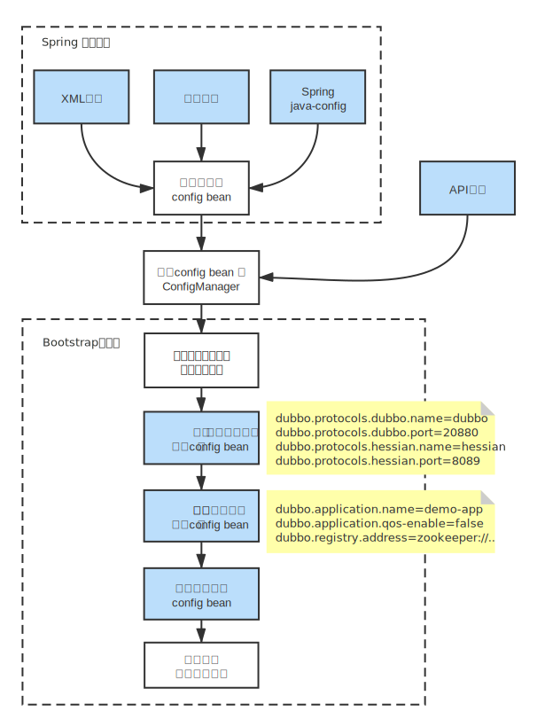

# Dubbo 配置规则

## 配置覆盖优先级

从 Dubbo 支持的配置来源说起，默认有 6 种配置来源：

- JVM System Properties：JVM -D 参数
- System environment：JVM 进程的环境变量
- Externalized Configuration：外部化配置，从配置中心读取
- Application Configuration：应用的属性配置，从 Spring 应用的 Environment 中提取 "dubbo" 打头的属性集。
- API、XML、注解等编程接口采集的配置可以被理解成配置来源的一种，是直接面向用户编程的配置采集方式。
- 从 classpath 读取配置文件：dubbo.properties。

从虚拟机参数到本地文件优先级依次降低

## 配置原则

- 作服务的提供者，比服务使用方更清楚服务性能参数，如调用的超时时间，合理的重试次数，等等。
- 在 Provider 配置后，Consumer 不配置则会使用 Provider 的配置值，即 Provider 配置可以作为 Consumer 的缺省值。否则，Consumer 会使用 Consumer 端的全局设置，这对于 Provider 不可控的，并且往往是不合理的。

## 不同粒度配置的覆盖关系

- 方法级优先，接口级次之，全局配置再次之。
- 如果级别一样，则消费方优先，提供方次之。

## 配置加载流程

