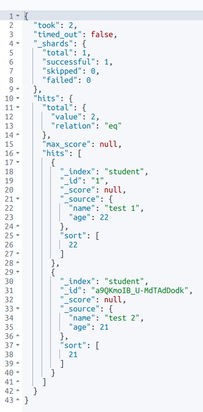

# DSL

## 创建文档

```js
PUT student/_doc/1
{
  "name": "test 1",
  "age": 22
}

POST student/_doc
{
  "name": "test 2",
  "age": 21
}

// 批量创建，注意一个花括号一行
PUT student/_bulk
{"index":{"_id": 2}}
{"name": "koston", "age": 24}
{"index":{"_id":3}}
{"name": "koston zhuang", "age": 20}
{"index":{"_id":4}}
{"name": "kostonzhuang", "age": 20}
```

::: tip

PUT 请求中，最后需要包含唯一性标识，POST 可以不包含，将会自动生成。

:::

## 基础查询

### 查询所有

```js
GET student/_search
{
  "query": {
    "match_all": {

    }
  },
  "sort": [
      {
      "age": {
        "order": "desc"
      }
    }
  ]
}
```

`match_all` 表示查询所有数据，`sort` 表示按照什么字段排序。

查询结果如下图：



- `took`：Elasticsearch 运行查询所花费的时间（以毫秒为单位）。
- `timed_out`：搜索请求是否超时。
- `_shards`：搜索了多少个碎片，以及成功，失败或跳过了多少个碎片的细目分类。
- `max_score`：找到的最相关文档的分数。
- `hits.total.value`：找到了多少个匹配的文档。
- `hits.sort`：文档的排序位置（不按相关性得分排序时）。
- `hits._score`：文档的相关性得分（使用 match_all 时不适用）。

### 分页查询

利用 from 和 size 实现分页。

```js
GET student/_search
{
  "query": {
    "match_all": {

    }
  },
  "sort": [
      {
      "age": {
        "order": "desc"
      }
    }
  ],
  "from": 0,
  "size": 1
}
```

### 指定字段查询

```js
GET student/_search
{
  "query": {
    "match": {
      "name": "koston test"
    }
  }
}
```

因为 Elasticsearch 是分词索引的，例如如果值中包含空格则会被拆成多个分词，又因为 match 也是分词查询的，因此上面的查询结果将不会包含 name 为 kostonzhuang 的结果，但会包含分词中有 koston 或者 test 的结果。

### 查询段落匹配

如果不想分词查询：

```js
GET student/_search
{
  "query": {
    "match_phrase": {
      "name": "koston zhuang"
    }
  }
}
```

### 部分字段查询

```js
GET student/_search
{
  "query": {
    "bool": {
      "must": [
        {
          "match": {
            "name": "koston"
          }
        },
        {
          "range": {
            "age": {
              "gte": 23
            }
          }
        }
      ]
    }
  },
  "_source": ["age"]
}
```

## 复合查询

### 布尔查询

Bool 查询语法有以下特点:

- 子查询可以任意顺序出现。
- 可以嵌套多个查询，包括 bool 查询。
- 如果 bool 查询中没有 must 条件，should 中必须至少满足一条才会返回结果。

bool 查询包含四种操作符：分别是 must, should, must_not, filter。他们均是一种数组，数组里面是对应的判断条件。

- must：必须匹配。贡献算分。
- must_not：过滤子句，必须不能匹配，但不贡献算分。
- should：选择性匹配，至少满足一条。贡献算分。
- filter：过滤子句，必须匹配，但不贡献算分。

```js
GET student/_search
{
  "query": {
    "bool": {
      "must": [
        {
          "match": {
            "name": "koston"
          }
        }
      ],
      "must_not": [
        {
          "range": {
            "age": {
              "gte": 10,
              "lte": 20
            }
          }
        }
      ]
    }
  }
}
```

### 提高查询

不同于布尔查询，布尔查询中只要一个子查询条件不匹配那么就不会出现在结果中，提高查询 boosting query 则是降低显示的权重，即评分。

```js
// 分词查询，对于分词包含 koston 的提高评分，包含 zhuang 的降低评分
GET student/_search
{
  "query": {
    "boosting": {
      "positive": {
        "match": {
          "name": "koston"
        }
      },
      "negative": {
        "match": {
          "name": "zhuang"
        }
      },
      "negative_boost": 0.5
    }
  }
}
```

### 固定分数查询

查询某个条件时，固定的返回指定的 score。

```js
GET student/_search
{
  "query": {
    "constant_score": {
      "filter": {
        "range": {
          "age": {
            "gte": 22
          }
        }
      },
      "boost": 1.2
    }
  }
}
```

### 最佳匹配查询

首先插入数据：

```js
POST /test-dsl-dis-max/_bulk
{ "index": { "_id": 1 }}
{"title": "Quick brown rabbits","body":  "Brown rabbits are commonly seen."}
{ "index": { "_id": 2 }}
{"title": "Keeping pets healthy","body":  "My quick brown fox eats rabbits on a regular basis."}
```

此时，如果需要搜索 标题或者内容中包含 Brown fox 的结果，如果使用布尔查询：

```js
GET /test-dsl-dis-max/_search
{
    "query": {
        "bool": {
            "should": [
                { "match": { "title": "Brown fox" }},
                { "match": { "body":  "Brown fox" }}
            ]
        }
    }
}
```

因为第一条文档的标题和内容中对于查询的内容的评分都是大于 0 的，最终两个 should 的评分之和大于第二条，但是实际上第二条记录的优先级应当更高，因此就需要引入最佳匹配查询，将任意和任一查询匹配的文档作为结果返回，但是只把最佳匹配的评分作为查询的评分返回。

```js
GET /test-dsl-dis-max/_search
{
    "query": {
        "dis_max": {
            "queries": [
                { "match": { "title": "Brown fox" }},
                { "match": { "body":  "Brown fox" }}
            ],
            "tie_breaker": 0
        }
    }
}
```

评分计算：分数 = 第一个匹配条件分数 + tie_breaker * 第二个匹配的条件的分数……

## 全文搜索

首先创建一些数据：

```js
POST /test-dsl-match/_bulk
{ "index": { "_id": 1 }}
{ "title": "The quick brown fox" }
{ "index": { "_id": 2 }}
{ "title": "The quick brown fox jumps over the lazy dog" }
{ "index": { "_id": 3 }}
{ "title": "The quick brown fox jumps over the quick dog" }
{ "index": { "_id": 4 }}
{ "title": "Brown fox brown dog" }
```

### match

match 查询中，对于多个分词会分多次 term 查询然后将结果使用布尔查询组合起来，默认情况下，满足任一分词的结果都会出现在最终结果里，也可以指定 operator 要求每个分词都满足：

```js
GET test-dsl-match/_search
{
  "query": {
    "match": {
      "title": {
        "query": "quick brown",
        "operator": "and"
      }
    }
  }
}
```

match_phrase 是连续的 term 查询，因此如果 match_phrase 中包含没有匹配结果的分词则结果将为空：

```js
GET test-dsl-match/_search
{
  "query": {
    "match_phrase": {
      "title": {
        "query": "quick brown f"
      }
    }
  }
}
```

此时可以使用 match_phrase_prefix 进行查询，此查询只是限制最后一个分词满足 term prefix 查询：

```js
GET test-dsl-match/_search
{
  "query": {
    "match_phrase_prefix": {
      "title": {
        "query": "quick brown f"
      }
    }
  }
}
```

如果希望一次性对多个字段进行查询，可以使用 multi_match：

```js
{
  "query": {
    "multi_match" : {
      "query":    "Will Smith",
      "fields": [ "title", "*_name" ]
    }
  }
}
```

### query string

[query_string](https://www.elastic.co/guide/en/elasticsearch/reference/current/query-dsl-query-string-query.html) 类似 SQL 语句：

```js
GET test-dsl-match/_search
{
  "query": {
    "query_string": {
      "default_field": "title",
      "query": "(lazy dog) OR (brown dog)"
    }
  }
}
```

### Interval

[TODO:](https://www.elastic.co/guide/en/elasticsearch/reference/current/query-dsl-intervals-query.html)

## Term

准备数据：

```js
PUT /test-dsl-term-level
{
  "mappings": {
    "properties": {
      "name": {
        "type": "keyword"
      },
      "programming_languages": {
        "type": "keyword"
      },
      "required_matches": {
        "type": "long"
      }
    }
  }
}

POST /test-dsl-term-level/_bulk
{ "index": { "_id": 1 }}
{"name": "Jane Smith", "programming_languages": [ "c++", "java" ], "required_matches": 2}
{ "index": { "_id": 2 }}
{"name": "Jason Response", "programming_languages": [ "java", "php" ], "required_matches": 2}
{ "index": { "_id": 3 }}
{"name": "Dave Pdai", "programming_languages": [ "java", "c++", "php" ], "required_matches": 3, "remarks": "hello world"}
```

字段是否存在：

```js
GET test-dsl-term-level/_search
{
  "query": {
    "exists": {
      "field": "title"
    }
  }
}
```

id 查询：

```js
GET /test-dsl-term-level/_search
{
  "query": {
    "ids": {
      "values": [3, 1]
    }
  }
}
```

前缀查询：

```js
GET /test-dsl-term-level/_search
{
  "query": {
    "prefix": {
      "name": {
        "value": "Jan"
      }
    }
  }
}
```

分词匹配 term：

```js
// 基础查询
GET /test-dsl-term-level/_search
{
  "query": {
    "term": {
      "programming_languages": "php"
    }
  }
}
// 多分词匹配，它们是或关系
GET /test-dsl-term-level/_search
{
  "query": {
    "terms": {
      "programming_languages": ["php","c++"]
    }
  }
}
```

通配符 wildcard：

```js
GET /test-dsl-term-level/_search
{
  "query": {
    "wildcard": {
      "name": {
        "value": "D*ai",
        "boost": 1.0,
        "rewrite": "constant_score"
      }
    }
  }
}
```

范围 range：

```js
GET /test-dsl-term-level/_search
{
  "query": {
    "range": {
      "required_matches": {
        "gte": 3,
        "lte": 4
      }
    }
  }
}
```

正则匹配 regexp：

```js
GET /test-dsl-term-level/_search
{
  "query": {
    "regexp": {
      "name": {
        "value": "Ja.*",
        "case_insensitive": true
      }
    }
  }
}
```

模糊匹配 fuzzy：

```js
GET /test-dsl-term-level/_search
{
  "query": {
    "fuzzy": {
      "remarks": {
        "value": "hell"
      }
    }
  }
}
```

模糊匹配支持下面几种情况：

- 更改字符（box->fox）。
- 删除字符（black->lack）。
- 插入字符（sic->sick）。
- 转置两个相邻字符（act->cat）。
