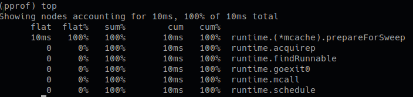
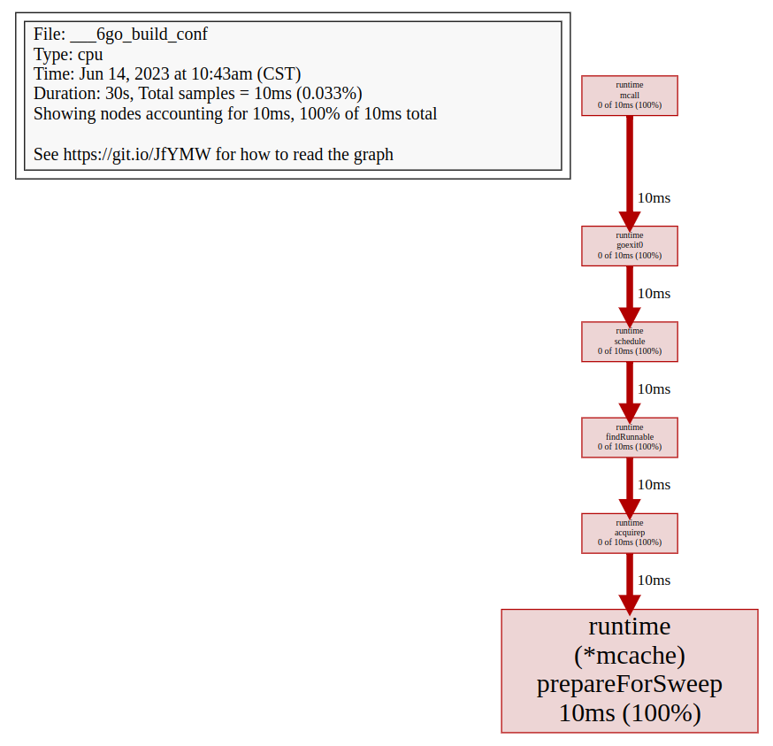
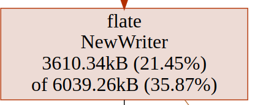

# pprof

## 导出数据

### web 类型应用

引入 pprof 包：

```go
import _ "net/http/pprof"
```

这个包中的 init 函数使用 `http.HandleFunc` 注册了多个路径，所以只要引入并且使用默认 ServerMux 就可以实现数据的收集。如果使用的不是默认 ServerMUX，例如使用了 gin 框架，那么需要手动注册这些路径（gin 框架提供了 `gin-contrib/pprof`，只要使用其中的 Register 方法注册 gin engine 即可）。

对于 grpc 服务来说，可以在服务端的其他端口启动一个 http 服务，同时引入 pprof 包间接实现数据的收集。

访问 http 服务 `http://localhost:8080/debug/pprof` 即可看到多个指标：

- allocs：过去所有内存分配的样本，包括已经被 GC 的内存也会被统计在内。
- block：导致阻塞同步的堆栈追踪。
- cmdline：当前程序的命令行的完整调用路径。
- goroutine：当前所有运行的 goroutines 堆栈追踪（实时变化）。
- heap：活动对象的内存分配情况，也就是还没被 GC 的部分（实时变化）。
- mutex：导致互斥锁的竞争持有者的堆栈跟踪。
- profile：默认进行 30 秒的 CPU Profiling，得到一个分析用的 profile 文件。
- threadcreate：查看创建新 OS 现成的堆栈跟踪。
- trace：记录程序运行期间发生的各种事件，例如 goroutine 的创建、系统调用、网络请求、垃圾收集、调度等。

默认情况下不会对 block 和 mutex 进行追踪，需要加上下面的代码：

```go
runtime.SetBlockProfileRate(1)
runtime.SetMutexProfileFraction(1)
```

方法一：

```shell
go tool pprof -seconds=30 http://localhost:8080/debug/pprof/heap
```

使用此命令会收集 heap 指标的 30 秒内的数据，并将文件下载到本地，然后会进入 pprof 交互式命令行。

方法二：

```shell
curl -o heap.out http://localhost:8080/debug/pprof/heap?seconds=30
go tool pprof heap.out
```

首先使用 curl 获取 30 秒内的 heap 信息存储到文件中，然后分析此文件。

### 对于普通程序

记录 CPU Profiling

```go
file, err := os.Create("cpu.pprof")
if err != nil {
    panic(err)
}
defer file.Close()
pprof.StartCPUProfile(file)
// 其他逻辑
pprof.StopCPUProfile()
```

记录 heap 等指标：

```go
file, err := os.Create("cpu.pprof")
if err != nil {
    panic(err)
}
defer file.Close()
pprof.Lookup("heap").WriteTo(file, 0)
```

## 分析数据

示例程序：

```go
func main() {
	runtime.SetBlockProfileRate(1)
	runtime.SetMutexProfileFraction(1)
	go func() {
		for {
			go demo()
			time.Sleep(time.Millisecond * 500)
		}
	}()
	http.ListenAndServe("0.0.0.0:8080", nil)
}

var lock = &sync.Mutex{}

func demo() {
	lock.Lock()
	time.Sleep(time.Second)
	lock.Unlock()
}
```

### 交互式分析

以 CPU Profiling 为例：

```shell
go tool pprof http://127.0.0.1:8080/debug/pprof/profile
```

然后就会进入 pprof 交互命令行了，可以使用 help 命令查看所有支持的命令。

查看消耗前 5 的函数：

```shell
top5
```



查看图片（需要先安装 graphviz）：

执行 web 命令即可，这会生成一个 svg 图片并使用默认程序打开。



### 启动 pprof 图片界面

```shell
go tool pprof -http=:8082 http://127.0.0.1:8080/debug/pprof/allocs
```

## 理解指标

### flat flat%

一个函数内直接操作的物理耗时。

```go
func foo(){
    a()                                        // step1
    largeArray := [math.MaxInt64]int64{}       // step2
    for i := 0; i < math.MaxInt64; i++ {       // step3
            c()                                // step4
    }
}
```

flat 只会记录 step2 和 step3 的时间；flat% 即是 flat/总运行时间。内存等参数同理。

所有的 flat 相加即是总采样时间，所有的 flat% 相加应该等于 100%。

flat 一般是我们最关注的。其代表一个函数可能非常耗时，或者调用了非常多次，或者两者兼而有之，从而导致这个函数消耗了最多的时间。

如果是我们自己编写的代码，则很可能有一些无脑 for 循环、复杂的计算、字符串操作、频繁申请内存等等。

如果是第三方库的代码，则很可能我们过于频繁地调用了这些第三方库，或者以不正确的方式使用了这些第三方库。

### cum cum%

相比 flat，cum 则是这个函数内所有操作的物理耗时，比如包括了上述的 step1、2、3、4。

cum% 即是 cum的时间/总运行时间。内存等参数同理。

一般 cum 是我们次关注的，且需要结合 flat 来看。flat 可以让我们知道哪个函数耗时多，而cum可以帮助我们找到是哪些函数调用了这些耗时的（flat 值大的）函数。

### sum%

其上所有行的 flat% 的累加。可以视为，这一行及其以上行，其所有的直接操作一共占了多少物理时间。

## 连线图



自上而下分别是：包名、函数名、flat（flat%）、cum（cum%）。

## 火焰图

火焰图横向长度表示 cum，每一行相比下一行超出的部分代表 flat。
