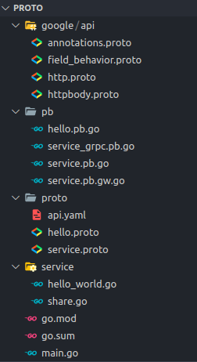

# gRPC Gateway

## 安装工具

```shell
go install github.com/grpc-ecosystem/grpc-gateway/v2/protoc-gen-grpc-gateway@latest
go install github.com/grpc-ecosystem/grpc-gateway/v2/protoc-gen-openapiv2@latest
```

## 在服务 proto 文件中定义

首先定义一个简单的服务：

```protobuf
syntax = "proto3";
option go_package = "./;pb";

message HelloWorldRequest {
  string msg = 1;
}

message HelloWorldResponse {
  string msg = 1;
}
```

```protobuf
syntax = "proto3";
option go_package = "./;pb";

import "proto/hello.proto";
import "google/api/annotations.proto";

service HelloService {
  rpc HelloWorld(HelloWorldRequest) returns (HelloWorldResponse){
    option (google.api.http) = {
      post: "/v1/example/echo/{msg}" // 绑定请求方法和请求路径
      body: "*"
      additional_bindings { // 绑定其他请求方式和路径
        get: "/v1/get"
      }
    };
  }
}
```

::: warning 注意
这种方式需要将 [`googleapis`](https://github.com/googleapis/googleapis) `google/api` 目录中的几个文件拷贝到项目中：`annotations.proto`、`field_behavior.proto`、`httpbody.proto`、`http.proto`。
:::

执行编译命令：

```shell
protoc -I . --go_out=pb --go-grpc_out=pb --grpc-gateway_out pb --grpc-gateway_opt logtostderr=true  proto/*.proto
```

实现所有的接口，最终项目文件结构：



其中的 `api.yaml` 是另一种 grpc-gateway 的使用方式，这里先不考虑。

main.go：

```go
package main

import (
	"context"
	"log"
	"net"
	"net/http"
	"proto/pb"
	"proto/service"

	"github.com/grpc-ecosystem/grpc-gateway/v2/runtime"
	"google.golang.org/grpc"
	"google.golang.org/grpc/credentials/insecure"
	"google.golang.org/grpc/reflection"
)

func startHttpServer(ctx context.Context) {
	mux := runtime.NewServeMux()
	err := pb.RegisterHelloServiceHandlerFromEndpoint(ctx, mux, "localhost:8082", []grpc.DialOption{grpc.WithTransportCredentials(insecure.NewCredentials())})
	if err != nil {
		log.Println("RegisterHelloServiceHandlerFromEndpoint failed:", err)
	}
	http.ListenAndServe(":8081", mux)
}

func startgRPCServer() {
	grpcServer := grpc.NewServer()
	helloServer := service.HelloService{}
	pb.RegisterHelloServiceServer(grpcServer, helloServer)
	reflection.Register(grpcServer)
	listener, err := net.Listen("tcp", ":8082")
	if err != nil {
		log.Println(err)
		log.Println("start server failed")
	}
	err = grpcServer.Serve(listener)
	if err != nil {
		log.Println("start grpc server failed")
	}
}

func main() {
	go startHttpServer(context.Background())
	startgRPCServer()
}
```

其中的 `RegisterHelloServiceHandlerFromEndpoint` 方法可以用来转换包括流式 gRPC 的类型，需要指定 gRPC 服务端的路径；如果只有一元 gRPC 可以使用 `RegisterHelloServiceHandlerServer` 方法，这个方法不需要指定 gRPC 服务端的路径，同时使用这个方法也不需要额外启动 gRPC 服务端。

## 在 YAML 配置文件中定义

定义 `api.yaml` 文件：

```yaml
type: google.api.Service
config_version: 3

http:
  rules:
    - selector: HelloService.HelloWorld
      post: /v1/example/echo
      body: '*'
      additional_bindings:
        - get: /v1/example/echo
```

[配置参考](https://cloud.google.com/endpoints/docs/grpc-service-config/reference/rpc/google.api#special-notes)，使用 YAML 和直接在 proto 文件中定义都可以参考这里的配置。

其他代码不需要改动，执行编译命令后直接运行：

```shell
protoc -I . --go_out=pb --go-grpc_out pb --grpc-gateway_out pb --grpc-gateway_opt logtostderr=true --grpc-gateway_opt grpc_api_configuration=proto/api.yaml proto/*.proto
```

## 设置 grpc-gateway

### http request header and grpc metadata

默认情况下，grpc gateway 只会将请求中的带有 `Grpc-Metadata-` 前缀的 http header转换为 grpc metadata，且去掉此前缀。对于下面的 header 则会拼接上 `grpcgateway-` 前缀传递给 grpc metadata。


使用自定义 header 转换：

header to metadata:

```go
func myMatcher(key string) (string, bool) {
	return key, true
}

func startGateway() {
	mux := runtime.NewServeMux(
		runtime.WithIncomingHeaderMatcher(myMatcher),
		runtime.WithOutgoingHeaderMatcher(myMatcher),
	)
	proto.RegisterHelloServiceHandlerFromEndpoint(context.Background(), mux, "127.0.0.1:8080", []grpc.DialOption{
		grpc.WithTransportCredentials(insecure.NewCredentials()),
	})
	http.ListenAndServe("0.0.0.0:8081", mux)
}
```

metadata to header:

```go
func (HelloService) Hello(ctx context.Context, req *proto.HelloRequest) (*proto.HelloResponse, error) {
	incomingContext, ok := metadata.FromIncomingContext(ctx)
	grpc.SendHeader(ctx, metadata.New(map[string]string{
		"REQID": "123",
	}))
	if ok {
		return &proto.HelloResponse{
			Message: strings.Join(incomingContext.Get("x-account-id"), " "),
		}, nil
	}
	return &proto.HelloResponse{
		Message: req.Message,
	}, nil
}
```

::: warning

grpc-gateway 进行 header 转换时，key 会先执行一次处理，中划线后第一个字母将被大写，其他字母将被小写，如果包含空格和非 ASCII 字符则将返回自身，不进行处理，例如："accept-encoding" -> "Accept-Encoding"。

:::

### 自定义序列化

- 编写 Marshaler 的实现。
- 使用 WithMarshalerOption 注册自定义序列化方法。

TODO:

### 响应拦截器

```go
func (HelloService) Hello(ctx context.Context, req *pb.HelloRequest) (*pb.HelloResponse, error) {
	md, ok := metadata.FromIncomingContext(ctx)
	if ok {
		grpc.SetHeader(ctx, metadata.Join(md, metadata.New(map[string]string{
			"reqId": primitive.NewObjectID().Hex(),
		})))
	}
	return &pb.HelloResponse{
		Message: req.Message,
	}, nil
}

func MyFilter(ctx context.Context, w http.ResponseWriter, msg proto.Message) error {
	m, ok := runtime.ServerMetadataFromContext(ctx)
	if !ok {
		return nil
	}
	s := m.HeaderMD.Get("reqId")
	w.Header().Set("Req-Id", s[0])
	return nil
}

func startGateway() {
	mux := runtime.NewServeMux(
	runtime.WithForwardResponseOption(MyFilter),
	)
	pb.RegisterHelloServiceHandlerFromEndpoint(context.Background(), mux, "127.0.0.1:8080", []grpc.DialOption{
		grpc.WithTransportCredentials(insecure.NewCredentials()),
	})
	http.ListenAndServe("0.0.0.0:8081", mux)
}
```

### 错误处理

例如我们可以强制所有的请求返回都是 200。

```go
func (HelloService) Hello(ctx context.Context, req *pb.HelloRequest) (*pb.HelloResponse, error) {
	return nil, fmt.Errorf("1!5!")
}

func myMatcher(key string) (string, bool) {
	return key, true
}

type MyMashaler struct {
}

func MyFilter(ctx context.Context, w http.ResponseWriter, msg proto.Message) error {
	m, ok := runtime.ServerMetadataFromContext(ctx)
	if !ok {
		return nil
	}
	s := m.HeaderMD.Get("reqId")
	w.Header().Set("Req-Id", s[0])
	return nil
}

func startGateway() {
	mux := runtime.NewServeMux(
		runtime.WithErrorHandler(func(ctx context.Context, sm *runtime.ServeMux, m runtime.Marshaler, w http.ResponseWriter, r *http.Request, err error) {
			if err == nil {
				return
			}
			w.Write([]byte(err.Error()))
			w.WriteHeader(http.StatusOK)
		}),
	)
	pb.RegisterHelloServiceHandlerFromEndpoint(context.Background(), mux, "127.0.0.1:8080", []grpc.DialOption{
		grpc.WithTransportCredentials(insecure.NewCredentials()),
	})
	http.ListenAndServe("0.0.0.0:8081", mux)
}
```

路由错误处理：

默认情况下，405 Method Not Allowed 会被转换 grpc 12 UNIMPLEMENTED 进而变为 501 Not Implement 错误，如果希望保留 405 响应，可以进行下面的处理：

```go
func startGateway() {
	mux := runtime.NewServeMux(
		runtime.WithRoutingErrorHandler(func(ctx context.Context, sm *runtime.ServeMux, m runtime.Marshaler, w http.ResponseWriter, r *http.Request, i int) {
			if i == http.StatusMethodNotAllowed {
				w.WriteHeader(http.StatusMethodNotAllowed)
				w.Write([]byte("Method Not Allowed"))
				return
			}
			runtime.DefaultRoutingErrorHandler(ctx, sm, m, w, r, i)
		}),
	)
	pb.RegisterHelloServiceHandlerFromEndpoint(context.Background(), mux, "127.0.0.1:8080", []grpc.DialOption{
		grpc.WithTransportCredentials(insecure.NewCredentials()),
	})
	http.ListenAndServe("0.0.0.0:8081", mux)
}
```
