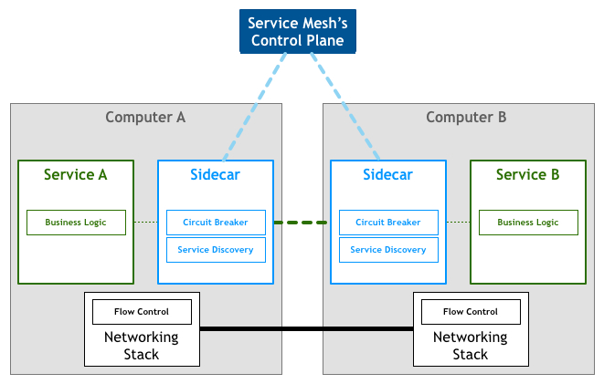

---
prev:
  text: 首页
  link: /istio
---

# Istio 是什么

Istio 是一个完全开源的服务网格，作为透明的一层接入到现有的分布式应用程序里。它也是一个平台，拥有可以集成任何日志、遥测和策略系统的 API 接口。

## 服务网格

服务网格是用于处理服务间通信的专用基础设施层。它负责通过包含现代云原生应用程序的复杂服务拓扑来可靠地传递请求。实际上，服务网格通常通过一组轻量级网络代理来实现，这些代理与应用程序代码一起部署，而不需要感知应用程序本身

服务网格有如下几个特点：

- 应用程序间通讯的中间层。
- 轻量级网络代理。
- 应用程序无感知。
- 解耦应用程序的重试/超时、监控、追踪和服务发现。

服务网格的来龙去脉：

- 最原始的主机之间直接使用网线相连。
- 网络层的出现。
- 集成到程序内部的控制流。
- 分解到程序外部的控制流。
- 应用程序中集成服务发现和断路器。
- 出现了专门用于服务发现和断路器的软件包、库。
- 出现了专门用于服务发现和断路器的开源软件。
- 最为微服务的中间层的服务网格出现。

服务网格架构图：

服务网格作为 sidecar 运行，对应用程序来说是透明，所有应用程序间的流量都会通过它，所以对应用程序流量的控制都可以在 serivce mesh 中实现。

## 服务网格如何工作（以 Istio 为例）

- Istio 将服务请求路由到目的地址，根据中的参数判断是到生产环境、测试环境还是 staging 环境中的服务（服务可能同时部署在这三个环境中），是路由到本地环境还是公有云环境？所有的这些路由信息可以动态配置，可以是全局配置也可以为某些服务单独配置。
- 当 Istio 确认了目的地址后，将流量发送到相应服务发现端点，在 Kubernetes 中是 service，然后 service 会将服务转发给后端的实例。
- Istio 根据它观测到最近请求的延迟时间，选择出所有应用程序的实例中响应最快的实例。
- Istio 将请求发送给该实例，同时记录响应类型和延迟数据。
- 如果该实例挂了、不响应了或者进程不工作了，Istio 将把请求发送到其他实例上重试。
- 如果该实例持续返回 error，Istio 会将该实例从负载均衡池中移除，稍后再周期性得重试。
- 如果请求的截止时间已过，Istio 主动失败该请求，而不是再次尝试添加负载。
- Istio 以 metric 和分布式追踪的形式捕获上述行为的各个方面，这些追踪信息将发送到集中 metric 系统。
