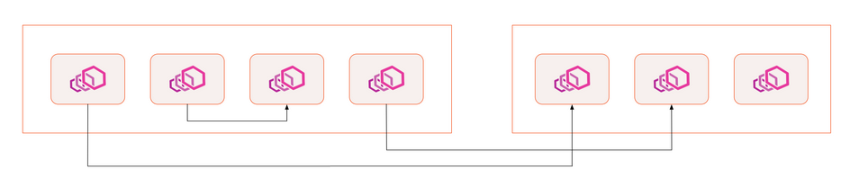
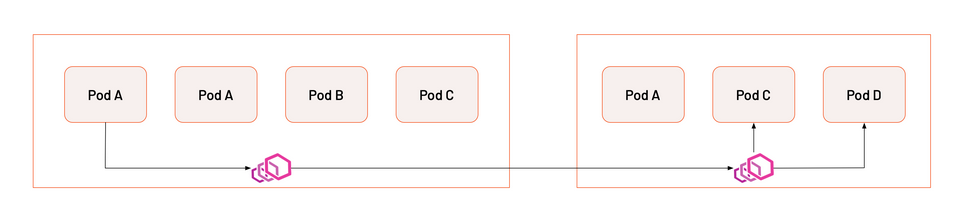
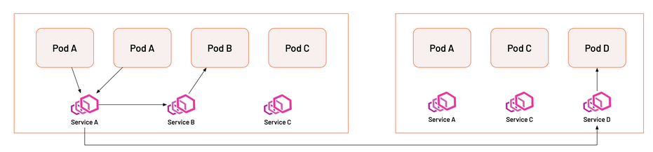
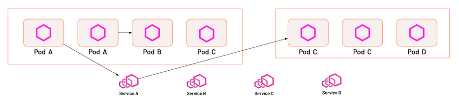

# 概念原理

## 服务网格的部署模式

### Sidecar 代理

此模式在每个应用程序旁运行一个代理，体现在 Kubernetes 中就是每个 Pod 都有两个容器，内存开销最大，Pod 级别的隔离，单一 sidecar 故障不影响其他 Pod。

### 节点共享代理

每个节点上只有一个代理，所有工作负载共享，内存开销小，如果 Istio 故障会影响该节点的所有工作负载。

### Service Account/节点共享代理

在每个节点中，根据 ServiceAccount 的数量，每个 ServiceAccount 运行一个代理，单节点 Istio 故障会影响该节点的所有工作负载。

### 带有微代理的共享远程代理

在每个应用旁运行一个微代理，微代理专门处理 mTLS，L7 路由在远程。

