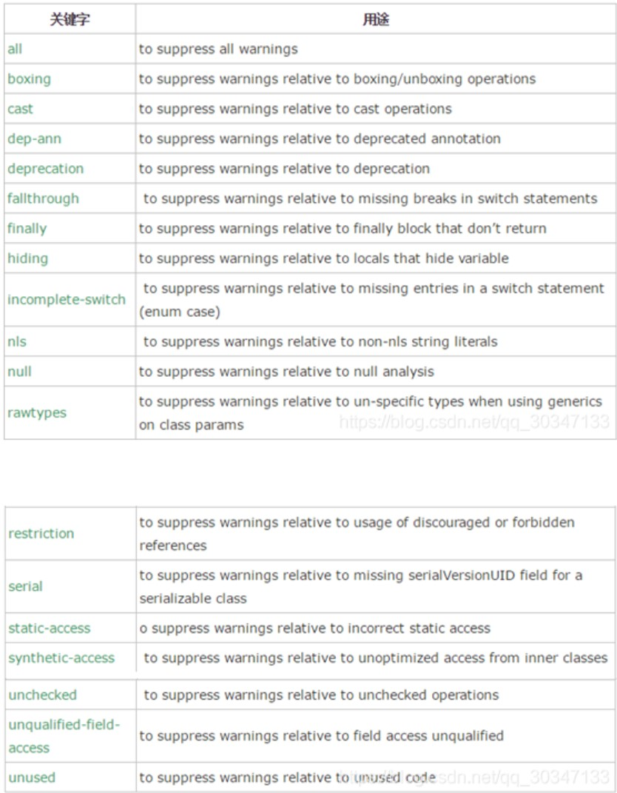

# 注解

注解是放在 Java 源码的类、方法、字段、参数前的一种特殊“注释”。

注释会被编译器直接忽略，注解可以被编译器打包进入 class 文件，因此，注解是一种用作标注的“元数据”。

## 注解的作用

从 JVM 的角度来看，注解本身对于代码逻辑没有任何影响，如何使用注解完全由工具决定。

Java 中的注解可以分为三类：

- `@Override`、`@Deprecated`、`@SuppressWarnings` 等编译器注解，编译器会根据这些注解进行检查和警告。这类注解不会被编译进入 class 文件，编译后就会被丢掉。
- 第二类是由工具处理 `.class` 文件时使用的注解，这类注解会被编译进入 class 文件，但不会被 JVM 直接使用，而是由工具在处理 class 文件时读取和使用。
- 第三类是程序运行时能够读取的注解，它们被加载后会一直存在于 JVM 中，可以通过反射 API 读取和使用。

## 内置注解

### @Override

表示当前方法覆盖了父类的方法。

此注释只适用于修饰方法，表示一个方法声明打算重写超类中的另一个方法声明。如果方法利用此注释类型进行注解但没有重写超类方法，则编译器会生成一条错误消息。

### @Deprecated

表示方法已经过时,方法上有横线，使用时会有警告。

此注释可用于修饰方法、属性、类，表示不鼓励程序员使用这样的元素，通常是因为它很危险或存在更好的选择。在使用不被赞成的程序元素或在不被赞成的代码中执行重写时，编译器会发出警告。

### @SuppressWarnings

用来抑制编译时的警告信息。与前两个注释有所不同，你需要添加一个参数才能正确使用，这些参数值都是已经定义好了的，我们选择性的使用就好了



例如：

```java
@SuppressWarnings(value={"unchecked", "deprecation"})
```

## 定义注解

Java 中定义注解的语法和定义接口类似，使用 `@interface` 关键字来定义一个注解类型：

```java
public @interface PostConstruct {
}
```

注解也可以有参数，参数的定义方式类似于接口中的方法定义：

```java
public @interface Validator {
    int min();
    int max();
    String label() default "";
}
```

注解中的参数可以有默认值，如果没有默认值，则在使用注解时必须提供该参数的值。一般来说建议为注解中的参数设置默认值，这样在使用注解时就不需要每次都提供参数值了。

注解属性类型可以有以下列出的类型：

- 基本数据类型。
- String。
- 枚举类型。
- 注解类型。
- Class 类型。
- 以上类型的一维数组类型。

### 元注解

元注解顾名思义我们可以理解为注解的注解，它是作用在注解中，方便我们使用注解实现想要的功能。元注解分别有 `@Retention`、 `@Target`、 `@Document`、 `@Inherited` 和 `@Repeatable`（JDK1.8 加入）五种。

#### @Retention

Retention 英文意思有保留、保持的意思，它表示注解存在阶段是保留在源码（编译期），字节码（类加载）或者运行期（JVM 中运行）。在 `@Retention` 注解中使用**枚举 RetentionPolicy**来表示注解保留时期。

- `RetentionPolicy.SOURCE`：注解只存在于源码中，class字节码文件中不包含。
- `RetentionPolicy.CLASS`：默认的保留策略，注解在 class 字节码文件中存在，但运行时无法获得。
- `RetentionPolicy.RUNTIME`：注解会在 class 字节码文件中存在，在运行时可以通过反射获取到。

如果不手动指定 `@Retention` 注解，则默认使用 `RetentionPolicy.CLASS` 策略。因此，如果想要在运行时通过反射获取注解信息，必须将注解的保留策略设置为 `RetentionPolicy.RUNTIME`。

```java
@Retention(RetentionPolicy.RUNTIME)
public @interface PostConstruct {
}
```

#### @Target

Target 的英文意思是目标，这也很容易理解，使用 `@Target` 元注解表示我们的注解作用的范围就比较具体了，可以是类，方法，方法参数变量等，同样也是通过**枚举类 ElementType**表达作用类型。

下面是 `ElementType` 的汇总表：

| 枚举值 | 作用 / 说明 | 示例 / 备注 |
| --- | --- | --- |
| `ElementType.TYPE` | 作用于类型声明：类、接口、枚举、注解 | 注解用于类/接口声明，例如用于标注某个注解可用于类。 |
| `ElementType.FIELD` | 作用于字段或枚举常量 | 注解字段或枚举常量。 |
| `ElementType.METHOD` | 作用于方法声明 | 注解普通方法（包括抽象/默认方法）。 |
| `ElementType.PARAMETER` | 作用于方法或构造函数的形参 | 示例：`void m(@A String s)`，注解方法参数。 |
| `ElementType.CONSTRUCTOR` | 作用于构造函数 | 注解构造方法声明。 |
| `ElementType.LOCAL_VARIABLE` | 作用于局部变量 | 注解方法体内的局部变量或迭代变量。 |
| `ElementType.ANNOTATION_TYPE` | 作用于注解类型的声明（即用于定义注解） | 用于定义“元注解”，例如注解另一个注解的声明。 |
| `ElementType.PACKAGE` | 作用于包声明 | 在 `package-info.java` 中使用以标注包。 |
| `ElementType.TYPE_PARAMETER` | 作用于类型参数声明（泛型声明处）；JDK 1.8 新增 | 示例：`class C<@A T>`，注解泛型类型参数声明。 |
| `ElementType.TYPE_USE` | 作用于“类型使用”位置（几乎所有出现类型的地方）；JDK 1.8 新增 | 用于类型注解，如 `@NonNull String`、强制转换、泛型实际类型、implements、throws 等。 |

`@Target` 注解的参数是一个 `ElementType` 枚举值的数组，表示注解可以作用于哪些 Java 元素，如果只有一个元素，可以直接写成单个枚举值：

```java
import java.lang.annotation.ElementType;
import java.lang.annotation.Target;

@Target({
        ElementType.METHOD,
})
public @interface PostConstruct {
}
```

#### @Document

Document的英文意思是文档。它的作用是能够将注解中的元素包含到 Javadoc 中去。

#### @Inherited

Inherited 的英文意思是继承，但是这个继承和我们平时理解的继承大同小异，一个被 `@Inherited` 注解了的注解修饰了一个父类，它的子类也会继承父类的注解。

```java
@Target(ElementType.TYPE)
@Documented
@Retention(RetentionPolicy.RUNTIME)
@Inherited
@interface InheritedTest{

}

@InheritedTest
class Father{

}

class Son extends Father{

}
public class MetaAnnotation {
    public static void main(String[] args) {
        Class<Son> sonClass = Son.class;
        Annotation[] annotations = sonClass.getAnnotations();
        for (Annotation annotation : annotations) {
            System.out.println(annotation);
        }

    }
}
```

::: tip

`@Inherited` 仅对 `@Target(ElementType.TYPE)` 的注解有效，即只能作用于类、接口、枚举和注解类型的声明。

:::

#### @Repeatable

Repeatable 的英文意思是可重复的。顾名思义说明被这个元注解修饰的注解可以同时作用一个对象多次，但是每次作用注解又可以代表不同的含义。

```java
/**
 * 一个人喜欢玩游戏，他喜欢玩英雄联盟，绝地求生，极品飞车，尘埃4等，
 * 则我们需要定义一个人的注解，
 * 他属性代表喜欢玩游戏集合，
 * 一个游戏注解，游戏属性代表游戏名称
 * @author 16582*/
@Documented
@Retention(RetentionPolicy.RUNTIME)
@Target(ElementType.TYPE)
@interface People {
    Game[] value() ;
}
/**游戏注解
 * @author 16582*/
@Repeatable(People.class)
@Retention(RetentionPolicy.RUNTIME)
@Target(ElementType.TYPE)
@interface Game {
    String value() default "";
}
/**玩游戏类*/
@Game(value = "LOL")
@Game(value = "PUBG")
@Game(value = "NFS")
@Game(value = "Dirt4")
class PlayGame {
}
```

## 处理注解

注解本身是 `Annotation` 接口的子接口，因此注解也是一种接口类型，可以拿到注解的 Class 对象，进而通过反射 API 获取注解的信息。

接下来实现两个实例代码，分别是实现 `@PostConstruct` 注解和 `@Validator` 注解的处理。

首先是 `@PostConstruct` 注解的处理，我们希望这个自定义注解在类的方法上使用，当类被构建时，这个方法会调用。

::: code-tabs#post-construct

@tab Main.java

```java
public class Main {

    static Object newInstance(Class<?> clazz) throws Exception {
        Object instance = null;
        for (Constructor<?> constructor : clazz.getConstructors()) {
            if (constructor.getParameterCount()==0) {
                instance = constructor.newInstance();
            }
        }
        for (Method method : clazz.getDeclaredMethods()) {
            if (method.isAnnotationPresent(PostConstruct.class) && method.getParameterCount() == 0) {
                method.invoke(instance);
            }
        }
        return instance;
    }

    static void main() throws Exception {
        newInstance(Base.class);
    }
}
```

@tab Base.java

```java
public class Base {
    private String privateBaseStr;
    public int publicBaseInt;

    @PostConstruct
    public void postConstruct() {
        System.out.println("post construct method running");
    }
}
```

@tab PostConstruct.java

```java
import java.lang.annotation.ElementType;
import java.lang.annotation.Retention;
import java.lang.annotation.RetentionPolicy;
import java.lang.annotation.Target;

@Target({
        ElementType.METHOD,
})
@Retention(RetentionPolicy.RUNTIME)
public @interface PostConstruct {
}
```

:::

这个例子中我们通过 `isAnnotationPresent` 方法判断方法上是否有 `@PostConstruct` 注解，如果有就调用这个方法。

接下来是 `@Validator` 注解的处理，我们希望这个注解可以用在方法参数上，表示对参数进行校验。或者时作用在字段上，表示对字段进行校验。

::: code-tabs#validator

@tab Main.java

```java
import java.lang.reflect.*;

public class Main {

    static void valid(Object obj) throws Exception{
        Class<?> clazz = obj.getClass();
        for (Field field : clazz.getDeclaredFields()) {
            if (field.isAnnotationPresent(Validator.class) && field.getType() == int.class) {
                field.setAccessible(true);
                Validator annotation = field.getAnnotation(Validator.class);
                if (field.getInt(obj) < annotation.min() || field.getInt(obj) > annotation.max()) {
                    throw new RuntimeException(String.format("field %s value %d out of range [%d, %d]",annotation.label(), field.getInt(obj), annotation.min(), annotation.max()));
                }
            }
        }
    }

    static void main() throws Exception {
        int amount = 1;
        Request request = new Request();
        Method method = request.getClass().getDeclaredMethod("setAmount", int.class);
        for (Parameter parameter : method.getParameters()) {
            Validator annotation = parameter.getAnnotation(Validator.class);
            if (annotation != null && (amount < annotation.min() || amount > annotation.max())) {
                throw new RuntimeException(String.format("parameter value %d out of range [%d, %d]", amount, annotation.min(), annotation.max()));
            }
        }
        request.setAmount(amount);
        valid(request);
    }
}
```

@tab Validator.java

```java
import java.lang.annotation.ElementType;
import java.lang.annotation.Retention;
import java.lang.annotation.RetentionPolicy;
import java.lang.annotation.Target;

@Retention(RetentionPolicy.RUNTIME)
@Target({
        ElementType.FIELD,
        ElementType.PARAMETER,
})
public @interface Validator {
    int min();
    int max();
    String label() default "";
}
```

@tab Request.java

```java
public class Request {

    @Validator(min = 0, max = 100, label = "amount")
    private int amount;

    public int getAmount() {
        return amount;
    }

    public void setAmount(int amount) {
        this.amount = amount;
    }
}
```

:::
