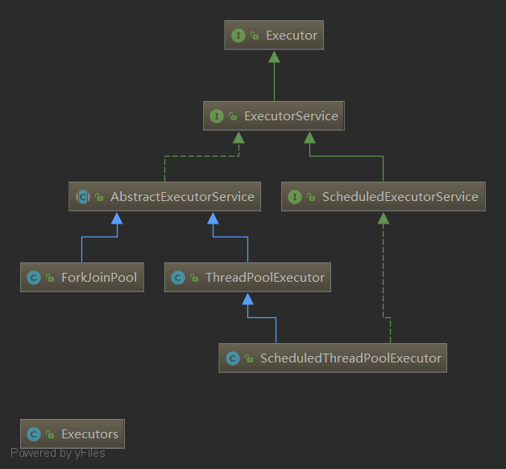

# ForkJoin

ForkJoin特点：工作窃取。

工作窃取，即每个线程负责一个任务队列，部分线程可能会较先完成自己队列中的任务，此时这个线程会从其他未完成的队列中偷走一个任务执行，任务队列使用双端队列。

## ForkJoinPool

ForkJoinPool 实现了 ExecutorService 接口，提供非 ForkJoinTask 客户 ForkJoinPool 的入场点，以及管理和监控操作。线程池中的所有线程都企图找到并执行提交给线程池的任务。当在构造方法中设置 asyncMode为true 的时候这种处理更加高效。

## ForkJoinTask

在 ForkJoinPool 内运行的任务的抽象基类。ForkJoinTask 是一个线程实体，其重量比普通线程轻得多。



直接子类：

- CountedCompleter：无返回值任务，完成任务后可以触发回调。
- RecursiveTask：一个递归有结果的 ForkJoinTask（有返回值）。
- RecursiveAction：一个递归无结果的 ForkJoinTask（没有返回值）。

## 使用 ForkJoin 进行计算

创建一个执行任务的类，并继承 ForkJoinTask 或其子类并重写 `compute()` 方法。

```java
class ForkJoinCalculate extends RecursiveTask<Long>{

    private long start;
    private long end;
    private long temp=10000L;

    public ForkJoinCalculate(long start, long end) {
        this.start = start;
        this.end = end;
    }

    @Override
    protected Long compute() {
        if ((end-start)<temp){
            long sum=0L;
            for (long i=start;i<end;i++){
                sum+=i;
            }
            return sum;
        }else {
            long mid=(start+end)/2;
            ForkJoinCalculate forkJoinCalculate = new ForkJoinCalculate(start, mid);
            // 调用fork方法提交任务，在当前任务正在运行的池中异步执行此任务
            // 如果是ForkJoinWorkerThread运行过程中fork()，则直接加入到它的工作队列中，否则，重新提交任务。(见ForkJoinWorkerThread)
            forkJoinCalculate.fork();
            ForkJoinCalculate forkJoinCalculate1 = new ForkJoinCalculate(mid, end);
            forkJoinCalculate1.fork();
            // 调用join方法返回计算结果
            // 异常完成导致RuntimeException或Error
            // get方法异常完成会导致ExecutionException
            return forkJoinCalculate.join()+forkJoinCalculate1.join();
        }
    }
}
```

创建 ForkJoinPool：

```java
ForkJoinPool forkJoinPool = new ForkJoinPool();
ForkJoinPool forkJoinPool = new ForkJoinPool(2, ForkJoinPool.defaultForkJoinWorkerThreadFactory, null, true);
// 参数一：parallelism - 并行级别。 对于默认值，请使用Runtime.availableProcessors()
// 参数二：factory - 创建新线程的工厂。 默认值为defaultForkJoinWorkerThreadFactory 。
// 参数三：handler - 由于执行任务时遇到不可恢复的错误而终止的内部工作线程的处理程序。 默认值为null 。
// 参数四：asyncMode - 如果为true，请为从未连接的分叉任务建立本地先进先出调度模式。 在工作线程仅处理事件式异步任务的应用程序中，此模式可能比默认的基于本地堆栈的模式更合适。 默认值为false 。
```

向 ForkJoinPool 提交任务：

```java
// submit有返回值
// execute没有返回值
ForkJoinTask<Long> submit = forkJoinPool.submit(new ForkJoinCalculate(0L,100_0000_0000L));
```

获取结果：

```java
Long sum = submit.get();
```
