# Basic

## 链接

创建链接：

```shell
# 硬链接
ln file link
# 符号链接
ln -s item link
```

硬链接：

- 以文件副本的形式存在，但不占用实际空间。
- 一个硬链接不能关联它所在文件系统之外的文件，也就是不能关联与链接自身不在同一个磁盘分区上的文件。
- 不允许给目录创建硬链接。

软链接：

- 产生一个特殊文档，其中内容是真是文件的位置。
- 软链接以路径形式存在。
- 软链接可以跨文件系统。
- 软链接可以对目录进行链接。
- 被软链接的文件、目录被删除后，软链接仍然存在，变为坏链接。

## 重定向

文件描述符：

- 0：标准输入。
- 1：标准输出。
- 2：标准错误输出。

- 文件描述符应当紧贴在重定向符号前。
- 标准错误输出的重定向必须出现在标准输出重定向之后，否则将不起作用。
- 重定向使用 `>` 符号完成，但是会覆盖原有内容，追加应使用 `>>`。
- 将输出重定向到 `/dev/null` 丢掉不需要的输出。

由于重定向符号的覆盖特点，可以使用下面的方法来清空一个文件：

```shell
> target
```

```shell
# 错误输出重定向到标准输出同目标
nohup java -jar test.jar > out.log 2>&1 &
```

管道线：

使用管道操作符 `|`（竖杠），一个命令的标准输出可以通过管道送至另一个命令的标准输入：

```shell
ls ~ | sort | less
```

被管道线组合在一起的多个命令被称为过滤器。

cat 命令：

cat 命令可以将多个文件连接在一起，结合重定向就能再输出到一个文件中：

```shell
cat *.txt > result
```

因为通配符展开总是有序的，所以这些文件将有序地输出到指定文件。

如果 cat 命令没有输入参数，则会读取标准输入，按 Ctrl+D(EOF) 结束。

sort 命令：

针对文本文件的内容，按行为单位进行排序，使用 `-k` 参数指明排序的参考列，使用 `-f` 将小写字母视为大写字母。

```shell
cat package.json | sort
```

uniq 命令：

删除重复行，使用 `-d` 参数可以查看重复的内容。

```shell
uniq Makefile
```

grep 命令：

打印匹配行，可以找到输入中的匹配内容，通过 `-i` 参数忽略大小写。

```shell
docker ps | grep -i REDIS
```

wc 命令：

打印行数、字数和字节数，`-l` 只打印行数，`-w` 只打印字数，`-c` 只显示字节数。

```shell
wc -lwc yarn.lock
```

head 命令：

打印文件开头部分，可以通过 `-n` 参数指定打印的行数。

```shell
head yarn.lock -n 100
```

tail 命令：

打印文件的结尾部分，默认打印 10 行，通过 `-n` 参数可以指定行数，如果指定的数字前带有正好，则会从第 n 行开始打印直到末尾。通过 `-f` 参数可以持续监测文件或输入流，当出现新内容后会立即输出，直到输入 Ctrl+C。

```shell
tail -f /var/log/syslog
```

tee 命令：

从标准输入读取并同时输出到标准输出和文件，使用 `-a` 参数附加到指定文件而不是覆盖。

```shell
tee test -a
```

## 展开

通配符：

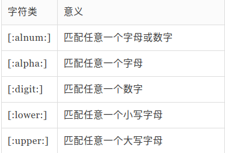

波浪线展开：

当用在一个单词开头时，它会展开为指定用户的家目录名，如果没有指定用户名，则展开成当前用户的家目录。

```shell
cd ~user
```

算术表达式展开：

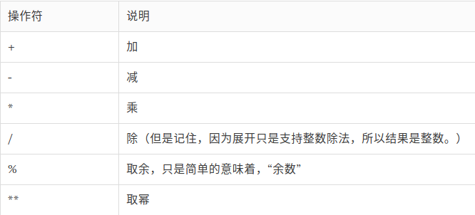

```shell
echo $((5**2-11%6))
```

花括号展开：

```shell
# 从一个包含花括号的模式中 创建多个文本字符串
echo PPG00{1,2,3,4,5,6,7} # PPG001 PPG002 PPG003 PPG004 PPG005 PPG006 PPG007
# 可以进行嵌套或指定区间
echo PPG00{1..7} # PPG001 PPG002 PPG003 PPG004 PPG005 PPG006 PPG007
echo a{A{1,2},B{3,4}}b # aA1b aA2b aB3b aB4b
```

参数展开：

```shell
# 查看有效的变量列表：
printenv
# 查看指定变量的值
echo $GOPATH
# 如果变量名输入有误则会输出空行
```

命令替换：

把一个命令的输出作为另一个命令的一部分来使用 `$(command)`。

```shell
docker stop $(docker ps -q)
```

引用：

shell 提供了一种 叫做引用的机制，来有选择地禁止不需要的展开。

```shell
# 下面的命令不会输出$100
echo price is $100
# 下面的会
echo price is '$100'
echo price is \$100
```

如果你把文本放在双引号中， shell 使用的特殊字符，都失去它们的特殊含义，被当作普通字符来看待。 有几个例外： $，\ (反斜杠），和 `（倒引号）。使用双引号可以操作文件名包含空格的文件。

单引号引用程度增强，$ 也被禁止展开。

转义字符也可以用来消除特殊符号的特殊含义。

## 键盘技巧

自动补全：

- 使用 tab 按键。
- 通过 `Alt+?` 显示可能的自动补全列表。

查看历史命令：

- 使用 `history` 命令查看历史记录，默认情况下最多存在 500 条历史记录。
- 按下 `Ctrl+r` 开始检索历史记录，输入要找的文本，如果已经找到，按下回车就能执行。

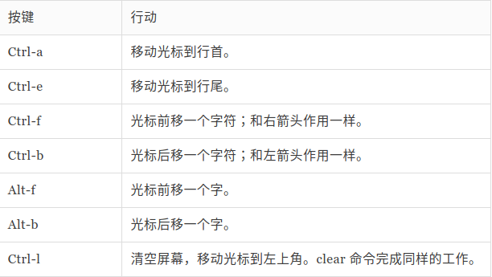

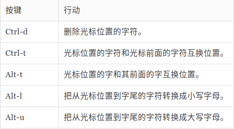

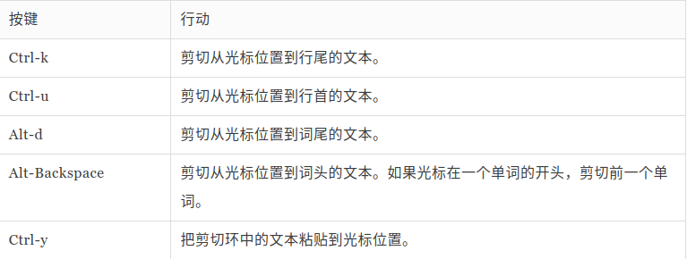

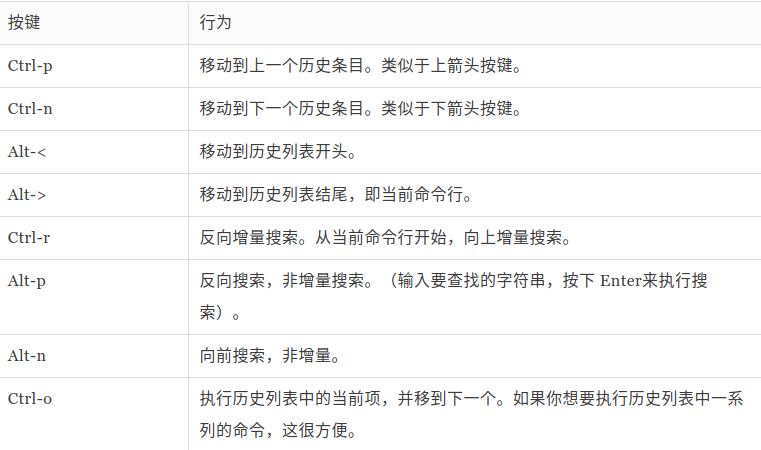

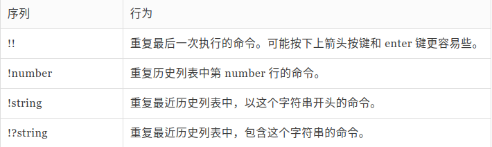

## 权限

账户信息：

用户帐户 定义在 /etc/passwd 文件里面，用户组定义在 /etc/group 文件里面。当用户帐户和用户组创建以后， 这些文件随着文件 /etc/shadow 的变动而修改，文件 /etc/shadow 包含了关于用户密码的信息。 对于每个用户帐号，文件 /etc/passwd 定义了用户（登录）名、uid、gid、帐号的真实姓名、家目录 和登录 shell。

读取、写入和执行：

执行 `ls -l` 的结果的前十个字符是文件的属性，其中第一个字符表示文件的类型。

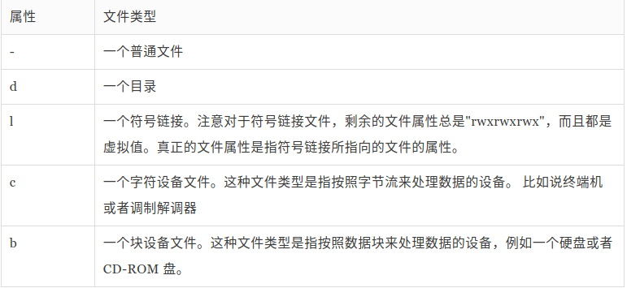

剩余九个字符称为文件模式，代表着文件所有者、文件组所有者和其他人的读、写、可执行权限：

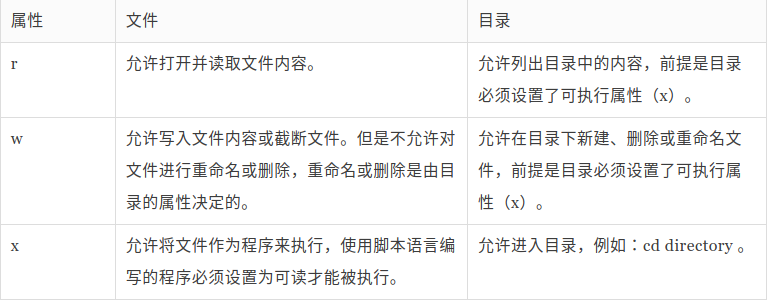

更改文件模式：

使用 `chmod` 命令可以修改文件模式，只有文件的所有者或者超级用户才能更改文件或目录的模式。

八进制、二进制数字表示法及对应模式：

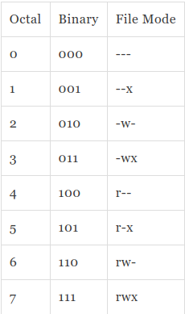

符号表示：

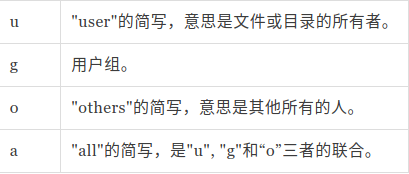

通过 `${用户符号} ${运算符 +-=} ${权限符号 rwx}` 为指定用户增加、移除、修改指定权限，如果不填用户符号则相当于 all。

更换身份：

- su：以其他用户身份和组运行一个 shell。

  `su [options] [user]`，`-m` 不改变环境变量，`-c [commond]` 切换到指定用户执行指定命令后再切换回来，`-s [shell]` 指定要使用的 shell，`-l` 切换到指定用户并使用指定用户的环境配置，如果不指定用户名，默认为 root，输入 exit 可以切换回原来的用户。

- sudo：以另一个用户身份执行命令。

  使用权限：在 /etc/sudoers 中有出现的使用者。查看自己的可用权限 `sudo -l`。

更改文件所有者和用户组命令：`chown`（change owner）。

此命令需要 root 权限。

语法：`chown [commond] user[:group] file...`。`-c` 显示修改的信息，`-f` 忽略错误信息，`-R` 处理指定目录及其中的所有文件。

更改文件或目录的所属组 `chgrp`。

语法：`chgrp [commond] [所属群组] [文件或目录...]`。`-f` 不显示错误信息，`-R` 递归处理，`-v` 显示指令执行过程。

## 进程

ps 命令：

- `-A`：列出所有的进程。
- `-w`：显示加宽可以显示较多的资讯。
- `-au`：显示较详细的资讯。
- `-aux`：显示所有包含其他使用者的进程。

STAT 字段含义：

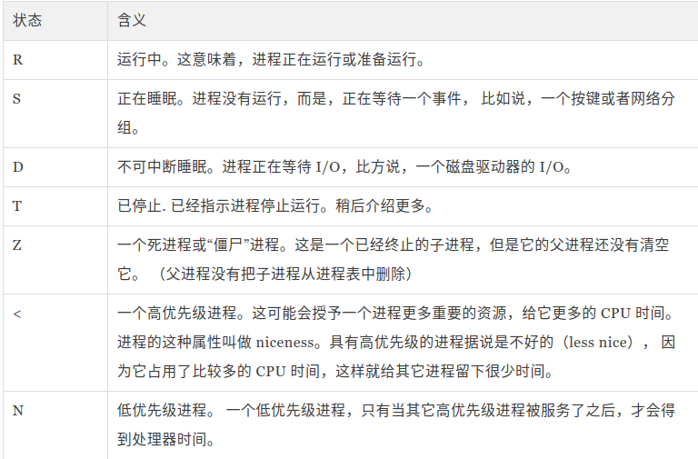

top 命令：

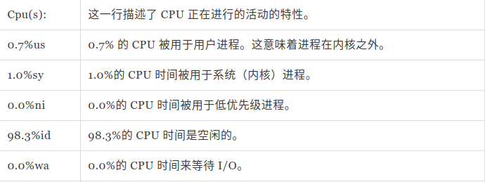

讲一个进程放置到后台：

在进程启动命令后添加 `&`。使用 `jobs` 命令可以看到正在运行的进程。

进程返回前台：

使用 `fg` 命令，后面接一个百分号和任务号，`fg %1`。

进程移动到后台： `bg` 命令。

停止进程 `Ctrl+z`。

向进程发送信号：`kill [signal] PID`。

常用信号：

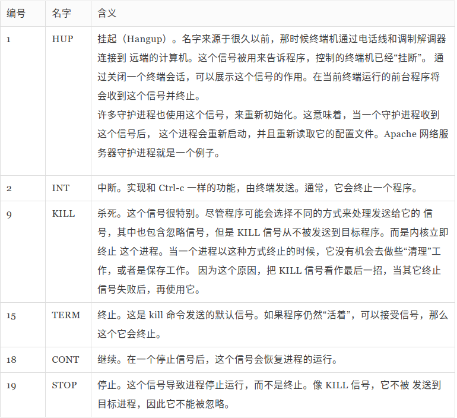

查看所有信号 `kill -l`，信号既可以用数字，也可以用名字。

其他命令：

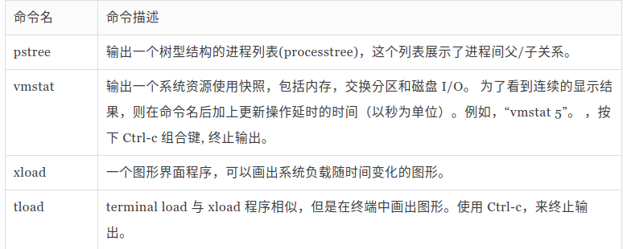

## shell 环境

登录 shell 会话启动内容：

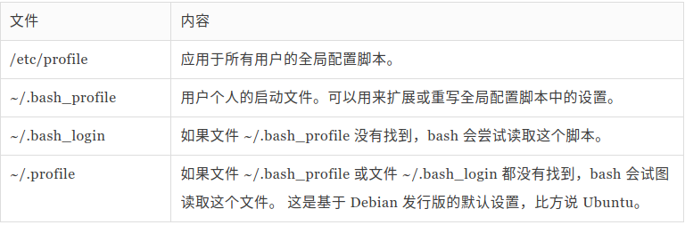

非登录会话启动内容：

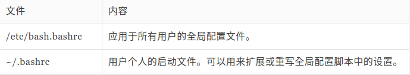

## vi basic

常用命令：

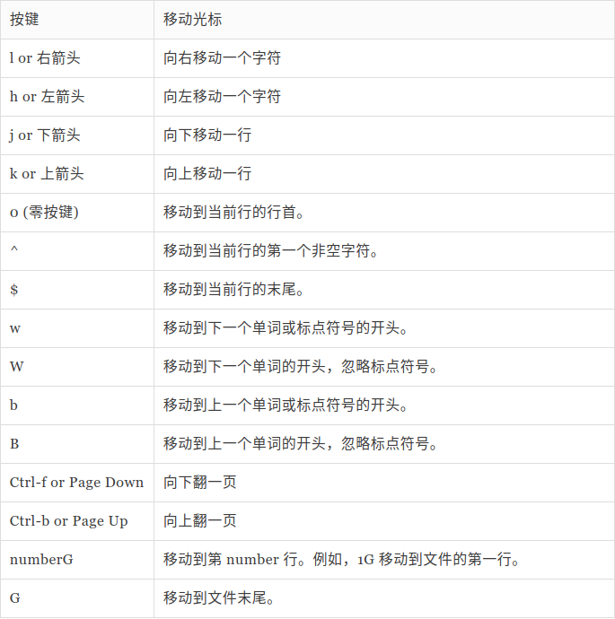

部分命令前加数字可以指定数目，例如右移位数。

基本编辑命令：

- `u` 命令：撤销所做的最后一次更改。
- `i` 命令：插入。
- `a` 命令：光标移到行尾时，使用 a 命令越过行尾并进入插入模式。
- `A` 命令：越过行尾并进入插入模式。
- `o` 命令：在当前行下方另起一行。
- `O` 命令：在当前行上方另起一行。
- `J` 命令：连接当前行和下面一行。
- `f` 命令：将光标移动到当前行的下一个匹配的字符上。
- `/` 命令：查找与指定字符串匹配的内容，重复使用 n 命令会定位到其他匹配的位置。

删除命令：

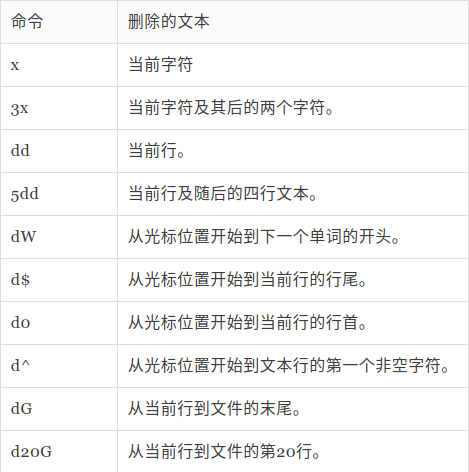

复制命令：

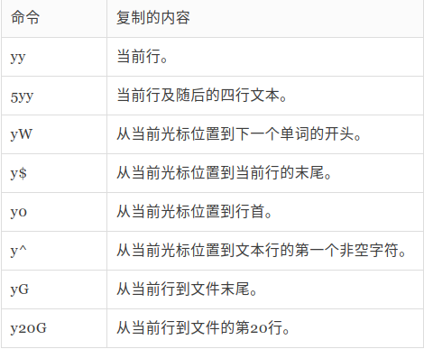

粘贴命令：

- `p` （小写）命令：粘贴到当前行的下面。
- `P` （大写）命令：粘贴到当前行的上面。

替换命令：

`:%s/Line/line/g` 将 Line 替换为 line。

各项含义：

- `%`：指定要操作的行数，表示第一行到最后一行；也可以用形如 1,5 指定范围，或者 1,$ 表示第一行到最后一行，如果不指定范围，默认就在当前行。
- `g`：意为“全局”，对文本行中所匹配的字符串执行查找和替换操作。如果省略 g，则 只替换每个文本行中第一个匹配的字符串。
- 可以在命令末尾增加一个 c 字符，在替换时要求逐个确认。

替换确认按键：

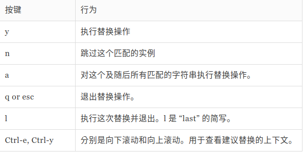

编辑多个文件：

- 文件间切换：
  - `:n` 切换到下一个文件。
  - `:N` 切换到先前的文件。
- 打开另一个文件并编辑：

  在已经打开的 vi 中使用 `:e foo.txt` 切换到另一个文件并关闭当前文件，但是可以使用 `:buffer` 来切换。

- 插入整个文件到另一个文件：
  - 整体复制、切换、粘贴。
  - 在被插入的文件中使用:`r [要插入的文件]`。

保存：

- `:w` [filename]：如果有 filename 就等价于另存为。
- `:wq`。
- `ZZ`。

## 软件包管理

这里包含 apt 软件管理器和 yum 软件管理器。

```shell
# 通过软件包安装
rpm -i package_file
dpkg --install package_file
# 卸载
apt-get remove package_name
yum erase package_name
# 更新
apt-get update; apt-get upgrade
yum update
dpkg --install package_file
rpm -U package_file
# 列出所安装的软件包
dpkg --list
rpm -qa
# 确定一个软件包是否已安装
dpkg --status package_name
rpm -q package_name
# 显示所安装软件包的信息
apt-cache show package_name
yum info package_name
# 查找安装了某个文件的软件包
dpkg --search file_name
rpm -qf file_name
```

## 网络系统

- ping：发送 ICMP 报文测试网络是否连通。
- traceroute：显示从本地到目的地走过的路由信息。
- netstat：检查各种各样的网络设置和统计数据。
  - `-l`：列出监听中的端口。
  - `-i`：显示网卡列表。
  - `-p`：显示是什么程序。
  - `-n`：不使用别名直接使用IP和数字。
- wget：下载单个、多个文件。

## DNS

- 使用 dig 工具可以看到域名解析过程，使用 @ 参数指定要去询问的 DNS 解析服务器 dig @8.8.8.8 www.google.com。
- 域名的层级结构：主机名.次级域名.顶级域名.根域名，其中次级域名用户可以注册，主机名用户可以随意分配。

## curl

- 不使用任何参数就是发起 get 请求。
- `-A` 参数：设置 User-Agent，`curl -A 'PPG007' localhost:8081/`。
- `-b` 参数：向服务器发送 Cookie，`curl -A 'PPG007' -b 'name=ppg' localhost:8081/`，也可以读取本地文件中的 Cookie。
- `-c` 参数：将服务器返回的 Cookie 写入指定文件，`curl -A 'PPG007' -b 'name=ppg;password=123' -c /home/user/playground/cookie.txt localhost:8081/demo`。
- `-d` 参数：发送 POST 请求的数据体，`curl -d "login-emma&password=123" localhost:8081/postParam`，`curl -d "login-emma" -d "password=123" localhost:8081/postParam`。
  - 使用 `-d` 参数以后，HTTP 请求会自动加上标头 Content-Type : application/x-www-form-urlencoded。并且会自动将请求转为 POST 方法，因此可以省略 `-X POST`。
  - 读取本地文件发送 `curl -d '@cookie.txt' localhost:8081/postParam`，必须加 @ 符。
- `--data-urlencode` 参数：等同于 -d 但是会自动将发送的数据进行 URL 编码。
  - 命令：`curl --data-urlencode 'comment=hello world' localhost:8081/postParam`。
  - 服务端收到：`comment=hello+world`。
- `-e` 参数：设置请求头中的 Referer 表示请求来源，`curl -e 'localhost' localhost:8081/headerTest`。
- `-F` 参数：向服务器上传二进制文件，`curl -F 'file=@foo.txt' localhost:8081/fileUploadTest`，上面命令会给 HTTP 请求加上标头 Content-Type: multipart/form-data，也可以指定 MIME 类型，还可以通过 filename 指定服务器收到的文件名。
- `-G` 参数：构造 URL 查询字符串，`curl -G -d 'username=ppg007' -d 'password=123' localhost:8081/getParams`，如果省略 -G 则会发送 POST 请求。
- `-H` 参数：设置请求头
  - `curl -H 'Content-Type:application/json' -d '{"name":"PPG007","password":"wuhu"}' localhost:8081/postParam`。
  - `curl -H 'Accept-Language:en-US' -H 'Content-Type:application/json' localhost:8081/headerTest`。
- `-i` 参数：打印服务器响应头，先输出响应头，空一行输出请求结果，`curl -i localhost:8081/responseHeader`。
- `-I`、`--head` 参数：只打印响应头。
- `-k` 参数：跳过 SSL 检测。
- `-L` 参数：让 HTTP 请求跟随服务器的重定向。curl 默认不跟随重定向，`curl -L -d 'username=ppg' -d 'password=123456' localhost:8081/beforeRedirect`。
- `--limit-rate` 参数：限制 HTTP 请求和回应的带宽，模拟慢网速的环境，`curl -I --limit-rate 100k localhost:8081/responseHeader` 限制每秒 100k 字节。
- `-o` 参数：将服务器的回应保存成文件，等同于 wget 命令，`curl -o download.png localhost:8081/downloadFile`。
- `-O` 参数：将服务器回应保存成文件，并将 URL 的最后部分当作文件名，`curl -O localhost:8081/downloadFile` 这里服务端直接输出流，那么 `downloadFile` 就是下载的文件名，不要在后面再添加，否则可能会 404。
- `-s` 参数：不输出错误和进度信息。
  - `curl -s https://www.example.com` 一旦发生错误，不会显示错误信息。不发生错误的话，会正常显示运行结果。
  - `curl -s -o /dev/null https://google.com` 不会出现任何输出。
- `-S` 参数：只输出错误信息
- `-u` 参数：设置服务器认证的用户名和密码，`curl -u 'bob:12345' https://google.com/login`。
- `-v` 参数：输出通信的整个过程，用于调试，`curl -L -d 'username=ppg' -d 'password=123456' -v localhost:8081/beforeRedirect`。
- `-x` 参数：指定 HTTP 请求的代理，如果不指定代理协议，默认是 HTTP，`curl https://www.google.com -x http://localhost:8889`。
- `-X` 参数：指定 HTTP 的请求方法，`curl -X PUT localhost:8081/putMethodTest`。

## 守护进程

- 把一个任务变为后台任务：
  - 在启动命令末尾添加 & 符号。
  - 如果要将当前运行的程序变为后台任务，按下 Ctrl+z 将任务切到后台并暂停，然后输入 bg 使得最近暂停的后台任务继续执行。
- 后台任务的特点：
  - 继承当前 session 会话的标准输出和标准错误输出，后台的输出依然会在命令行下显示。
  - 不继承当前 session 的标准输入，如果程序试图读取标准输入，那么它会被暂停执行。
- SIGHUP 信号：
  当用户结束 session 对话时，系统向该 session 发送 SIGHUP 信号，session 再把这个信号发给所有子进程，子进程在这个信号的作用下退出（有的情况下这个信号不会发送到后台任务），后台启动一个 http server，退出 shell 则对应端口将无法访问。

::: tip

如果一个进程不在 jobs 命令的返回结果中，session 就肯定不会向其发送 SIGHUP 信号。

:::

disown 命令：

disown 命令将指定的进程从 jobs 中删除：

```shell
# 移出最近一个正在执行的后台任务
disown

# 移出所有正在执行的后台任务
disown -r

# 移出所有后台任务
disown -a

# 不移出后台任务，但是让它们不会收到 SIGHUP 信号
disown -h

# 根据 jobId 移出指定的后台任务
disown %2
disown -h %2
```

对后台任务进行重定向：`node server.js > stdout.txt 2> stderr.txt < /dev/null &`。

nohup 命令：

- nohup 命令会阻止 session 发送 SIGHUP 信号到进程。
- nohup 命令会关闭标准输入。
- 重定向标准输出和标准错误输出到文件 nohup.out。
- nohup 命令不会自动把进程变为后台任务，需要使用 &。

## Systemd

### 系统管理

systemd 不是一个命令，而是一组命令

```shell
# 重启系统
sudo systemctl reboot

# 关闭系统，切断电源
sudo systemctl poweroff

# CPU 停止工作
sudo systemctl halt

# 暂停系统
sudo systemctl suspend

#让系统进入冬眠状态
sudo systemctl hibernate

# 让系统进入交互式休眠状态
sudo systemctl hybrid-sleep

# 启动进入救援状态（单用户状态）
sudo systemctl rescue
```

```shell
# 查看启动耗时
systemd-analyze

# 查看每个服务的启动耗时
systemd-analyze blame

# 显示瀑布状的启动过程流
systemd-analyza critical-chain

# 显示指定服务的启动流
systemd-analyza critical-chain atd.service
```

```shell
# 显示当前主机的信息
hostnamectl

# 设置主机名
sudo hostnamectl set-hostname user
```

```shell
# 查看本地化设置
localectl

# 设置本地化参数
sudo localectl set-locale LANG=en_GB.utf8
sudo localectl set-keymap en_GB
```

```shell
# 查看当前时区设置
timedatectl

# 显示所有可用的时区
timedatectl list-timezones

# 设置当前时区
sudo timedatectl set-timezone America/New_York
sudo timedatectl set-time YYYY-MM-DD
sudo timedatectl set-time HH:MM:SS
```

```shell
# 列出当前 session
loginctl list-sessions

# 列出当前登录用户
loginctl list-users

# 列出显示指定用户的信息
loginctl show-user user
```

### Unit

Systemd 可以管理所有系统资源。不同的资源统称为 Unit（单位）。

Unit 种类：

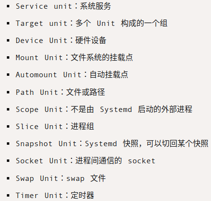

```shell
# 列出正在运行的 Unit
systemctl list-units

# 列出所有的 Unit，包括没有找到配置文件或者启动失败的
systemctl list-units --all

# 列出所有没有运行的 Unit
systemctl list-units --all --state=inactive

# 列出所有加载失败的 Unit
systemctl list-units --failed

# 列出所有正在运行的、类型为 service 的 Unit
systemctl list-units --type=service
```

Unit 的状态：

```shell
# 显示系统状态
systemctl status
# 显示单个 Unit 的状态
systemctl status ssh
# 显示远程主机某个 Unit 的状态
systemctl -H root@host status httpd
```

三个简单命令：

```shell
# 显示某个 Unit 是否正在运行
systemctl is-active ssh

# 显示某个 Unit 是否处于启动失败状态
systemctl is-failed ssh

# 显示某个 Unit 服务是否建立了启动链接
systemctl is-enabled ssh
```

Unit 管理：

```shell
# 立即启动一个服务
sudo systemctl start ssh

# 立即停止一个服务
sudo systemctl stop ssh

# 重启一个服务
sudo systemctl restart ssh

# 杀死一个服务的所有子进程
sudo systemctl kill ssh

# 重新加载一个服务的配置文件
sudo systemctl reload ssh

# 重载所有修改过的配置文件
sudo systemctl daemon-reload

# 显示某个 Unit 的所有底层参数
systemctl show httpd

# 显示某个 Unit 的指定属性的值
systemctl show -p CPUShares httpd

# 设置某个 Unit 的指定属性
sudo systemctl set-property httpd CPUShares=500
```

Unit 的依赖关系：

如果 Unit A 依赖于 Unit B，那么启动 A 的时候会去启动 B，使用 `systemctl list-dependencies ${unit name}` 列出一个 unit 的依赖。

Unit 的配置文件：

- Systemd 默认从目录 /etc/systemd/system/ 读取配置文件。但是，里面存放的大部分文件都是符号链接，指向目录 /usr/lib/systemd/system/，真正的配置文件存放在那个目录。
- systemctl enable 命令能够开启 unit 的开机启动，就是做出了软链接，与之对应的 systemctl disable 撤销开机启动。

配置文件状态：

systemctl list-unit-files 命令用于列出所有配置文件：

```shell
# 列出所有配置文件
systemctl list-unit-files

# 列出指定类型配置文件
systemctl list-unit-files --type=service
```

四种配置文件状态：

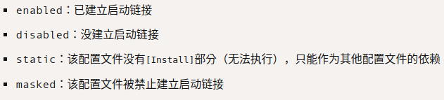

如果修改配置文件就需要重新加载配置文件并重启 unit：

```shell
sudo systemctl daemon-reload
sudo systemctl restart httpd
```

配置文件的内容：

使用 `systemctl cat ${unit name}` 查看某个 unit 的配置文件内容。

```conf
[Unit]
Description=DockerHostsUpdater
After=network.target nss-lookup.target
[Service]
User=root
Type=simple
ExecStart=/home/user/docker-hosts-updater
ExecStop=kill -9 $(pidof docker-hosts-updater)
ExecReload=kill -9 $(pidof docker-hosts-updater) && /home/user/docker-hosts-updater
Restart=on-failure

[Install]
WantedBy=multi-user.target
```

- Unit 区块，通常是配置文件的第一个区块，用来定义 Unit 的元数据以及配置与其他 Unit 的关系：

  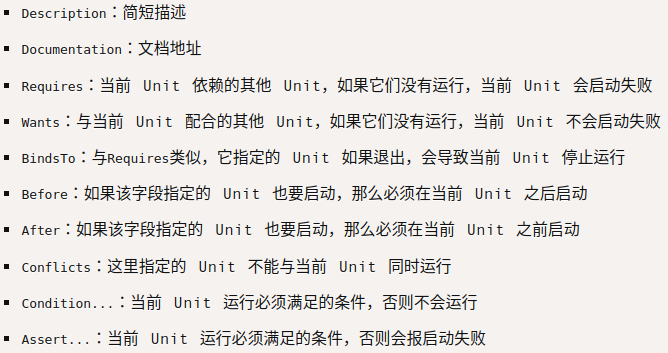

- Install 区块，通常是配置文件的最后一个区块，用来定义如何启动以及是否开机启动：

  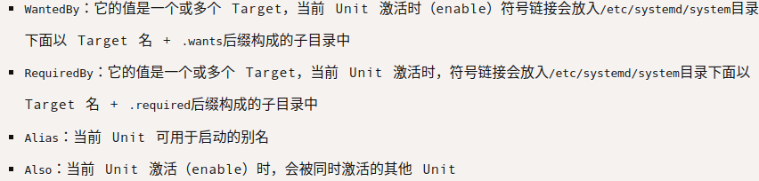

- Service 区块，用来进行 Service 的配置，只有 Service 类型的 Unit 才有这个区块：

  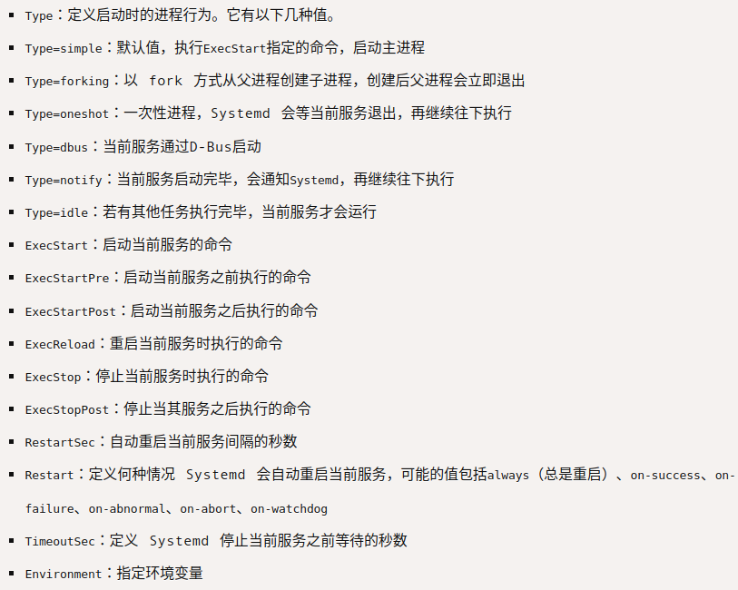

### Target

需要启动很多 unit 的时候每次都要明确指出要启动哪个 unit 十分不方便，使用 Target 管理一组 unit，类似于一个目标点，多个 Target 可以同时启动。

```shell
# 查看当前系统所有的 Target
systemctl list-unit-files --type=target

# 查看一个 Target 包含的所有 Unit
systemctl list-dependencies multi-user.target

# 查看启动时的默认 Target
systemctl get-default

# 设置启动时的默认 Target
sudo systemctl set-default multi-user.target

# 切换 Target 时，默认不关闭前一个 Target 启动的进程，
# systemctl isolate 命令可以改变这种行为
# 关闭前一个 Target 里面所有不属于后一个 Target 的进程
sudo systemctl isolate multi-user.target
```

### 日志管理 journalctl

```shell
# 查看所有日志（默认情况下只保存本次启动的日志）
sudo journalctl

# 查看内核日志（不显示应用日志）
sudo journalctl  -k

# 查看系统本次启动的日志
sudo journalctl -b
sudo journalctl -b -0

# 查看上一次启动的日志（需要更改设置）
sudo journalctl -b -1

# 查看指定时间的日志
sudo journalctl --since="2012-10-30 18:17:16"
sudo journalctl --since "20 min ago"
sudo journalctl --since yesterday
sudo journalctl --since "2015-01-10" --until "2015-01-11 03:00"
sudo journalctl --since 09:00 --until "1 hour ago"

# 显示尾部的最新 10 行日志
sudo journalctl -n

# 显示尾部指定行数的日志
sudo journalctl -n 20

# 实时滚动显示最新日志
sudo journalctl -f

# 查看指定服务的日志
sudo journalctl /usr/lib/systemd/systemd

# 查看指定进程的日志
sudo journalctl _PID=1

# 查看某个路径的脚本的日志
sudo journalctl /usr/bin/bash

# 查看指定用户的日志
sudo journalctl _UID=33 --since today

# 查看某个 Unit 的日志
sudo journalctl -u nginx.service
sudo journalctl -u nginx.service --since today

# 实时滚动某个 Unit 的最新日志
sudo journalctl -u nginx.service -f
```

```shell
# 合并显示多个 Unit 的日志
journalctl -u nginx.service -u php-fpm.service --since today

# 查看指定优先级（及其以上级别）的日志，共有 8 级
# 0: emerg
# 1: alert
# 2: crit
# 3: err
# 4: warning
# 5: notice
# 6: info
# 7: debug
sudo journalctl -p err -b

# 日志默认分页输出，--no-pager 改为正常的标准输出
sudo journalctl --no-pager

# 以 JSON 格式（单行）输出
sudo journalctl -b -u nginx.service -o json

# 以 JSON 格式（多行）输出
sudo journalctl -b -u nginx.service -o json-pretty

# 显示日志占据的硬盘空间
sudo journalctl --disk-usage

# 指定日志文件占据的最大空间
sudo journalctl --vacuum-size=1G

# 指定日志文件保存多久
sudo journalctl --vacuum-time=1years
```

## ssh

### ssh 登录过程：

第一次ssh到远程主机时远程主机会发送它的公钥到客户端主机，客户机确认继续连接后会把远程主机的公钥保存到.ssh/known_hosts文件，下次再连接此远程主机时会去.ssh/known_hosts查看，如果是已经保存的公钥证明是信任主机，即不会告警并直接提示输入用户名密码登录。

- 密码登录：发起连接请求后，服务端返回自己的公钥给客户端，客户端将输入的密码使用此公钥加密后发给服务端，服务端使用私钥解密后判断密码是否正确。
- 公钥登录：客户端将自己的公钥存储到远程主机的.ssh/authorized_keys中，客户端发起登录时，远程主机会发送一段随机字符串给客户端，客户端用自己的私钥加密后重新发回远程主机，远程主机用存储的客户端公钥解密之后对比之前发送给客户端的字符串，相同的话即认为客户机认证，不在需要输入密码直接登录系统。

### 绑定本地端口

`ssh -D 8080 user@host`，使用这个命令将会在本地的 8080 端口上开启监听，实际上是一个 socks 代理，也就是说可以使用代理软件将请求通过 ssh 服务器转发出去。

### 本地端口转发

现在假设有三台主机，分别是本地主机 A，远程主机 B 和 C，但是 A 和 B 之间无法直接连通，C 既可以连通 A 也可以连通 B，可以使用 C 作为中转。

在 A 主机中执行下面的命令：

`ssh -L 2121:B:21 C`，此命令会在 A 主机的 2121 端口开启监听，将传入这个端口的请求经 C 转发到 B 的 21 端口上。

此命令中 L 参数共接收三个值，格式为 `本地端口:目标主机:目标主机端口`。

::: warning

L 参数中的目标主机是相对于 C 而言的，也就是说如果目标主机值为 localhost，那么实际上就是 C 主机。

:::

### 远程端口转发

依然使用上面的例子，但是 C 主机在内网中，A 无法访问 C，但是 C 能访问 A，可以使用远程端口转发，即从 C 上与 A 建立连接，然后在 A 上使用此连接进行转发。

在 C 主机上执行下面的命令：

`ssh -R 2121:B:21 A`，此命令会让 A 主机监听自己的 2121 端口然后将所有数据经此接口转发给 B 主机的 21 端口。

R 参数也接收三个值，格式为 `远程主机端口:目标主机:目标主机端口`。

::: warning

这里的目标主机同样是相对 C 来说的。

:::

### 其他参数

- N 参数，表示只连接远程主机，不打开远程 shell。
- T 参数，表示不为这个连接分配 TTY。N、T 两个参数可以放在一起用，代表这个 SSH 连接只用来传数据，不执行远程操作。
- f 参数，表示 SSH 连接成功后，转入后台运行。这样一来，你就可以在不中断 SSH 连接的情况下，在本地 shell 中执行其他操作。
- p 参数，指定连接到的端口。

例如使用下面的命令开启端口转发并后台执行：

```shell
ssh -fNT -D 8888 root@192.168.3.3
```

放到后台后只能使用 kill 关闭连接：

```shell
kill -9 $(pidof ssh)
```

### 防止 ssh 连接因无响应被超时关闭

通过修改 ssh 配置文件中的参数实现，客户端和服务端的修改进行一种即可。

服务端配置：

修改 /etc/ssh/ssh_config 的下面三个参数值：

```text
TCPKeepAlive no
ClientAliveInterval 60
ClientAliveCountMax 100
```

这意味着服务端将不会再发送 TCP 包确认客户端连接是否正常，但是仍然每隔 60 秒会发送一个加密的校验信息，如果客户端连续 100 次不正常，那么将断开连接。

客户端配置：

修改 /etc/ssh/ssh_config 的 ServerAliveInterval 为 60，此参数表示客户端每 60 秒向服务端发 alive 包。

或者在建立连接时使用 o 参数指定：

```shell
ssh -o "ServerAliveInterval 60" root@192.168.3.3
```

修改配置文件后需要执行 `sudo systemctl restart ssh`。

## Others

磁盘相关：

```shell
# 查看磁盘使用情况
df -h
# 查看当前目录各文件大小
sudo apt-get update
sudo apt-get install ncdu
# 默认按照大小排序
ncdu
```

ncdu 快捷键：

- n：按文件名进行排序。
- s：按文件大小进行排序。
- r：重新统计当前文件夹大小。
- g：用#或百分比显示各文件/目录的大小所占的百分比。
- i：显示当前文件/目录信息。
- C：按项目数排序（升序/降序）。
- d：删除选定的文件或目录。
- t：排序时将目录放在文件前面。
- q：退出。
