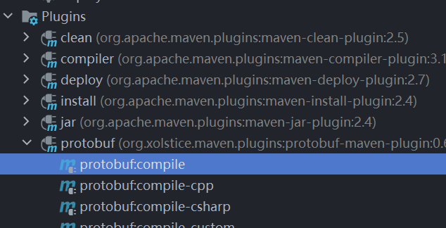
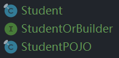

# Netty 编码解码

Netty 本身自带的 ObjectDecoder 和 ObjectEncoder 可以用来实现 POJO 对象或各种业务对象的编码和解码,底层使用的仍是 Java 序列化技术,而 Java 序列化技术本身效率就不高,存在如下问题：

- 无法跨语言。
- 序列化后的体积太大,是二进制编码的 5 倍多。
- 序列化性能太低。

新的解决方案：Google Protobuf。

Protobuf 官方文档：[Proto](https://developers.google.com/protocol-buffers)。

## 使用 Protobuf 编码传输单个类

引入 Maven 坐标

```xml
<dependency>
    <groupId>com.google.protobuf</groupId>
    <artifactId>protobuf-java</artifactId>
    <version>3.17.3</version>
</dependency>
```

引入 Maven 插件，可以使用此插件将 `.proto` 文件编译为 `.java` 文件：

```xml
<plugin>
    <groupId>org.xolstice.maven.plugins</groupId>
    <artifactId>protobuf-maven-plugin</artifactId>
    <version>0.6.1</version>
    <configuration>
        <protocExecutable>
            D:\protoc-3.17.3-win64\bin\protoc.exe  <!--protoc.exe-->
        </protocExecutable>
        <pluginId>protoc-java</pluginId>
        <!-- proto文件放置的目录 -->
        <protoSourceRoot>${project.basedir}/src/main/java/protocol</protoSourceRoot>
        <!-- 生成文件的目录 -->
        <outputDirectory>${project.basedir}/src/main/java</outputDirectory>
        <!-- 生成文件前是否把目标目录清空，这个最好设置为false，以免误删项目文件 -->
        <clearOutputDirectory>false</clearOutputDirectory>
    </configuration>
    <executions>
        <execution>
            <goals>
                <goal>compile</goal>
            </goals>
        </execution>
    </executions>
</plugin>
```

编译程序下载地址：[protoc](https://github.com/protocolbuffers/protobuf/releases/tag/v3.17.3)。

在 Maven 插件配置的 proto 文件目录中新建一个 `.proto` 文件。

`Student.proto`：

```protobuf
syntax="proto3";//指定版本
option java_package="pojo";//指定生成的java文件在哪个包下
option java_outer_classname="StudentPOJO";//指定生成java文件的名字，不能和下面定义的message重名
option java_multiple_files = true;//开启多文件，不开就生成一个java文件，开了会生成接口和类
//proto中数据类型以message定义，与class类似
message Student{
//proto中的类型，对应关系参考官方文档
  int32 id=1;//等号不是赋值，而是一个标记，不能重复，就像是数据库主键一样
  string name=2;
  double salary=3;
}
```

执行 Maven 插件的 compile 命令：



在指定的包下生成三个文件：



Netty 客户端设置编码器，注意添加 handler 的先后顺序，发送放在自定义 handler 中，所以编码要放在自定义 handler 之前。

```java
bootstrap.group(eventExecutors)
    .channel(NioSocketChannel.class)
    .handler(new ChannelInitializer<SocketChannel>() {
        @Override
        protected void initChannel(SocketChannel ch) {
            ch.pipeline().addLast(new ProtobufEncoder());
            ch.pipeline().addLast(new ClientHandler());
        }
    });
```

Netty 客户端自定义 handler：

```java
public class ClientHandler extends ChannelInboundHandlerAdapter {
    @Override
    public void channelRead(ChannelHandlerContext ctx, Object msg) {
        ByteBuf byteBuf = (ByteBuf) msg;
        System.out.println("client received==>"+byteBuf.toString(StandardCharsets.UTF_8));
        System.out.println("server address==>"+ctx.channel().remoteAddress());
    }

    @Override
    public void channelActive(ChannelHandlerContext ctx) {
        System.out.println("client "+ctx);
        Student student = Student.newBuilder().setId(31).setName("李在干神魔").setSalary(5.5).build();
        ctx.writeAndFlush(student);
    }
}
```

Netty 服务端设置解码器，自定义 handler 负责读取输出，所以解码放在自定义 handler 前：

```java
.childHandler(new ChannelInitializer<SocketChannel>() {
    @Override
    protected void initChannel(SocketChannel ch) {
        ChannelPipeline pipeline = ch.pipeline();
        pipeline.addLast(new ProtobufDecoder(Student.getDefaultInstance()));
        pipeline.addLast(new ServerHandler());

    }
});
```

Netty 服务端自定义 handler：

```java
public class ServerHandler extends ChannelInboundHandlerAdapter {
    @Override
    public void channelReadComplete(ChannelHandlerContext ctx) {
        ctx.writeAndFlush(Unpooled.copiedBuffer("扎不多得嘞",StandardCharsets.UTF_8));
    }

    @Override
    public void exceptionCaught(ChannelHandlerContext ctx, Throwable cause) {
        ctx.channel().close();
    }

    @Override
    public void channelRead(ChannelHandlerContext ctx, Object msg) {
        System.out.println("server ctx==>"+ctx);
        //强制类型转换
        Student student = (Student) msg;
        System.out.println(student.getId());
        System.out.println(student.getName());
        System.out.println(student.getSalary());
    }
}
```

如果继承的父类 handler 是支持泛型的，也可以通过泛型指定消息类型，不需要强制类型转换，如 `SimpleChannelInboundHandler`

## 使用 Protobuf 编码传输多个类

同样先创建 `.proto` 文件：

```protobuf
syntax="proto3";
option java_package="pojo";
option java_outer_classname="SchoolPOJO";
option java_multiple_files = true;
option optimize_for=SPEED;//加速编译
message Teacher{//定义一个Teacher
  int32 id=1;
  string name=2;
}
message Child{//定义一个Child
  int32 age=1;
  string name=2;
}
message School{//定义School，由School管理前面的两个类型
  enum DataType{//创建枚举类，注意枚举类元素标记从0开始，枚举是内部枚举
    TeacherType=0;
    ChildType=1;
  }
  //标识传递的是哪个枚举类型，注意：上面的是枚举，而下面的是数据类型(相当于实例)，也就是说Teacher中有两个数据类型
  DataType data_type=1;
  //oneof表示其中的类型只能是其中一个，要么是Teacher要么是Child
  oneof dataBody{
    Teacher teacher=2;
    Child child=3;
  }
}
```

Netty 客户端编码器配置不变，自定义 handler 如下：

```java
public class ClientHandler extends ChannelInboundHandlerAdapter {
    @Override
    public void channelRead(ChannelHandlerContext ctx, Object msg) {
        ByteBuf byteBuf = (ByteBuf) msg;
        System.out.println("client received==>"+byteBuf.toString(StandardCharsets.UTF_8));
        System.out.println("server address==>"+ctx.channel().remoteAddress());
    }

    @Override
    public void channelActive(ChannelHandlerContext ctx) {
        System.out.println("client "+ctx);

        Child child = Child.newBuilder().setName("孩子").setAge(1).build();
        School school = School.newBuilder().setDataType(School.DataType.ChildType).setChild(child).build();
        ctx.writeAndFlush(school);

        Teacher teacher = Teacher.newBuilder().setId(2).setName("教师").build();
        School school1 = School.newBuilder().setDataType(School.DataType.TeacherType).setTeacher(teacher).build();
        ctx.channel().eventLoop().schedule(()->{
            ctx.writeAndFlush(school1);
        },10,TimeUnit.SECONDS);
    }
}
```

创建 `School` 类还是使用 `newBuilder()`，但是还要设置数据类型，因为 `.proto` 文件使用了 `oneof`，然后传入对应的实例对象调用 `build()` 完成创建：

Netty 服务端解码器配置，这里就变成了传入 `School` 对象。

```java
.childHandler(new ChannelInitializer<SocketChannel>() {
    @Override
    protected void initChannel(SocketChannel ch) {
        ChannelPipeline pipeline = ch.pipeline();
        pipeline.addLast(new ProtobufDecoder(School.getDefaultInstance()));
        pipeline.addLast(new ServerHandler());

    }
});
```

Netty 服务端自定义 handler：

```java
public class ServerHandler extends ChannelInboundHandlerAdapter {
    @Override
    public void channelReadComplete(ChannelHandlerContext ctx) {
        ctx.writeAndFlush(Unpooled.copiedBuffer("扎不多得嘞",StandardCharsets.UTF_8));
    }

    @Override
    public void exceptionCaught(ChannelHandlerContext ctx, Throwable cause) {
        ctx.channel().close();
    }

    @Override
    public void channelRead(ChannelHandlerContext ctx, Object msg) {
        System.out.println("server ctx==>"+ctx);
        School school = (School) msg;
        School.DataType dataType = school.getDataType();
        if (dataType== School.DataType.ChildType){
            Child child = school.getChild();
            System.out.println(child.getName());
            System.out.println(child.getAge());
        }else {
            Teacher teacher = school.getTeacher();
            System.out.println(teacher.getId());
            System.out.println(teacher.getName());
        }
    }
}
```

先强制转换为大类型(School)，然后判断 DataType 再调用对应方法即可获取对应值。
