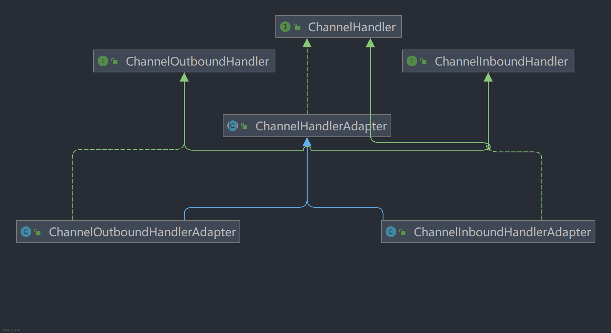
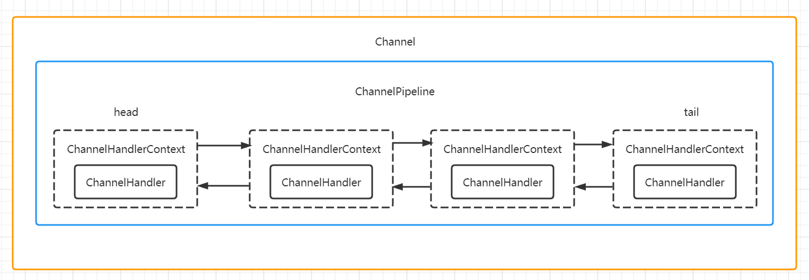

# Netty核心模块

## Bootstrap、ServerBootstrap

Bootstrap 是*客户端*的启动引导类，ServerBootstrap 是*服务端*的启动引导类。

常用方法：

```java
group(bossGroup,workerGroup)//用于服务端指定两个EventLoopGroup
group(eventGroup)//用于客户端设置一个EventLoopGroup
channel(NioServerSocketChannel.class)//用于服务端指定服务端channel或客户端指定客户端channel类型
option(ChannelOption.SO_BACKLOG,128)//给自己的channel添加配置
childOption(ChannelOption.SO_KEEPALIVE,true)//给接收到的channel添加配置
childHandler()//添加自定义handler
serverBootstrap.bind()//用于服务端，绑定监听端口号
bootstrap.connect()//用于客户端连接服务端
```

## Future、ChannelFuture

Netty 中 I/O 操作都是异步的，不能立刻得知消息是否正确处理，通过 Future、ChannelFuture 注册监听回调获取执行结果。

## Channel

支持关联 I/O 操作与对应的处理程序。

不同协议、不同的阻塞类型的连接都有不同的 Channel 与之对应，常用的 Channel 类型：

- NioSocketChannel：异步的客户端 TCP Socket 连接。
- NioServerSocketChannel：异步的服务端 TCP Socket 连接。
- NioDatagramChannel：异步的 UDP 连接。
- NioSctpChannel：异步的客户端 Sctp 连接。
- NioSctpServerChannel：异步的服务端 Sctp 连接。

## Selector

Netty 基于 Selector 对象实现 I/O 多路复用，通过 Selector 一个线程可以监听多个连接的 Channel 事件。

当向一个 Selector 中注册 Channel 后，Selector 内部的机制就可以自动不断地查询(Select)这些注册的 Channel 是否有已就绪的 I/O 事件（例如可读，可写，网络连接完成等)，这样程序就可以很简单地使用一个线程高效地管理多个 Channel。

## ChannelHandler 及其实现类

ChannelHandler 是一个接口，处理 I/О 事件或拦截 I/O 操作，并将其转发到其 ChannelPipeline(业务处理链)中的下一个处理程序。

ChannelHandler 本身并没有提供很多方法，因为这个接口有许多的方法需要实现，方便使用期间，可以继承它的子类。



- ChannelInboundHandler：处理入站 I/O 事件。
- ChannelOutboundHandler：处理出站 I/O 操作。
- ChannelInboundHandlerAdapter：处理入站 I/O 事件。
- ChannelOutboundHandlerAdapter：处理出站 I/O 操作。
- ChannelDuplexHandler：用于处理入站和出站事件。

## Pipeline 和 ChannelPipeline

ChannelPipeline 是一个 Handler 的集合，它负责处理和拦截 inbound 或者 outbound 的事件和操作，相当于一个贯穿 Netty 的链(也可以这样理解:ChannelPipeline 是保存 ChannelHandler 的 List，用于处理或拦截 Channel 的入站事件和出站操作)。

ChannelPipeline 实现了一种高级形式的拦截过滤器模式，使用户可以完全控制事件的处理方式，以及 Channel 中各个的 ChannelHandler 如何相互交互。



一个 Channel 包含了一个ChannelPipeline，而 ChannelPipeline 中又维护了一个由 ChannelHandlerContext 组成的双向链表，并且每个 channelHandlerContext 中又关联着一个 channelHandler
入站事件和出站事件在一个双向链表中，入站事件会从链表 head 往后传递到最后一个入站的 handler,出站事件会从链表 tail 往前传递到最前一个出站的 handler，两种类型的 handler 互不干扰。

## ChannelHandlerContext

保存 Channel 相关所有上下文信息，同时关联一个 ChannelHandler 对象。

即 ChannelHandlerContext 中包含了一个具体的事件处理器 ChannelHandler 同时 ChannelHandlerContext 中也绑定了对应的 pipeline 和 Channel 信息。

## ChannelOption

SO_BACKLOG：

对应 TCP/IP 协议 listen 函数中的 backlog 参数，用来初始化服务器可连接队列大小，多个请求到来时，服务端一次处理一个，把暂时没处理的放入队列。

SO_KEETALIVE：

一直保持连接活动状态，布尔值。

## EventLoopGroup 及其实现类 NioEventLoopGroup

EventLoopGroup 是一组 EventLoop 的抽象,Netty 为了更好的利用多核 CPU 资源一般会有多个 EventLoop 同时工作,每个 EventLoop 维护着一个 Selector 实例。

EventLoopGroup 提供 next 接口,可以从组里面按照一定规则获取其中一个 EventLoop 来处理任务。在 Netty 服务器端编程中,我们一般都需要提供两个 EventLoopGroup,例如: BossEventLoopGroup 和  WorkerEventLoopGroup。

通常一个服务端口即一个 ServerSocketChannel 对应一个 Selector 和一个 EventLoop 线程。 BossEventLoop 负责接收客户端的连接并将 SocketChannel 交给 WorkerEventLoopGroup 来进行 I/O 处理。

BossEventLoopGroup 通常是一个单线程的 EventLoop, EventLoop 维护着一个注册了 ServerSocketChannel 的 Selector 实例 BossEventLoop 不断轮询 Selector 将连接事件分离出来。

通常是 OP_ACCEPT 事件,然后将接收到的 SocketChannel 交给 WorkerEventLoopGroup。

WorkerGroup 会由 next 选择其中一个 EventLoop 来将这个 SocketChannel 注册到其维护的 Selector 并对其后续的 I/O 事件进行处理。

## Unpooled 类

Netty 提供的一个专门用来操作缓冲区的工具类，用来将字符串、整数等值转化为 Netty 中的 `ByteBuf`。
