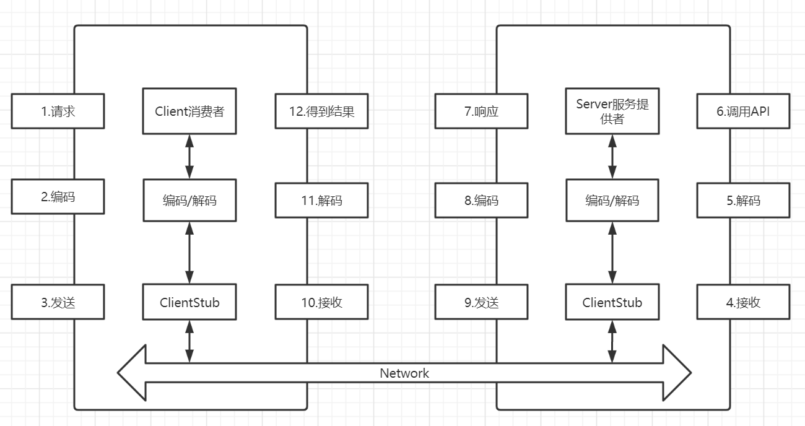

# RPC 调用

## RPC 流程



RPC 服务将 2-11 步封装起来，消费者只能看到调用与结果。

## Netty 实现 RPC

### 设计描述

1. 创建一个接口，定义抽象方法，用于消费者和提供者的约定。
2. 创建一个提供者，该类需要监听消费者的请求，并按照约定返回数据。
3. 创建一个消费者，该类需要透明的调用自己不存在的方法，内部需要使用 Netty 请求提供者返回数据。

### 具体实现

接口：

```java
public interface DemoInterface {

    /**
     * 返回逆序字符串
     * @param source 源串
     * @return 逆序字符串
     */
    String reverse(String source);

    /**
     * 返回两个整数的和
     * @param a 整数a
     * @param b 整数b
     * @return a+b
     */
    Integer sum(int a,int b);
}
```

Provider 中的实现类:

```java
public class DemoInterfaceImpl implements DemoInterface {
    @Override
    public String reverse(String source) {
        return new StringBuilder(source).reverse().toString();
    }

    @Override
    public Integer sum(int a, int b) {
        return a + b;
    }
}
```

服务端 Netty Handler：

RPC 要有规定传输格式，这里简化为使用井号分隔，分割后第一个字符串是要调用的方法名，之后是参数，由于只添加了 String 编码解码器，所有为了简化这里都用 String 传输。

```java
public class NettyServerHandler extends ChannelInboundHandlerAdapter {
    @Override
    public void channelRead(ChannelHandlerContext ctx, Object msg) throws Exception {
        String[] split = msg.toString().split("#");
        if ("reverse".equals(split[0])){
            String reverse = new DemoInterfaceImpl().reverse(split[1]);
            ctx.writeAndFlush(reverse);
        }else if ("sum".equals(split[0])){
            Integer sum = new DemoInterfaceImpl().sum(Integer.parseInt(split[1]), Integer.parseInt(split[2]));
            ctx.writeAndFlush(String.valueOf(sum));
        }
    }

    @Override
    public void exceptionCaught(ChannelHandlerContext ctx, Throwable cause) throws Exception {
        ctx.channel().closeFuture();
    }

    @Override
    public void channelActive(ChannelHandlerContext ctx) throws Exception {
    }

    @Override
    public void handlerAdded(ChannelHandlerContext ctx) throws Exception {
    }
}
```

编写 Netty 服务端：

```java
public class NettyServer {

    private NioEventLoopGroup boss;

    private NioEventLoopGroup worker;

    public void run(int port){
        this.boss=new NioEventLoopGroup(1);
        this.worker=new NioEventLoopGroup();
        ServerBootstrap serverBootstrap = new ServerBootstrap();
        serverBootstrap
                .group(boss,worker)
                .channel(NioServerSocketChannel.class)
                .childHandler(new ChannelInitializer<SocketChannel>() {
                    @Override
                    protected void initChannel(SocketChannel ch) throws Exception {
                        ChannelPipeline pipeline = ch.pipeline();
                        pipeline.addLast(new StringEncoder())
                                .addLast(new StringDecoder())
                                .addLast(new NettyServerHandler());
                    }
                });
        try {
            ChannelFuture channelFuture = serverBootstrap.bind(port).sync();
            channelFuture.addListener((ChannelFutureListener) future -> {
                if (future.isSuccess()){
                    System.out.println("服务端启动成功");
                }
            });
            channelFuture.channel().closeFuture().sync();
        } catch (InterruptedException e) {
            e.printStackTrace();
        } finally {
            this.boss.shutdownGracefully();
            this.worker.shutdownGracefully();
        }
    }
}
```

编写 Provider 启动类：

```java
public class Server {
    public static void main(String[] args) {
        NettyServer nettyServer = new NettyServer();
        nettyServer.run(8848);
    }
}
```

编写 Netty 客户端Handler，客户端实现 Callable 接口，具体思路是在消费者发出 RPC 请求后，创建一个 Handler 对象，然后启动 Netty 客户端，添加 Handler，调用了 active 方法，此时成员变量 context 被赋值，由于 Handler 实现了 Callable 接口，可以交给线程池运行，在 call 方法中发出 RPC 请求，并调用 wait 阻塞等待结果，read 方法在服务提供者传回消息后调用，将结果赋给成员变量 result 并调用 notify 唤醒 call 方法，返回执行结果，call 和 read 方法要使用 synchronized 同步。

```java
public class NettyClientHandler extends ChannelInboundHandlerAdapter implements Callable {

    private ChannelHandlerContext context;

    private String result;

    private String params;

    public void setParams(String params) {
        this.params = params;
    }

    @Override
    public synchronized Object call() throws Exception {
        System.out.println("发出RPC请求");
        this.context.writeAndFlush(this.params);
        wait();
        return this.result;

    }

    @Override
    public void channelActive(ChannelHandlerContext ctx) throws Exception {
        this.context=ctx;
    }

    @Override
    public synchronized void channelRead(ChannelHandlerContext ctx, Object msg) throws Exception {
        this.result=msg.toString();
        System.out.println("获取结果，准备唤醒");
        notify();
    }

    @Override
    public void exceptionCaught(ChannelHandlerContext ctx, Throwable cause) throws Exception {
        ctx.channel().close();
    }
}
```

编写 Netty 客户端：

静态代码块中初始化线程池与启动 Netty 客户端并连接，为连接添加监听，在连接成功后给标志位 success 赋值 1，失败赋值为 0，success 初始值为 -1，success 要使用 volatile 保证对 getInstance 方法可见，getInstance 方法接收一个 Class 对象使用动态代理创建一个此类对象，这样消费者在调用 getInstance 方法后获取到的就是接口的动态代理对象，可以直接调用方法。通过 `Proxy.newProxyInstance` 方法创建动态代理，由于只用了 String 编码解码器，所以要判断调用的 method 的返回值类型，如果是 int 就调用 `parseInt` 解析为 int，将客户端 Handler 对象提交给线程池并调用 get 方法获取最终结果。

```java
public class NettyClient {
    public static ExecutorService executorService;

    static {
        executorService = new ThreadPoolExecutor(
                Runtime.getRuntime().availableProcessors() / 2,
                Runtime.getRuntime().availableProcessors(),
                10,
                TimeUnit.SECONDS,
                new ArrayBlockingQueue<>(10),
                new ThreadPoolExecutor.DiscardPolicy());
        executorService.execute(NettyClient::init);
    }

    private static NettyClientHandler clientHandler;

    private volatile static int success=-1;

    public static void init(){
        clientHandler=new NettyClientHandler();
        NioEventLoopGroup eventExecutors = new NioEventLoopGroup();
        Bootstrap bootstrap = new Bootstrap();
        bootstrap.group(eventExecutors)
                .channel(NioSocketChannel.class)
                .handler(new ChannelInitializer<SocketChannel>() {
                    @Override
                    protected void initChannel(SocketChannel ch) throws Exception {
                        ChannelPipeline pipeline = ch.pipeline();
                        pipeline.addLast(new StringDecoder())
                                .addLast(new StringEncoder())
                                .addLast(clientHandler);
                    }
                });
        try {
            ChannelFuture channelFuture = bootstrap.connect("localhost",8848).sync();
            channelFuture.addListener((ChannelFutureListener) future -> {
                if (future.isSuccess()){
                    System.out.println("请求启动成功");
                    success=1;
                }else{
                    success=0;
                }
            });
            channelFuture.channel().closeFuture().sync();
        } catch (InterruptedException e) {
            System.out.println("连接断开");
        }finally {
            eventExecutors.shutdownGracefully();
        }
    }

    public Object getInstance(Class<?> service){
        return Proxy.newProxyInstance(Thread.currentThread().getContextClassLoader()
                , new Class<?>[]{service}, ((proxy, method, args) -> {
                    while (success<=0);
                    String str=method.getName();
                    for (Object arg : args) {
                        str+="#"+arg;
                    }
                    clientHandler.setParams(str);
                    return method.getReturnType()==Integer.class
                            ?Integer.parseInt(executorService.submit(clientHandler).get().toString())
                            :executorService.submit(clientHandler).get();
                }));
    }
}
```

编写消费者：

```java
public class Client {

    public static void main(String[] args) {
        NettyClient nettyClient = new NettyClient();
        DemoInterface instance = (DemoInterface) nettyClient.getInstance(DemoInterface.class);
        String result = instance.reverse("蚌埠住了");
        System.out.println(result);
        System.out.println(instance.sum(1, 2));
        NettyClient.executorService.shutdownNow();
    }
}
```
