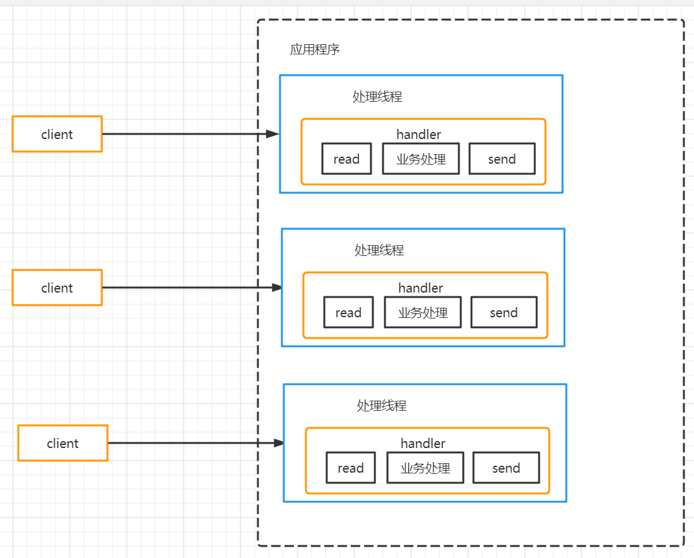
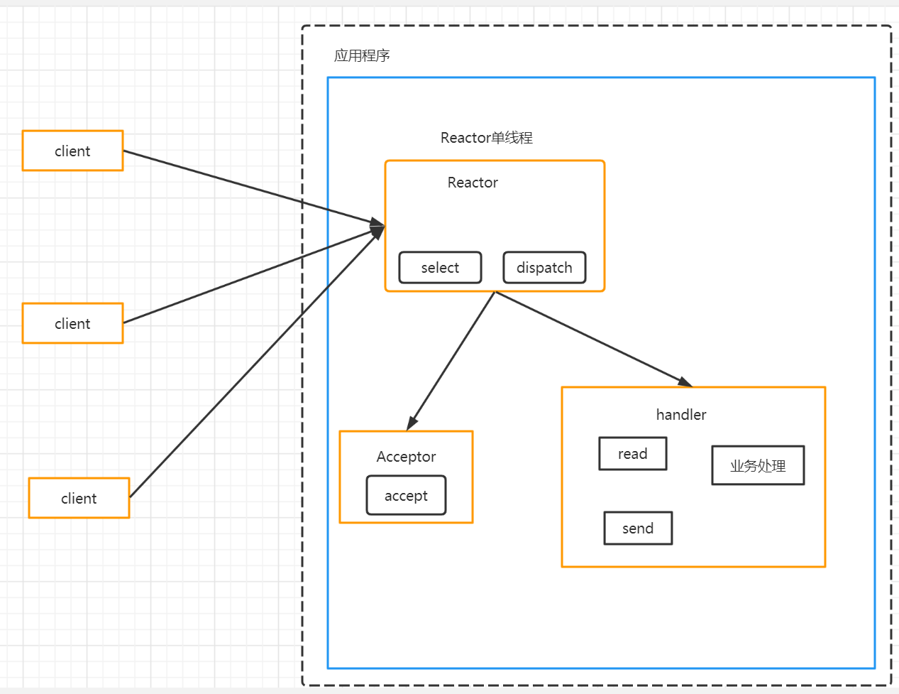
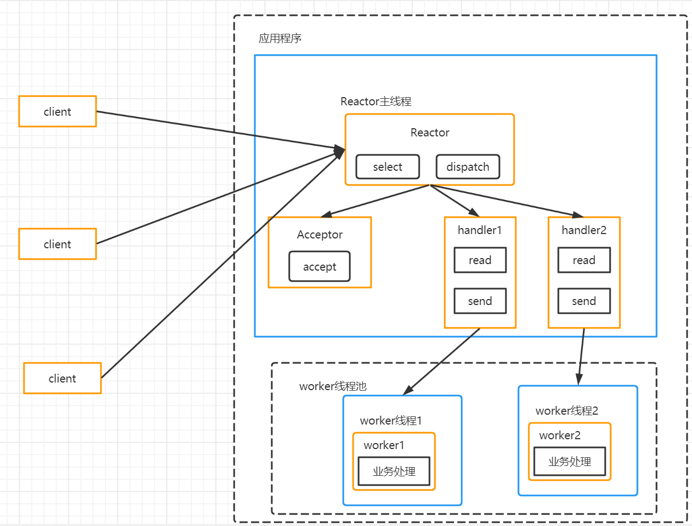
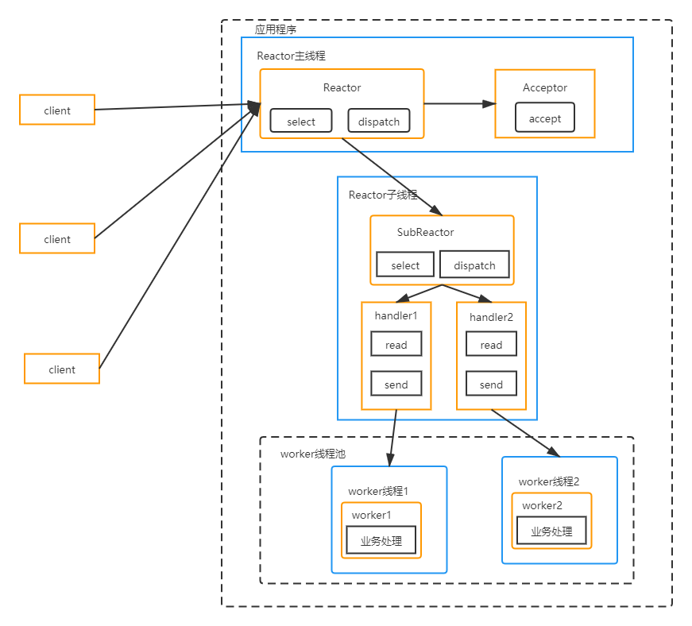
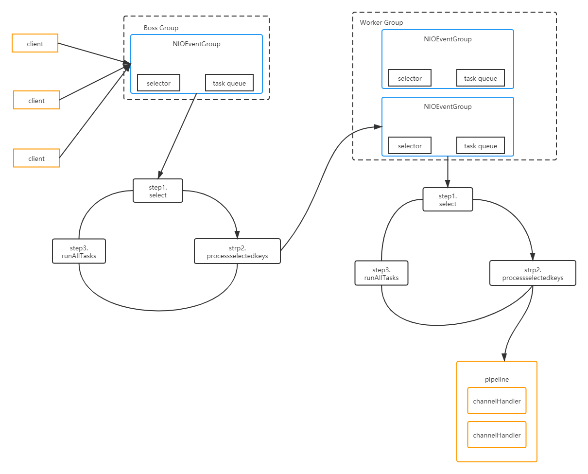

# 线程模型

## 传统阻塞 I/O 服务模型



每个连接都需要一个线程完成业务处理、输入输出，如果线程没有数据可读，会阻塞在 read，浪费资源，并发量很大时，创建大量线程，占用很大系统资源。

## Reactor模型

- 基于 I/O 复用模型，多个连接共用一个阻塞对象。
- 基于线程池复用线程。

### 单Reactor单线程



服务端用一个线程多路复用实现了所有的处理任务，例如 NIO 群聊系统，性能不强，适合客户端数量少且业务处理很快的场景。

### 单 Reactor 多线程



- Reactor 通过 select 监控客户端请求事件，收到事件后，通过 dispatch 分发。
- 如果是建立连接请求，则由 acceptor处理并创建一个 handler 对象处理连接后的各种事件。
- 如果不是连接事件则由 reactor 分发给对应 handler 进行处理。
- handler 只负责响应事件，不做具体业务处理，通过 read 读取数据后，分发给后面的 worker 线程池的某个线程处理业务。
- worker 线程池分配线程完成任务将结果返回 handler。
- handler 收到结果后调用 send 将结果返回 client。

充分利用多核 CPU，多线程共享比较复杂，reactor 处理所有事件监听和响应还是单线程，高并发会有性能瓶颈。

### 主从 Reactor 多线程



- Reactor 监听连接事件，通过 Acceptor 处理连接事件。
- 处理连接事件后，将连接分配到 SubReactor。
- SubReactor 将连接加入到连接队列进行监听，并创建 handler 进行各种事件处理。
- 当新事件发生时，SubReactor 调用相应 handler 处理。
- handler 通过 read 获取数据，分发给 worker 线程处理。
- worker 线程池分配独立线程进行业务处理，返回结果。
- handler 收到结果后通过 send 返回给 client。
- MainReactor 可以对应多个 SubReactor。

## Netty 工作原理



- Netty 抽象出两组线程池，BossGroup 负责接收客户端的连接，WorkerGroup 负责网络的读写。
- BossGroup 和 WorkerGroup 类型都是 NioEventLoopGroup。
- NioEventLoopGroup 相当于一个事件循环组，这个组中有多个事件循环，每一个事件循环是 NioEventLoop。
- NioEventLoop 表示一个不断循环执行处理任务的线程，每个 NioEventLoop 都有一个 selector，用于监听绑定在其上的 socket 的网络通讯。
- NioEventLoop 是串行的。
- NioEventLoopGroup 可以有多个线程，即可以有多个 NioEventLoop。
- 每个 Boss NioEventLoop 循环执行步骤有三步：
    - 轮询 accept 事件。
    - 处理 accept 事件，与 client 建立连接，生成 NioSocketChannel，并将其注册到某个 Worker NioEventLoop 上的 selector。
    - 处理任务队列的任务，即 runAllTasks。
- 每个 Worker NioEventLoop 循环执行的步骤：
    - 轮询 read、write 事件。
    - 处理 I/O 事件，在对应的 NioSocketChannel 处理。
    - 处理任务队列的任务，即 runAllTasks。
- 每个 Worker NioEventLoop 处理业务时，会使用 `pipeline` 管道，管道中包含 channel，即通过管道可以获取 channel，管道中维护了很多处理器。
- 每个 NioEventLoop 包含一个 Selector、一个 taskQueue。
- 每个 NioEventLoop 的Selector上可以注册监听多个 NioChannel。
- 每个 NioChannel 只会绑定在唯一的 NioEventLoop。
- 每个 NioChannel 都绑定有一个自己的 ChannelPipeline。

### Netty 示例程序

本示例在收到客户端发来的消息后将消息和客户端信息输出到控制台并发送一条消息返回给客户端，客户端在控制台输出这条消息和服务端的信息。

引入依赖：

```xml
<dependency>
    <groupId>io.netty</groupId>
    <artifactId>netty-all</artifactId>
    <version>4.1.55.Final</version>
</dependency>
```

服务端：

```java
public class Server {
    public static void main(String[] args) {
//        创建BossGroup和WorkerGroup
        NioEventLoopGroup bossGroup = new NioEventLoopGroup();
        NioEventLoopGroup workerGroup = new NioEventLoopGroup();
        try {
//            创建配置对象
            ServerBootstrap serverBootstrap = new ServerBootstrap();
            serverBootstrap.group(bossGroup,workerGroup)
//                    指定服务端channel类型
                    .channel(NioServerSocketChannel.class)
//                    设置线程队列连接个数
                    .option(ChannelOption.SO_BACKLOG,128)
//                    设置保持活动连接状态
                    .childOption(ChannelOption.SO_KEEPALIVE,true)
//                    设置处理器
                    .childHandler(new ChannelInitializer<SocketChannel>() {
                        @Override
                        protected void initChannel(SocketChannel ch) {
                            ChannelPipeline pipeline = ch.pipeline();
                            pipeline.addLast(new ServerHandler());

                        }
                    });
            System.out.println("server is ready");
//            绑定端口并且同步
            ChannelFuture channelFuture = serverBootstrap.bind(8848).sync();
//            对关闭通道进行监听
            channelFuture.channel().closeFuture().sync();
        } catch (InterruptedException e) {
            e.printStackTrace();
        } finally {
//            关闭group
            workerGroup.shutdownGracefully();
            bossGroup.shutdownGracefully();
        }

    }
}
```

服务端处理器：

处理器继承一个 Adapter 并重写需要的方法即可。

```java
public class ServerHandler extends ChannelInboundHandlerAdapter {
    @Override
    public void channelReadComplete(ChannelHandlerContext ctx) {
        ctx.writeAndFlush(Unpooled.copiedBuffer("扎不多得嘞",StandardCharsets.UTF_8));
    }

    @Override
    public void exceptionCaught(ChannelHandlerContext ctx, Throwable cause) {
        ctx.channel().close();
    }

    @Override
    public void channelRead(ChannelHandlerContext ctx, Object msg) {
        System.out.println("server ctx==>"+ctx);
        ByteBuf byteBuf = (ByteBuf) msg;
        System.out.println("client send==>"+byteBuf.toString(StandardCharsets.UTF_8));
        System.out.println("client address==>"+ctx.channel().remoteAddress());
    }
}
```

客户端：

```java
public class Client {
    public static void main(String[] args) {
//        客户端同样是事件驱动
        NioEventLoopGroup eventExecutors = new NioEventLoopGroup();
        Bootstrap bootstrap = new Bootstrap();
        bootstrap.group(eventExecutors)
                .channel(NioSocketChannel.class)
                .handler(new ChannelInitializer<SocketChannel>() {
                    @Override
                    protected void initChannel(SocketChannel ch) {
                        ch.pipeline().addLast(new ClientHandler());
                    }
                });
        System.out.println("client is ready");
        try {
            ChannelFuture channelFuture = bootstrap.connect("localhost", 8848).sync();
            channelFuture.channel().closeFuture().sync();
        } catch (InterruptedException e) {
            e.printStackTrace();
        }finally {
            eventExecutors.shutdownGracefully();
        }

    }
}
```

客户端处理器：

```java
public class ClientHandler extends ChannelInboundHandlerAdapter {
    @Override
    public void channelRead(ChannelHandlerContext ctx, Object msg) {
        ByteBuf byteBuf = (ByteBuf) msg;
        System.out.println("client received==>"+byteBuf.toString(StandardCharsets.UTF_8));
        System.out.println("server address==>"+ctx.channel().remoteAddress());
    }

    @Override
    public void channelActive(ChannelHandlerContext ctx) {
        System.out.println("client "+ctx);
        ctx.writeAndFlush(Unpooled.copiedBuffer("蚌埠住了", StandardCharsets.UTF_8));
    }
}
```
