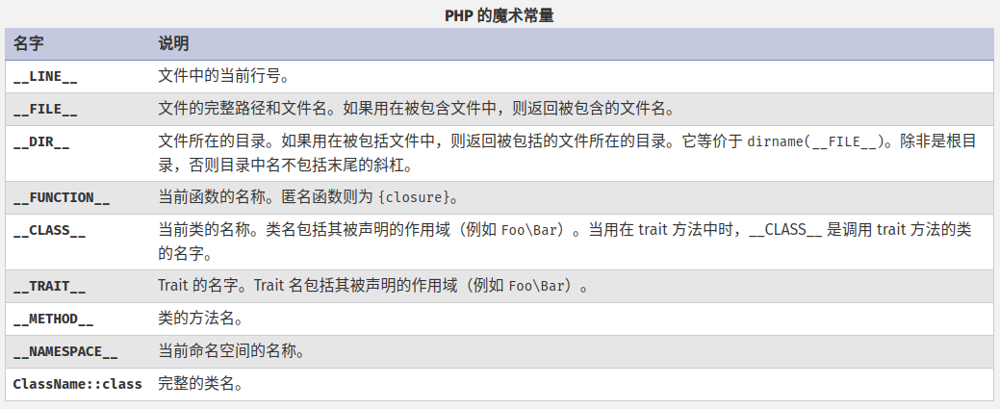

# 常量

常量是一个简单值的标识符（名字）。如同其名称所暗示的，在脚本执行期间该值不能改变（除了所谓的 魔术常量，它们其实不是常量）。常量大小写敏感。传统上常量标识符总是大写的。



还可以使用 define() 函数来定义包含保留字或非常规名称的常量，这类常量可以通过 constant() 函数来获取名称，但是非常不推荐这种用法。

::: warning

在 PHP 8.0.0 之前，使用 define() 定义的常量可能不区分大小写。

:::

```php
<?php

// 合法的常量名
define("FOO",     "something");
define("FOO2",    "something else");
define("FOO_BAR", "something more");

// 非法的常量名
define("2FOO",    "something");

// 下面的定义是合法的，但应该避免这样做：(自定义常量不要以__开头)
// 也许将来有一天 PHP 会定义一个 __FOO__ 的魔术常量
// 这样就会与你的代码相冲突
define("__FOO__", "something");
```

常量的范围是全局的。常量可以从脚本的任何地方被访问，而不考虑作用域。

::: tip

从 PHP 7.1.0 开始，类常量可以声明为 protected 或 private 的可见性， 使其只在其定义的类的层次范围内可用。

:::

可以使用 const 关键字或 define() 函数两种方法来定义一个常量。函数 define() 允许将常量定义为一个表达式，而 const 关键字有一些限制，具体可参见下述章节。一个常量一旦被定义，就不能再改变或者取消定义。

使用 const 关键字定义常量时，只能包含标量数据（bool、int、float 、string）。可以将常量定义为一个表达式，也可以定义为一个 array。还可以定义 resource 为常量，但应尽量避免，因为可能会造成不可预料的结果。

可以简单的通过指定其名字来取得常量的值，与变量不同，不应该在常量前面加上 $ 符号。如果常量名是动态的，也可以用函数 constant() 来获取常量的值。用 get_defined_constants() 可以获得所有已定义的常量列表。如果要检查是否定义了某常量，请使用 defined() 函数。

常量和变量的区别：

- 常量前面没有美元符号（$）。
- 常量可以不用理会变量的作用域而在任何地方定义和访问。
- 常量一旦定义就不能被重新定义或者取消定义。
- 常量只能计算标量值或数组。

```php
<?php

const a = 1;

echo a;

define("b", 2);
echo b;
var_dump(defined("b"));
```

::: warning

和使用 define() 来定义常量相反的是，使用 const 关键字定义常量必须处于最顶端的作用域，因为用此方法是在编译时定义的。这就意味着不能在函数内，循环内以及 if 或 try/catch 语句之内用 const 来定义常量。

:::

## 预定义常量

[预定义常量](https://www.php.net/manual/zh/reserved.constants.php)。

## 魔术常量

有九个魔术常量它们的值随着它们在代码中的位置改变而改变。


