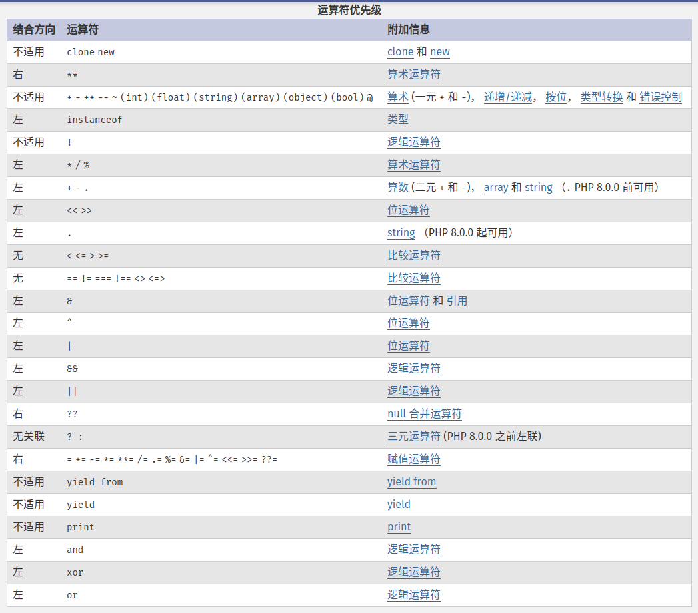
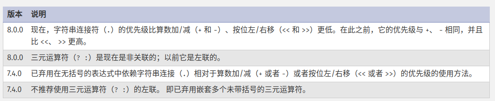
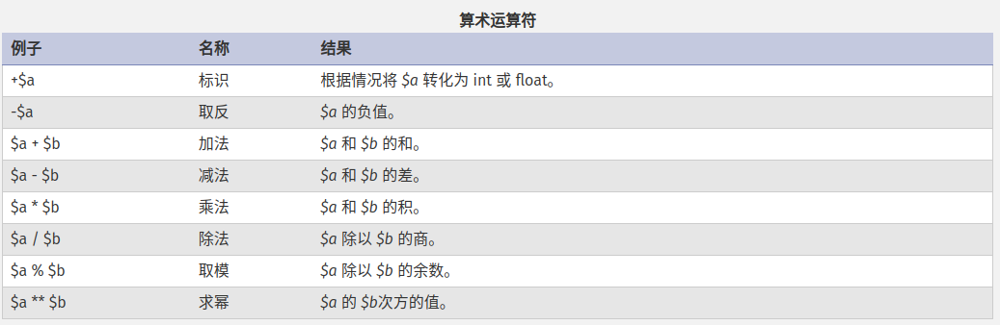
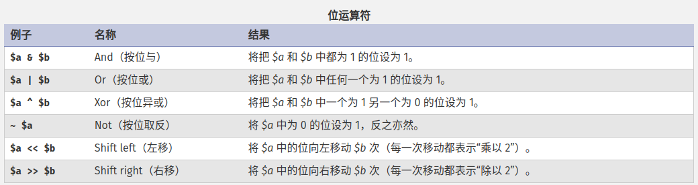
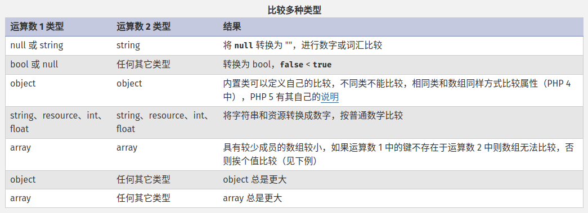
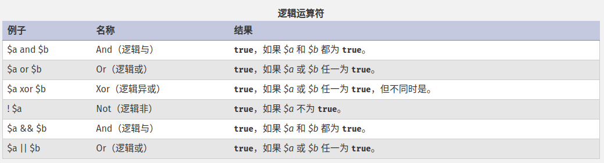

# 运算符

## 运算符优先级





## 算术运算符



除法运算符总是返回浮点数，除非两个操作数都是整数并且恰好能整除，这时会返回整数。

取模运算符的操作数在运算之前都会被转为 int，运算结果的符号和被除数的符号相同。

[数学函数](https://www.php.net/manual/zh/ref.math.php)。

## 赋值运算符

::: tip

赋值表达式的值就是所赋的值。

:::

所有二元运算符都可以和 = 结合为组合运算符，例如：

```php
<?php

$b = 'Hello';
$b .= ' World';
var_dump($b);
```

PHP 中赋值运算将原变量的值拷贝到新变量中，改变其中一个并不影响另一个，PHP 5 中对于对象是引用赋值的，除非明确使用了 clone 关键字拷贝。

PHP 支持引用赋值：

```php
<?php
$a = 3;
$b = &$a; // $b 是 $a 的引用

print "$a\n"; // 输出 3
print "$b\n"; // 输出 3

$a = 4; // 修改 $a

print "$a\n"; // 输出 4
print "$b\n"; // 也输出 4，因为 $b 是 $a 的引用，因此也被改变
```

::: tip

new 运算符将自动返回一个引用，因此不能再对 new 的结果进行引用赋值。

:::

## 位运算符



如果 &、 | 和 ^ 运算符的左右两个操作对象都是字符串，将对会组成字符串的字符 ASCII 值执行操作，结果也是一个字符串。除此之外，两个操作对象都将 转换为整数 ，结果也将会是整数。

如果 ~ 运算符的操作对象是字符串，则将对组成字符串的字符 ASCII 值进行操作， 结果将会是字符串，否则操作对象和结构都会是整数。

<< 和 >> 运算符的操作对象和结果始终都是整数。

## 比较运算符


::: warning

PHP 8.0.0 之前，如果 string 与数字或者数字字符串进行比较， 则在比较前会将 string 转化为数字。

:::

```php
<?php
// 整数
echo 1 <=> 1; // 0
echo 1 <=> 2; // -1
echo 2 <=> 1; // 1

// 浮点数
echo 1.5 <=> 1.5; // 0
echo 1.5 <=> 2.5; // -1
echo 2.5 <=> 1.5; // 1

// 字符串
echo "a" <=> "a"; // 0
echo "a" <=> "b"; // -1
echo "b" <=> "a"; // 1

echo "a" <=> "aa"; // -1
echo "zz" <=> "aa"; // 1

// 数组
echo [] <=> []; // 0
echo [1, 2, 3] <=> [1, 2, 3]; // 0
echo [1, 2, 3] <=> []; // 1
echo [1, 2, 3] <=> [1, 2, 1]; // 1
echo [1, 2, 3] <=> [1, 2, 4]; // -1

// 对象
$a = (object) ["a" => "b"];
$b = (object) ["a" => "b"];
echo $a <=> $b; // 0

$a = (object) ["a" => "b"];
$b = (object) ["a" => "c"];
echo $a <=> $b; // -1

$a = (object) ["a" => "c"];
$b = (object) ["a" => "b"];
echo $a <=> $b; // 1

// 不仅仅比较值，而且也会匹配键
$a = (object) ["a" => "b"];
$b = (object) ["b" => "b"];
echo $a <=> $b; // 1
```

多类型比较结果：



三元运算符：

```php
echo true ?1: 0; // 1
echo true ?: 0; // 1
```

NULL 合并运算符：

当 expr1 为 null，表达式 (expr1) ?? (expr2) 等同于 expr2，否则为 expr1。

```php
$action = $_POST['action'] ?? 'default';
```

## 错误控制运算符

HP 支持一个错误控制运算符：@。当将其放置在一个 PHP 表达式之前，该表达式可能产生的任何错误诊断都被抑制。`@unlink($localFile);`

::: warning

@ 只对表达式生效。如果能从某处获得值，就能在它前面加上 @ 运算符。例如，可以把它放在变量，函数调用，某些语言构造调用（例如 include ）等等之前。不能把它放在函数或类的定义之前，也不能用于条件结构例如 if 和 foreach 等。

:::

## 执行运算符

PHP 支持一个执行运算符：反引号（``）。注意这不是单引号！PHP 将尝试将反引号中的内容作为 shell 命令来执行，并将其输出信息返回（即，可以赋给一个变量而不是简单地丢弃到标准输出）。

```php
$output = `ls`;
echo $output;
```

## 递增、递减运算符

与 C 一致，对 null 递减没有任何效果，对其递增结果是 1；对布尔值递增递减没有效果。

## 逻辑运算符



## 字符串运算符

```php
$a = 'hello';
$b = 'world';
$c = $a . $b;
echo $c; // helloworld
$a .= $b;
echo $a; // helloworld
```

## 数组运算符


## 类型运算符

instanceof 用于确定一个 PHP 变量是否属于某一类 class 的实例：

```php
<?php
class MyClass
{
}

class NotMyClass
{
}
$a = new MyClass;

var_dump($a instanceof MyClass); // true
var_dump($a instanceof NotMyClass); // false
```

instanceof　也可用来确定一个变量是不是继承自某一父类的子类的实例：

```php
<?php
class ParentClass
{
}

class MyClass extends ParentClass
{
}

$a = new MyClass;

var_dump($a instanceof MyClass); // true
var_dump($a instanceof ParentClass); // false
```

instanceof也可用于确定一个变量是不是实现了某个接口的对象的实例：

```php
<?php
interface MyInterface
{
}

class MyClass implements MyInterface
{
}

$a = new MyClass;

var_dump($a instanceof MyClass); // true
var_dump($a instanceof MyInterface); // true
```

虽然 instanceof 通常直接与类名一起使用，但也可以使用对象或字符串变量：

```php
<?php
interface MyInterface
{
}

class MyClass implements MyInterface
{
}

$a = new MyClass;
$b = new MyClass;
$c = 'MyClass';
$d = 'NotMyClass';

var_dump($a instanceof $b); // true，$b 是 MyClass 类的对象
var_dump($a instanceof $c); // true，$c 是字符串 'MyClass'
var_dump($a instanceof $d); // false，$d 是字符串 'NotMyClass'
```

::: warning

如果被检测的变量不是对象，instanceof 并不发出任何错误信息而是返回 false。PHP 7.3.0 之前不允许用于检测常量。PHP 7.3.0 起， instanceof 操作符的左侧可以放常量。

:::

PHP 8.0.0 起， instanceof 可以与任何表达式一起使用。表达式必须使用括号括起来并且生成 string。

```php
<?php

class ClassA extends \stdClass {}
class ClassB extends \stdClass {}
class ClassC extends ClassB {}
class ClassD extends ClassA {}

function getSomeClass(): string
{
    return ClassA::class;
}

var_dump(new ClassA instanceof ('std' . 'Class'));
var_dump(new ClassB instanceof ('Class' . 'B'));
var_dump(new ClassC instanceof ('Class' . 'A'));
var_dump(new ClassD instanceof (getSomeClass()));
```
