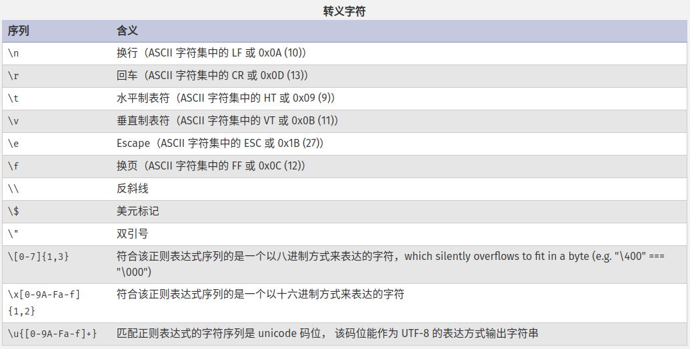
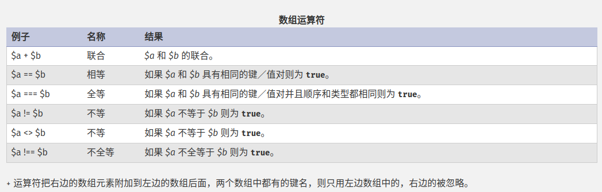
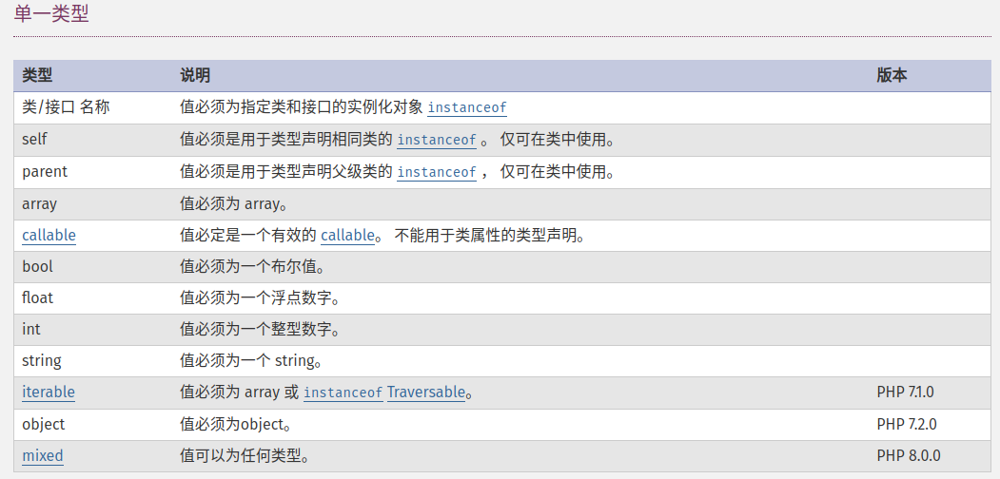

# 类型

PHP 支持 10 种原始数据类型。

四种标量类型：

- bool。
- int。
- float（历史原因，也称作 double）。
- string。

四种复合类型：

- array。
- object。
- callable。
- iterable。

两种特殊类型：

- resource。
- NULL。

变量类型通常不是被程序员设定的，一般是 PHP 根据上下文在运行时决定的。

```php
<?php
$a_bool = TRUE;   // 布尔值 boolean
$a_str  = "foo";  // 字符串 string
$a_str2 = 'foo';  // 字符串 string
$an_int = 12;     // 整型 integer

echo gettype($a_bool); // 输出:  boolean
echo gettype($a_str);  // 输出:  string

// 如果是整型，就加上 4
if (is_int($an_int)) {
    $an_int += 4;
}

// 如果 $bool 是字符串，就打印出来
// (啥也没打印出来)
if (is_string($a_bool)) {
    echo "String: $a_bool";
}
```

如果想查看某个表达式的值和类型，使用 `var_dump()` 函数。

如果只是想得到一个表达式的类型，可以使用 `gettype()` 函数，但是此函数返回的是类型名称字符串，因此如果要检验某个类型，应使用 `is_type` 函数，参考 [is_type](https://www.php.net/manual/zh/function.is-array.php)。

## Boolean 布尔类型

true、false 不区分大小写。

```php
<?php
$flag_1 = true;
$flag_2 = FALSE;

if ($flag_1){
    echo '$flag_1 ' . 'is true';
}

if ($flag_2) {
    echo '$flag_2 ' . 'is true';
}
```

当转换为 bool 时，以下值被认为是 false：

- false 本身。
- 整型值 0。
- 浮点型值 0.0 -0.0。
- 空字符串以及 "0"。
- 不包括任何元素的数组。
- 特殊类型 NULL，包括尚未赋值的变量。
- 由无属性的空元素创建 SimpleXML 对象，也就是既没有子节点也没有属性的元素。

::: warning

其他值都被认为是 true，包括任何 resource 和 NAN。

:::

```php
<?php
var_dump((bool) "");        // bool(false)
var_dump((bool) "0");       // bool(false)
var_dump((bool) 1);         // bool(true)
var_dump((bool) -2);        // bool(true)
var_dump((bool) "foo");     // bool(true)
var_dump((bool) 2.3e5);     // bool(true)
var_dump((bool) array(12)); // bool(true)
var_dump((bool) array());   // bool(false)
var_dump((bool) "false");   // bool(true)
?>
```

## Integer 整型

整型值 int 可以使用十进制、十六进制、八进制或者二进制，要使用八进制，数字前必须加零，要使用十六进制，数字前必须加 0x，要使用二进制，数字前必须加上 0b，从 PHP7.4.0 开始，整型数值可能会包含下划线，在展示的时候会被滤掉。

```php
<?php
$a = 1234; // 十进制数
$a = 0123; // 八进制数 (等于十进制 83)
$a = 0x1A; // 十六进制数 (等于十进制 26)
$a = 0b11111111; // 二进制数字 (等于十进制 255)
$a = 1_234_567; // 整型数值 (PHP 7.4.0 以后)
```

::: tip

PHP 不支持无符号的 int，int 值的字长可以用常量 `PHP_INT_SIZE` 表示，最大值 `PHP_INT_MAX`，最小值 `PHP_INT_MIN`。

:::

如果给定了一个数超出了 int 范围，将会被解释为 float，PHP 没有 int 除法取整运算符，要使用 `intdiv()` 实现，1/2 产生 float(0.5)，值可以舍弃小数部分，强制转换为 int，或者使用 `round()` 函数四舍五入：

```php
<?php
var_dump(25/7);         // float(3.5714285714286)
var_dump((int) (25/7)); // int(3)
var_dump(round(25/7, 1));  // float(3.6)，保留一位小数
```

要明确地将一个值转换为 int，用 int 或 integer 强制转换，还可以通过函数 `intval()` 将一个值转换为 int 整型。

- false 将产生 0，true 将产生 1。
- resource 转换结果将会是 PHP 运行时为 resource 分配的唯一资源号。
- 浮点型转换为 int 时将会向下取整，如果浮点数超出了 int 范围，则结果为*未定义*。
- NAN 和 Infinity 在转换为 int 时是 0。
- 如果字符串是数字字符串或者前导数字，则将被转换为对应的 int 值，否则将转换为 0。
- NULL 将会转换为 0。

::: warning

不要将未知的分数强制转换为 int，有时会导致不可以预料的结果：

```php
<?php
echo (int) ( (0.1+0.7) * 10 ); // 显示 7
```

:::

## Float 浮点型

也叫浮点数 float，双精度数 double 或 实数 real，使用以下任一语法定义：

```php
<?php
$a = 1.234;
$b = 1.2e3;
$c = 7E-10;
$d = 1_234.567; // 从 PHP 7.4.0 开始支持
```

::: warning 浮点数的精度

以十进制能够精确表示的有理数如 0.1 或 0.7，无论有多少尾数都不能被内部所使用的二进制精确表示，因此不能在不丢失一点点精度的情况下转换为二进制的格式。这就会造成混乱的结果：例如，floor((0.1+0.7)\*10) 通常会返回 7 而不是预期中的 8，因为该结果内部的表示其实是类似 7.9999999999999991118...。

永远不要相信浮点数结果精确到了最后一位，也永远不要比较两个浮点数是否相等。

:::

转换为浮点数：

- 如果字符串是数字字符串或者前导数字，则将被解析为对应的 float 值，否则将被转换为 0。
- 对于其他类型，情况类似于先转为 int 再转为 float。

比较浮点数：

```php
<?php
$a = 1.23456789;
$b = 1.23456780;
$epsilon = 0.00001;

if(abs($a-$b) < $epsilon) {
    echo "true";
}
```

::: warning NAN

某些数学运算会产生一个由常量 NAN 所代表的结果，此结果代表着一个在浮点数运算中未定义或者不可表述的值，任何拿此值与其他任何值（除了 true）进行的松散或严格比较的结果都是 false。

由于 NAN 代表着任何不同值，不应拿 NAN 去和其他值进行比较，包括其自身，应该用 `is_nan()` 来检查。

:::

## String 字符串

一个字符串由一系列字符组成，每个字符等同于一个字节，这意味着 PHP 只能支持 256 的字符集，不支持 Unicode。

一个字符串可以使用四种方式表达：

- 单引号。
- 双引号。
- heredoc 语法。
- nowdoc 语法。

### 单引号

定义一个字符串的最简单的方法是用单引号把它包围起来。

要表达一个单引号自身，需在它的前面加个反斜线（`\`）来转义。要表达一个反斜线自身，则用两个反斜线（`\\`）。其它任何方式的反斜线都会被当成反斜线本身：也就是说如果想使用其它转义序列例如 `\r` 或者 `\n`，并不代表任何特殊含义，就单纯是这两个字符本身。

```php
<?php
echo 'this is a simple string';

// 可以录入多行
echo 'You can also have embedded newlines in
strings this way as it is
okay to do';

// 输出： Arnold once said: "I'll be back"
echo 'Arnold once said: "I\'ll be back"';

// 输出： You deleted C:\*.*?
echo 'You deleted C:\\*.*?';

// 输出： You deleted C:\*.*?
echo 'You deleted C:\*.*?';

// 输出： This will not expand: \n a newline
echo 'This will not expand: \n a newline';

// 输出： Variables do not $expand $either
echo 'Variables do not $expand $either';
```

### 双引号

对于使用双引号的字符串，以下特殊字符将被解析：



::: tip

和单引号字符串一样，转义任何其它字符都会导致反斜线被显示出来。

用双引号定义的字符串最重要的特征是变量会被解析。

:::

### Heredoc

句法结构：<<<。在该运算符之后要提供一个标识符，然后换行。接下来是字符串 string 本身，最后要用前面定义的标识符作为结束标志。

结束标识符可以使用空格或制表符（tab）缩进，此时文档字符串会删除所有缩进。 在 PHP 7.3.0 之前的版本中，结束时所引用的标识符必须在该行的第一列。

而且，标识符的命名也要像其它标签一样遵守 PHP 的规则：只能包含字母、数字和下划线，并且必须以字母和下划线作为开头。

```php
<?php
// 无缩进
echo <<<END
      a
     b
    c
\n
END;
// 4 空格缩进
echo <<<wuhu
      a
     b
    c
    wuhu;
```

### Nowdoc

就象 heredoc 结构类似于双引号字符串，Nowdoc 结构是类似于单引号字符串的。Nowdoc 结构很象 heredoc 结构，但是 nowdoc 中不进行解析操作。

一个 nowdoc 结构也用和 heredocs 结构一样的标记 <<<， 但是跟在后面的标识符要用单引号括起来，即 <<<'EOT'。Heredoc 结构的所有规则也同样适用于 nowdoc 结构，尤其是结束标识符的规则。

```php
<?php

/* 含有变量的更复杂的示例 */
class foo
{
    public $foo;
    public $bar;

    function __construct()
    {
        $this->foo = 'Foo';
        $this->bar = array('Bar1', 'Bar2', 'Bar3');
    }
}

$foo = new foo();
$name = 'MyName';

echo <<<'EOT'
My name is "$name". I am printing some $foo->foo.
Now, I am printing some {$foo->bar[1]}.
This should not print a capital 'A': \x41
EOT;
```

### 变量解析

当字符串用双引号或 heredoc 结构定义时，其中的变量将会被解析。

这里共有两种语法规则：一种简单规则，一种复杂规则。简单的语法规则是最常用和最方便的，它可以用最少的代码在一个 string 中嵌入一个变量，一个 array 的值，或一个 object 的属性。

复杂规则语法的显著标记是用花括号包围的表达式。

简单语法：当 PHP 解析器遇到一个美元符号（$）时，它会和其它很多解析器一样，去组合尽量多的标识以形成一个合法的变量名。可以用花括号来明确变量名的界线。

```php
<?php

$name = "PPG007";
$languages = ['java', 'go'];

echo "My name is $name, my languages contain $languages[1]";
```

```php
<?php
$juices = array("apple", "orange", "koolaid1" => "purple");

echo "He drank some $juices[0] juice.".PHP_EOL;
echo "He drank some $juices[1] juice.".PHP_EOL;
echo "He drank some $juices[koolaid1] juice.".PHP_EOL;

class people {
    public $john = "John Smith";
    public $jane = "Jane Smith";
    public $robert = "Robert Paulsen";

    public $smith = "Smith";
}

$people = new people();

echo "$people->john drank some $juices[0] juice.".PHP_EOL;
echo "$people->john then said hello to $people->jane.".PHP_EOL;
echo "$people->john's wife greeted $people->robert.".PHP_EOL;
echo "$people->robert greeted the two $people->smith.";
```

复杂语法：任何具有 string 表达的标量变量，数组单元或对象属性都可使用此语法。 表达式的书写方式与在 string 以外的方式相同， 然后用花括号 `{` 和 `}` 把它括起来即可。由于 `{` 无法被转义，只有 `$` 紧挨着 `{` 时才会被识别。可以用 `{\$` 来表达 `{$`。

```php
<?php

class me
{
    var $name = "PPG007";
    var $languages = ['java', 'go'];

    public function show(): string
    {
        return "My name is {$this->name}, my languages are [{$this->languages[0]}, {$this->languages[1]}]";
    }
}

$m = new me();

echo "{$m->show()}";
```

```php
<?php

class me
{
    var $name = "PPG007";
    var $languages = ['java', 'go'];

    public function show(): string
    {
        return "My name is {$this->name}, my languages are [{$this->languages[0]}, {$this->languages[1]}]";
    }
}

$m = new me();
$hello = "123";
function hello(): string{
    return 'hello';
}
echo "show: {$m->show()}\n";

echo "wuhu: {${hello()}}"; // wuhu: 123
```

::: tip

`{${expression}}` 写法中，expression 的返回值将会被解析为一个变量名。

:::

### 存取和修改字符串中的字符

可以使用中括号修改 string 中某个位置的字符，8.0.0 之前还可以用大括号。

```php
<?php
// 取得字符串的第一个字符
$str = 'This is a test.';
$first = $str[0];

// 取得字符串的第三个字符
$third = $str[2];

// 取得字符串的最后一个字符
$str = 'This is still a test.';
$last = $str[strlen($str)-1];

// 修改字符串的最后一个字符
$str = 'Look at the sea';
$str[strlen($str)-1] = 'e';
```

::: danger

字符串下标必须为整数或可转换为整数的字符串。

用 [] 或 {} 访问任何其它类型（不包括数组或具有相应接口的对象实现）的变量只会无声地返回 null。

:::

### 有用的函数和运算符

字符串可以使用点进行连接，加号没有此功能。

```php
<?php
$a = "123"."456";
echo $a;
echo "\n";
$a .= "789";
echo $a;
```

[字符串函数](https://www.php.net/manual/zh/ref.strings.php)。

[字符类型函数](https://www.php.net/manual/zh/ref.ctype.php)。

### 转换为字符串

一个值可以通过在其前面加上 (string) 或用 strval() 函数来转变成字符串。在一个需要字符串的表达式中，会自动转换为 string。比如在使用函数 echo 或 print 时，或在一个变量和一个 string 进行比较时，就会发生这种转换。

一个布尔值 bool 的 true 被转换成 string 的 "1"。bool 的 false 被转换成 ""（空字符串）。这种转换可以在 bool 和 string 之间相互进行。

一个整数 int 或浮点数 float 被转换为数字的字面样式的 string（包括 float 中的指数部分）。使用指数计数法的浮点数（4.1E+6）也可转换。

数组 array 总是转换成字符串 "Array"，因此，echo 和 print 无法显示出该数组的内容。要显示某个单元，可以用 echo $arr['foo'] 这种结构。

null 总是被转变成空字符串。

资源 Resource 总会被转变成 "Resource id #1" 这种结构的字符串，其中的 1 是 PHP 在运行时分配给该 resource 的资源数字。

必须使用[魔术方法](https://www.php.net/manual/zh/language.oop5.magic.php) \_\_toString 才能将 object 转换为 string。

直接把 array，object 或 resource 转换成 string 不会得到除了其类型之外的任何有用信息。可以使用函数 print_r() 和 var_dump() 列出这些类型的内容。

大部分的 PHP 值可以转变成 string 来永久保存，这被称作串行化，可以用函数 serialize() 来实现。

## 数字字符串

如果一个 PHP string 可以被解释为 int 或 float 类型，则它被视为数字字符串。

PHP 也有前导数字字符串的概念。 这只是一个字符串，其开头类似于数字字符串，后跟任何字符。

当一个 string 需要被当作一个数字计算时，（例如：算术运算， int 类型声明等)，则采取以下步骤来确定结果：

- 如果 string 是数字，当 string 是整数字符串并且符合 int 类型的范围限制（即是 PHP_INT_MAX 定义的值），则解析为 int ，否则解析为 float 。
- 如果上下文允许前导数字和一个 string，如果 string 的前导部分是整数数字字符串且符合 int 类型限制（由 PHP_INT_MAX 定义），则解析为 int ，否则解析为 float 。 此外，还会导致 E_WARNING 级别的错误。
- 如果 string 不是数字，则会抛出一个 TypeError 的异常。

### PHP8.0 之前

- 在 PHP 8.0.0 之前， 只有在前导空格的时候，string 才被认为是数字；如果它有尾随空格，则该字符串被视为是前导数字。
- 在 PHP 8.0.0 之前，当在数字上下文中使用字符串时，它将执行与上述相同的步骤，但有以下区别：
  - 使用前导数字字符串将导致 E_NOTICE 而不是 E_WARNING 错误。
  - 如果字符串不是数字，则会导致 E_WARNING 错误并返回 0 。
- 在 PHP 7.1.0 之前，则既不会导致 E_NOTICE，也不会导致 E_WARNING。

```php
<?php
$foo = 1 + "10.5";                // $foo 是 float (11.5)
$foo = 1 + "-1.3e3";              // $foo 是 float (-1299)
$foo = 1 + "bob-1.3e3";           // PHP 8.0.0 起产生 TypeError；在此之前 $foo 是 integer (1)
$foo = 1 + "bob3";                // PHP 8.0.0 起产生 TypeError；在此之前 $foo 是 integer (1)
$foo = 1 + "10 Small Pigs";       // PHP 8.0.0 起，$foo 是 integer (11)，并且产生 E_WARNING；在此之前产生 E_NOTICE
$foo = 4 + "10.2 Little Piggies"; // PHP 8.0.0 起，$foo 是 float (14.2)，并且产生 E_WARNING；在此之前产生 E_NOTICE
$foo = "10.0 pigs " + 1;          // PHP 8.0.0 起，$foo 是 float (11)，并且产生 E_WARNING；在此之前产生 E_NOTICE
$foo = "10.0 pigs " + 1.0;        // PHP 8.0.0 起，$foo 是 float (11)，并且产生 E_WARNING；在此之前产生 E_NOTICE
```

## Array 数组

PHP 中的 array 实际上是一个有序映射。映射是一种把 values 关联到 keys 的类型。此类型针对多种不同用途进行了优化； 它可以被视为数组、列表（向量）、哈希表（映射的实现）、字典、集合、堆栈、队列等等。 由于 array 的值可以是其它 array 所以树形结构和多维 array 也是允许的。

### 语法

定义数组：

```php
<?php

$arr1 = array(
    "foo" =>"bar",
    "bar" => "foo",
);

$arr2 = ["foo"=>"bar", "bar"=>"foo"];
```

::: tip

key 可以是 int 或者 string，value 可以是任何类型。

:::

::: tip key 的强制类型转换

- String 中包含有效的十进制 int，除非数字前面有一个 + 号，否则将被转换为 int 类型。例如键名 "8" 实际会被储存为 8。另外， "08" 不会被强制转换，因为它不是一个有效的十进制整数。
- Float 也会被转换为 int ，意味着其小数部分会被舍去。例如键名 8.7 实际会被储存为 8。
- Bool 也会被转换成 int。即键名 true 实际会被储存为 1 而键名 false 会被储存为 0。
- Null 会被转换为空字符串，即键名 null 实际会被储存为 ""。
- Array 和 object 不能 被用为键名。坚持这么做会导致警告：Illegal offset type。

:::

::: warning

如果在数组定义时多个元素都使用相同键名，那么只有最后一个会被使用，其它的元素都会被覆盖。

```php
// 下面的代码实际上会导致数组里只有一个元素。
<?php
$array = array(
    1    => "a",
    "1"  => "b",
    1.5  => "c",
    true => "d",
);
var_dump($array);
```

一个复杂的例子：

```php
<?php
$array = array(
    1    => 'a',
    '1'  => 'b', // 值 "a" 会被 "b" 覆盖
    1.5  => 'c', // 值 "b" 会被 "c" 覆盖
    -1 => 'd',
    '01'  => 'e', // 由于这不是整数字符串，因此不会覆盖键名 1
    '1.5' => 'f', // 由于这不是整数字符串，因此不会覆盖键名 1
    true => 'g', // 值 "c" 会被 "g" 覆盖
    false => 'h',
    '' => 'i',
    null => 'j', // 值 "i" 会被 "j" 覆盖
    'k', // 值 “k” 的键名被分配为 2。这是因为之前最大的整数键是 1
    2 => 'l', // 值 "k" 会被 "l" 覆盖
);

var_dump($array);
```

:::

PHP 数组可以同时包含 int 和 string 类型的键名：

```php
<?php
$array = array(
    "foo" => "bar",
    "bar" => "foo",
    100   => -100,
    -100  => 100,
);
var_dump($array);
```

PHP 数组中 key 为可选项，如果未指定，将自动使用之前用过的最大 int 键名加一作为新的键名：

```php
<?php
$array = array(
    "a",
    "b",
6 => "c",
    "d", // 7
);
var_dump($array);
```

PHP 的自增索引值不一定是当前最大键加一，可能是之前存过的最大键加一：

```php
<?php
// 创建一个简单的数组
$array = array(1, 2, 3, 4, 5);
print_r($array);

// 现在删除其中的所有元素，但保持数组本身不变:
foreach ($array as $i => $value) {
    unset($array[$i]);
}
print_r($array);

// 添加一个单元（注意新的键名是 5，而不是你可能以为的 0）
$array[] = 6;
print_r($array);

// 重新索引：
$array = array_values($array);
$array[] = 7;
print_r($array);
```

访问数组单元：

```php
<?php
$array = array(
    "foo" => "bar",
    42    => 24,
    "multi" => array(
         "dimensional" => array(
             "array" => "foo"
         )
    )
);

var_dump($array["foo"]);
var_dump($array[42]);
var_dump($array["multi"]["dimensional"]["array"]);
```

数组的解引用：

```php
<?php
function getArray() {
    return array(1, 2, 3);
}

$secondElement = getArray()[1];
var_dump($secondElement);
// 或
list(, $secondElement) = getArray();
var_dump($secondElement);
```

新建、修改、删除数组元素：

```php
<?php
$arr = array(5 => 1, 12 => 2);

$arr[] = 56;    // 这与 $arr[13] = 56 相同;

$arr["x"] = 42; // 添加一个新元素，键名使用 "x"

unset($arr[5]); // 从数组中删除元素


var_dump($arr);
unset($arr);    // 删除整个数组
```

遍历：

```php
<?php
// 创建一个简单的数组
$array = array(1, 2, 3, 4, 5);
foreach ($array as $key => $value) {
    printf("%d => %d\n", $key, $value);
}

foreach ($array as $value) {
    printf("%d\n", $value);
}
```

::: danger

foreach 只能用在数组和对象上。

:::

其他[数组函数](https://www.php.net/manual/zh/ref.array.php)。

转换为数组：

- 对于任意 int，float， string，bool 和 resource 类型，如果将一个值转换为 array，将得到一个仅有一个元素的数组，其下标为 0，该元素即为此标量的值。
- 如果将 object 类型转换为 array，则结果为一个数组，其单元为该对象的属性。键名将为成员变量名，不过有几点例外：整数属性不可访问； 私有变量前会加上类名作前缀；保护变量前会加上一个 '\*' 做前缀。这些前缀的前后都各有一个 NUL 字节。 未初始化的类型属性将会被丢弃。
- 将 null 转换为 array 会得到一个空的数组。

数组运算符：



计算数组差集：

```php
<?php
$array1 = array("a" => "green", "red", "blue", "red");
$array2 = array("b" => "green", "yellow", "red");
$result = array_diff($array1, $array2);

print_r($result);
```

::: tip

array_diff(array $array, array ...$arrays): array 将会返回在第一个 array 中但是不在其他 array 中的值，键是第一个 array 的键。

:::

### 数组解包

在 array 定义时，用 ... 前缀的一个 array 可以被展开到当前位置。 只有实现了 Traversable 的数组和对象（也就是能被 foreach 遍历）才能被展开。 PHP 7.4.0 开始可以使用 ... 解包 array。

```php
<?php
// string key
$arr1 = ["a" => 1];
$arr2 = ["a" => 2];
$arr3 = ["a" => 0, ...$arr1, ...$arr2];
var_dump($arr3); // ["a" => 2]

// integer key
$arr4 = [1, 2, 3];
$arr5 = [4, 5, 6];
$arr6 = [...$arr4, ...$arr5];
var_dump($arr6); // [1, 2, 3, 4, 5, 6]
// 即 [0 => 1, 1 => 2, 2 => 3, 3 => 4, 4 => 5, 5 => 6]
// 也就是原始的 integer key 不再保留
```

... 操作符解包 array 时也遵守函数 array_merge() 的语义。 也就是说，key 为字符时，后面的字符键会覆盖之前的字符键；key 为 integer 时则会重新编号。

::: warning

在 PHP 8.1 之前，带有 string 键的 array 无法解包。

:::

## Iterable 可迭代对象

Iterable 是 PHP 7.1 中引入的一个伪类型。它接受任何 array 或实现了 Traversable 接口的对象。这些类型都能用 foreach 迭代， 也可以和生成器里的 yield from 一起使用。

可迭代对象可以用作参数类型，表示函数需要一组值，可以指定默认值为一个数组或者 null， 但是不会关心值集的形式，因为它将与 foreach 一起使用。如果一个值不是数组或 Traversable 的实例，则会抛出一个 TypeError。

```php
<?php

function foo(iterable $iterable = [1]) {
    foreach ($iterable as $index => $value) {
        echo "$index => $value";
    }
}

foo();
```

## Object 对象

创建新的对象使用 new 关键字：

```php
<?php
class foo
{
    function do_foo()
    {
        echo "Doing foo.";
    }
}

$bar = new foo;
$bar->do_foo();
```

- 如果将一个对象转换成对象，它将不会有任何变化。如果其它任何类型的值被转换成对象，将会创建一个内置类 stdClass 的实例。如果该值为 null，则新的实例为空。
- array 转换成 object 将使键名成为属性名并具有相对应的值。

## Enum 枚举

枚举是在类、类常量基础上的约束层， 目标是提供一种能力：定义包含可能值的封闭集合类型。

```php
<?php
enum Suit
{
    case Hearts;
    case Diamonds;
    case Clubs;
    case Spades;
}

function do_stuff(Suit $s)
{
    // ...
}

do_stuff(Suit::Spades);
```

::: warning

需要 PHP >= 8.1 才能支持枚举。

:::

- 将 enum 转换为 object 不会有变化。
- 将 enum 转换为 array， 纯粹枚举会创建单个 name 键的数组。
- 回退枚举创建带 name 和 value 键的数组。 其他类型转换都会导致错误。

## Resource 资源类型

资源 resource 是一种特殊变量，保存了到外部资源的一个引用。资源是通过专门的函数来建立和使用的。

由于资源类型变量保存有为打开文件、数据库连接、图形画布区域等的特殊句柄，因此将其它类型的值转换为资源没有意义。

参考：[资源类型列表](https://www.php.net/manual/zh/resource.php)，[get_resource_type](https://www.php.net/manual/zh/function.get-resource-type.php)。

## NULL

特殊的 null 值表示一个变量没有值。NULL 类型唯一可能的值就是 null。

在下列情况下一个变量被认为是 null：

- 被赋值为 null。
- 尚未被赋值。
- 被 unset()。

null 类型只有一个值，就是不区分大小写的常量 null：

```php
<?php
$a = null;
$b = NULL;
echo is_null($a);

echo is_null($b);
```

使用 (unset) $var 将一个变量转换为 null 将不会删除该变量或 unset 其值。仅是返回 null 值而已（PHP < 8.0.0）。

## Callback/Callable 类型

- PHP是将函数以string形式传递的。
- 一个已实例化的 object 的方法被作为 array 传递，下标 0 包含该 object，下标 1 包含方法名。 在同一个类里可以访问 protected 和 private 方法。
- 静态类方法可以不实例化 object 传递，只需要在下标为 0 的位置传递类名而不是 object ，或者传递 'ClassName::methodName'。
- 回调参数不仅可以使用普通的用户自定义函数，也接受 匿名函数 和 箭头函数。
- 任何实现了 \_\_invoke() 的对象都可以传入回调参数。

回调函数示例：

```php
<?php

// 回调函数示范
function my_callback_function() {
    echo 'hello world!';
}

// 回调方法示范
class MyClass {
    static function myCallbackMethod() {
        echo 'Hello World!';
    }
}

// 类型 1：简单的回调
call_user_func('my_callback_function');

// 类型 2：静态类方法回调
call_user_func(array('MyClass', 'myCallbackMethod'));

// 类型 3：对象方法回调
$obj = new MyClass();
call_user_func(array($obj, 'myCallbackMethod'));

// 类型 4：静态类方法回调
call_user_func('MyClass::myCallbackMethod');

// 类型 5：父级静态类回调
class A {
    public static function who() {
        echo "A\n";
    }
}

class B extends A {
    public static function who() {
        echo "B\n";
    }
}

call_user_func(array('B', 'parent::who')); // A

// 类型 6：实现 __invoke 的对象用于回调
class C {
    public function __invoke($name) {
        echo 'Hello ', $name, "\n";
    }
}

$c = new C();
call_user_func($c, 'PHP!');
```

闭包：

```php
<?php
// 闭包
$double = function($a) {
    return $a * 2;
};

// 这是数字范围
$numbers = range(1, 5);

// 这里使用闭包作为回调，
// 将范围内的每个元素数值翻倍
$new_numbers = array_map($double, $numbers);

print implode(' ', $new_numbers);
```

::: warning

在函数中注册有多个回调内容时(如使用 call_user_func() 与 call_user_func_array())，如在前一个回调中有未捕获的异常，其后的将不再被调用。

:::

## 类型声明

类型声明可以用于函数的参数、返回值，PHP 7.4.0 起还可以用于类的属性，来显性的指定需要的类型，如果预期类型在调用时不匹配，则会抛出一个 TypeError 异常。

::: warning

当子类覆盖父方法时，子类的方法必须匹配父类的类型声明。如果父类没有定义返回类型，那么子方法可以指定自己的返回类型。

:::



::: warning

不支持上述标量类型的别名。相反，它们被视为类或接口名。例如，使用 boolean 作为类型声明，将要求值是一个 instanceof 类或接口 boolean，而不能是类型 bool。

```php
<?php
function test1(boolean $param) {}
test1(true); // error

function test2(bool $param) {}
test2(true);
```

:::

Nullable 类型：自 PHP 7.1.0 起，类型声明允许前置一个问号 (?) 用来声明这个值允许为指定类型，或者为 null。

```php
<?php
function get_item(): ?string {
    if (isset($_GET['item'])) {
        return $_GET['item'];
    } else {
        return null;
    }
}

var_dump(get_item());
```

### 复合类型

联合类型：

联合类型接受多个不同的简单类型作为参数，自 8.0.0 后可用。

```php
<?php
function test(int|null $a): void
{
    var_dump($a);
}

test("sss"); // error
```

mixed 等同于 object|resource|array|string|int|float|bool|null。

false 伪类形：通过联合类型支持字面类型。

::: warning

- null 和 false 不能在联合类型中独立使用，即 `false`、`null`、`false|null`。
- true 字面类型不存在。

:::

交集类型：

只要能满足 class-type 的值，都可以在交集类型声明中使用，并且可使用多个值。自 8.1.0 后可用。

```php
<?php

class A {

}

class B extends A {

}

function test(A&B $a): void
{
    var_dump($a);
}

test(new B);
```

重复冗余类型：

为了能在复合类型声明中暴露简单的 bug，不需要加载 class 就可以在编译时让重复冗余的类型产生错误。 包含：

- 解析出来的类型只能出现一次。例如这样的类型 int|string|INT、 Countable&Traversable&COUNTABLE 会导致错误。
- 使用 mixed 会导致错误。
- 对于联合类型：
  - 使用了 bool 时就不能再附带使用 false。
  - 使用了 object 时就不能再附带使用 class 类型。
  - 使用了 iterable 时，array、 Traversable 都不能再附带使用。
- 对于交集类型：
  - 使用 class-type 以外的类型会导致错误。
  - 使用 self、parent、 static 都会导致错误。

```php
<?php
function foo(): int|INT {} // 不允许
function foo(): bool|false {} // 不允许
function foo(): int&Traversable {} // 不允许
function foo(): self&Traversable {} // 不允许

use A as B;
function foo(): A|B {} // 不允许 ("use" 是名称解析的一部分)
function foo(): A&B {} // 不允许 ("use" 是名称解析的一部分)

class_alias('X', 'Y');
function foo(): X|Y {} // 允许 (运行时才能知道重复性)
function foo(): X&Y {} // 允许 (运行时才能知道重复性)
```

### 仅返回类型

void：用于标识函数没有返回值，不能是联合类型的一部分，7.1.0 起可用。

never：never 是一种表示没有返回的返回类型。这意味着它可能是调用 exit()， 抛出异常或者是一个无限循环。所以，它不能作为联合类型的一部分。PHP 8.1.0 起可用。

```php
<?php

function test(): never{
    exit();
}
```

static：它的值必须是一个 class 的 instanceof，该 class 是调用方法所在的同一个类。 PHP 8.0.0 起有效。

```php
<?php

class Test
{
    public $_name = 'test';

    public function getStatic(): static
    {
        return $this;
    }
}

$obj = new Test();
$obj->_name = 'test2';
var_dump($obj->getStatic()->_name); // test2
```

### 严格类型

默认如果可能，PHP 会强制转化不合适的类型为想要的标量类型。 比如，参数想要 string，传入的是 int， 则会获取 string 类型的变量。

可以按文件开启严格模式。 在严格模式下，只能接受完全匹配的类型，否则会抛出 TypeError。 唯一的例外是 int 值也可以传入声明为 float 的类型。

```php
<?php
declare(strict_types=1);

function sum(int $a, int $b) {
    return $a + $b;
}

var_dump(sum(1, 2));
var_dump(sum(1.5, 2.5)); // error
```

没有开启 strict_types 时，标量类型可能会限制内部隐式类型转化。 如果值的类型不是联合类型中的一部分，则目标类型会按以下顺序：

- int。
- float。
- string。
- bool。

没有出现在上面列表中的类型则不是有效的内部隐式转化目标。 尤其是不会出现内部隐式转化 null 和 false 类型。

::: warning

有一个例外：当值是字符串，而 int 与 float 同时在组合中，将按现有的“数字字符串”检测语义，识别首选的类型。 例如，"42" 会选择 int 类型， 而 "42.0" 会选择 float 类型。

仅仅会在函数入口检查传引用的参数类型，而不是在函数返回时检查。 所以函数返回时，参数类型可能会发生变化。

:::

```text
// int|string
42    --> 42          // 类型完全匹配
"42"  --> "42"        // 类型完全匹配
new ObjectWithToString --> "__toString() 的结果"
                      // object 不兼容 int，降级到 string
42.0  --> 42          // float 与 int 兼容
42.1  --> 42          // float 与 int 兼容
1e100 --> "1.0E+100"  // float 比 int 大太多了，降级到 string
INF   --> "INF"       // float 比 int 大太多了，降级到 string
true  --> 1           // bool 与 int 兼容
[]    --> TypeError   // array 不兼容 int 或 string

// int|float|bool
"45"    --> 45        // int 的数字字符串
"45.0"  --> 45.0      // float 的数字字符串

"45X"   --> true      // 不是数字字符串，降级到 bool
""      --> false     // 不是数字字符串，降级到 bool
"X"     --> true      // 不是数字字符串，降级到 bool
[]      --> TypeError // array 不兼容 int、float、bool
```

## 类型转换的判别

PHP 在变量定义中不需要（或不支持）明确的类型定义；变量类型是根据使用该变量的上下文所决定的。也就是说，如果把一个 string 值赋给变量 $var，$var 就成了一个 string。如果又把一个int 赋给 $var，那它就成了一个int。

PHP 的自动类型转换的一个例子是乘法运算符“\*”。如果任何一个操作数是float， 则所有的操作数都被当成float，结果也是float。 否则操作数会被解释为int，结果也是int。 注意这并没有改变这些操作数本身的类型； 改变的仅是这些操作数如何被求值以及表达式本身的类型。

```php
<?php
$foo = "1";  // $foo 是字符串 (ASCII 49)
$foo *= 2;   // $foo 现在是一个整数 (2)
$foo = $foo * 1.3;  // $foo 现在是一个浮点数 (2.6)
$foo = 5 * "10 Little Piggies"; // $foo 是整数 (50)
$foo = 5 * "10 Small Pigs";     // $foo 是整数 (50)
```

自动转换为数组的行为目前没有定义：

```php
<?php
$a    = 'car'; // $a 是 string
$a[0] = 'b';   // $a 仍然是 string
echo $a;       // bar
```

### 类型强制转换

```php
<?php
$foo = 10;   // $foo is an integer
$bar = (boolean) $foo;   // $bar is a boolean
```

允许的强制转换有：

- (int), (integer) - 转换为整形 int。
- (bool), (boolean) - 转换为布尔类型 bool。
- (float), (double), (real) - 转换为浮点型 float。
- (string) - 转换为字符串 string。
- (array) - 转换为数组 array。
- (object) - 转换为对象 object。
- (unset) - 转换为 NULL。
