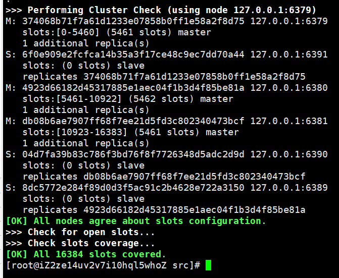

# 集群

去中心化集群。

## 集群搭建

创建六个配置文件，每个文件端口号不同，且均作出如下配置：

```sh
cluster-enabled yes

cluster-config-file nodes-6379.conf#这里的配置文件会自动生成，名字也要不同

cluster-node-timeout 15000
```

分别启动六个 redis 进程，并确认启动成功且 nodes.conf 文件正确生成后执行命令：

```sh
redis-cli --cluster create --cluster-replicas 1 127.0.0.1:6379 127.0.0.1:6380 127.0.0.1:6381 127.0.0.1:6389 127.0.0.1:6390 127.0.0.1:6391
```

执行上述命令开启集群，不要使用域名。

成功后输出结果：



使用 redis-cli 添加 -c 参数，然后连接任意端口进程都能连接到进程中：

```sh
redis-cli -c -p 6391
```

通过以下命令查看集群节点：

```sh
127.0.0.1:6391> cluster nodes
```

::: tip
每个集群至少要有三个主节点。
:::

## slots

从结果图可知，redis 集群有 16384 个插槽，每个 redis 都对应一个插槽范围，操作数据时，根据 key 值计算出插槽位置，在任意的 redis 中，执行操作会重定向到 key 所在的插槽所在的 redis 实例。

### 插入

在集群中插入 map 时要指定一个组，例如：

```sh
mset name{user} ppg age{user} 20
```

这样会根据 user 计算插槽值。

## 故障恢复

如果某段插槽的主从都挂掉,而 cluster-require-full-coverage 为 yes,那么,整个集群都挂掉。

如果臬段插槽的主从都挂掉,而 cluster-require-full-coverage 为 no,那么,该插槽数据全都不能使用,也无法存储
