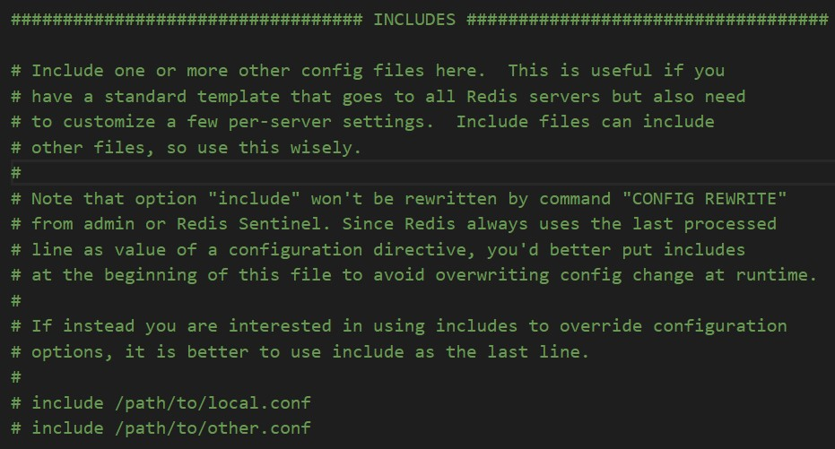
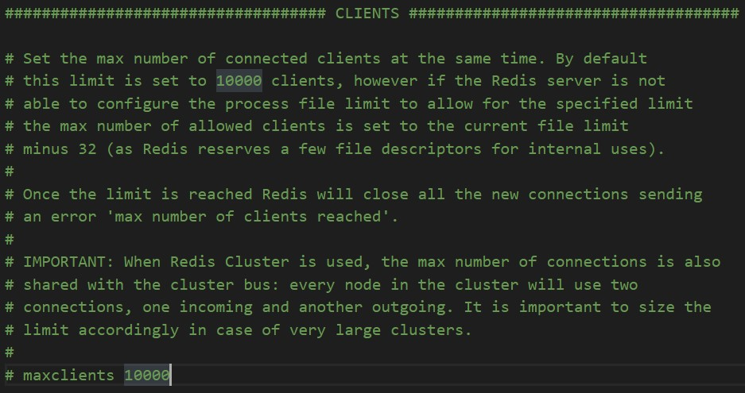

# Redis Config 文件解析

包含其他配置文件：



网络：

```sh
################################## NETWORK #####################################
# Examples:
# bind 192.168.1.100 10.0.0.1     # listens on two specific IPv4 addresses
# bind 127.0.0.1 ::1              # listens on loopback IPv4 and IPv6
# bind * -::*                     # like the default, all available interfaces

# 绑定ip，只有被绑定的ip地址才能访问
#bind 127.0.0.1 -::1

# 保护模式，默认开启
protected-mode no

# 端口设置
port 6379

tcp-backlog 511

# 超时
timeout 0

tcp-keepalive 300
```

通用设置：

```sh
# 默认情况下，redis不是在后台运行的，如果需要在后台运行，把该项的值更改为yes
daemonize yes
# 当运行多个redis服务时，需要指定不同的pid文件和端口
pidfile /var/run/redis_6379.pid

# 指定日志记录级别
# Redis总共支持四个级别：debug、verbose、notice、warning
loglevel notice
# 配置log文件地址
# 若为空值，则是stdout，标准输出
logfile ""

# 指定可用数据库数量
databases 16

always-show-logo no

set-proc-title yes

proc-title-template "{title} {listen-addr} {server-mode}"
```

快照：

```sh
# Save the DB to disk.
# save <seconds> <changes>
save 3600 1
save 300 100
save 60 10000

# 持久化出错是否继续工作
stop-writes-on-bgsave-error yes

# 是否压缩rdb文件
rdbcompression yes

# 保存rdb时，进行错误校验
rdbchecksum yes

# 本地持久化数据库文件名
dbfilename dump.rdb

rdb-del-sync-files no
# 工作目录
# 数据库镜像备份的文件放置的路径。
# 这里的路径跟文件名要分开配置是因为redis在进行备份时，
# 先会将当前数据库的状态写入到一个临时文件中，
# 等备份完成时，再把该该临时文件替换为上面所指定的文件，
# 而这里的临时文件和上面所配置的备份文件都会放在这个指定的路径当中。
# AOF文件也会存放在这个目录下面
# 注意这里必须制定一个目录而不是文件
dir ./
```

复制：

```sh
#   +------------------+      +---------------+
#   |      Master      | ---> |    Replica    |
#   | (receive writes) |      |  (exact copy) |
#   +------------------+      +---------------+

replica-serve-stale-data yes

replica-read-only yes

repl-diskless-sync no

repl-diskless-sync-delay 5

repl-diskless-load disabled

repl-disable-tcp-nodelay no

replica-priority 100
```

安全：

```sh
acllog-max-len 128

# 设置密码
requirepass 123456
```

限制：

客户端限制：



内存限制：

```sh
# 内存最大值
# maxmemory <bytes>

# 内存满后的操作
# maxmemory-policy noeviction

# 共8种选择
# volatile-lru 对设置了过期时间的key使用LRU算法
# allkeys-lru 所有key都使用LRU算法
# volatile-lfu 对设置了过期时间的key使用LFU算法
# allkeys-lfu 所有key都使用LFU算法
# volatile-random 对设置了过期时间的key随机移除
# allkeys-random 所有key都会被随机移除
# volatile-ttl 删除即将过期的
# noeviction 永不过期，返回错误
```

Append Only 模式(AOF)：

```sh
# 是否开启AOF，默认关闭，使用RDB
appendonly no

# 持久化文件名
appendfilename "appendonly.aof"

# 默认每秒都同步
appendfsync everysec
# appendfsync no 不执行同步，操作系统自行同步
# appendfsync always 每次修改都会同步
```
