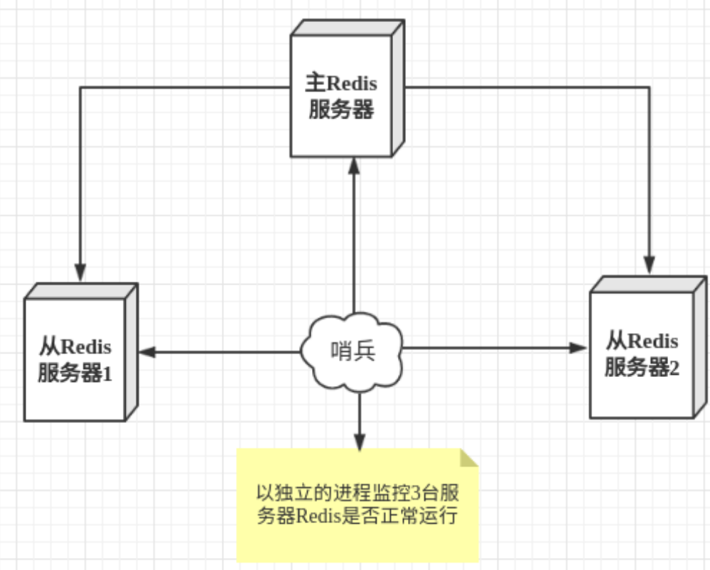
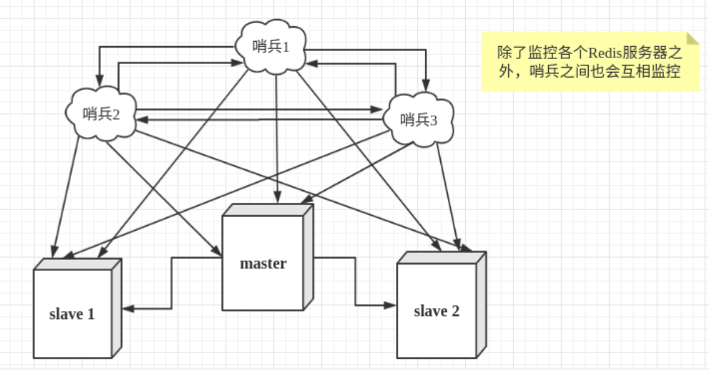

# Redis 主从复制

## 什么是主从复制

主从复制，是指将一台 Redis 服务器的数据，复制到其他的 Redis 服务器。前者称为主节点(master/leader)，后者称为从节点(slave/follower)；数据的复制是单向的，只能由主节点到从节点。

master 以写为主，slave 以读为主。

默认情况下，每台 Redis 服务器都是主节点；且一个主节点可以有多个从节点(或没有从节点)，但一个从节点只能有一个主节点。

## 主从复制作用

1. 数据冗余：主从复制实现了数据的热备份，是持久化之外的一种数据冗余方式。
2. 故障恢复：当主节点出现问题时，可以由从节点提供服务，实现快速的故障恢复；实际上是一种服务的冗余。
3. 负载均衡：在主从复制的基础上，配合读写分离，可以由主节点提供写服务，由从节点提供读服务（即写 Redis 数据时应用连接主节点，读 Redis 数据时应用连接从节点），分担服务器负载；尤其是在写少读多的场景下，通过多个从节点分担读负载，可以大大提高 Redis 服务器的并发量。
4. 高可用基石：除了上述作用以外，主从复制还是哨兵和集群能够实施的基础，因此说主从复制是 Redis 高可用的基础。

## 集群配置

只配置从库，不配置主库。

为简单起见，将 redis 配置文件拷贝三份，分别修改：

- 端口号。
- rdb文件名。
- 后台运行。
- pid文件名。
- log文件名。

依次使用这三个配置文件在同一台服务器中启动三个 redis。

这里使用*一主二从*。

### 临时配置

进入要配置的从机，执行命令：

```sh
SLAVEOF host port
```

即可指定主机。

### 永久配置

修改从机配置文件：

```sh
# replicaof <masterip> <masterport>
replicaof 127.0.0.1 6379
```

连接 redis 后，执行：

```sh
info replication
```

即可查看主从信息。

## 主从复制原理

Slave 启动成功连接到 master 后会发送一个 syn 同步命令，master 接到命令,启动后台的存盘进程,同时收集所有接收到的用于修改数据集命令,在后台进程执行完毕之后, master 将传送整个数据文件到 slave,并完成一次完全同步。

- 全量复制：而 slave 服务在接收到数据库文件数据后,将其存盘并加载到内存中。
- 增量复制：master 继续将新的所有收集到的修改命令依次传给 slave,完成同步。
- 只要是重新连接 master,一次完全同步(全量复制)将被自动执行。

::: tip
只有主机才能写，从机只能读。
:::

## 层层链路

爷爷-儿子-孙子

第一个从机指定主机为 master，第二台从机指定主机为第一台从机，依次向下。

在 master 宕机后，在第一层节点上执行命令：

```sh
SLAVEOF no one
```

这样第一层从机就成为了集群中的 master。

如果一段时间后原 master 重新上线，需要重新配置。

## 哨兵模式

### 什么是哨兵

哨兵模式是一种特殊的模式，首先 Redis 提供了哨兵的命令，哨兵是一个独立的进程，作为进程，它会独立运行。其原理是哨兵通过发送命令，等待 Redis 服务器响应，从而监控运行的多个 Redis 实例。类似于心跳检测。



单机哨兵可靠性依然很低，通常使用哨兵集群



### 哨兵的作用

- 通过发送命令，让 Redis 服务器返回监控其运行状态，包括主服务器和从服务器。
- 当哨兵监测到 master 宕机，会自动将 slave 切换成 master，然后通过**发布订阅模式**通知其他的从服务器，修改配置文件，让它们切换主机。

### 哨兵工作流程

假设主服务器宕机，哨兵1先检测到这个结果，系统并不会马上进行 failover 过程，仅仅是哨兵 1 主观的认为主服务器不可用，这个现象称为*主观下线*。当后面的哨兵也检测到主服务器不可用，并且数量达到一定值时，那么哨兵之间就会进行一次投票，投票的结果由一个哨兵发起，进行 failover 故障转移操作。

切换成功后，就会通过发布订阅模式，让各个哨兵把自己监控的从服务器实现切换主机，这个过程称为*客观下线*。

### 配置启动哨兵

新建两个配置文件：sentinel1.conf、sentinel2.conf。

写入配置

```sh
port 26379#哨兵启动端口，两个配置文件要不同
daemonize yes
pidfile /var/run/redis-sentinel.pid #pid文件
logfile "1.log"#日志文件
dir /tmp#哨兵工作目录
sentinel monitor mymaster 127.0.0.1 6379 1#监控的主机。最后的数字表示要多少个哨兵认为主机挂掉才切换master
sentinel down-after-milliseconds mymaster 30000#指定多少毫秒之后 主节点没有应答哨兵sentinel 此时 哨兵主观上认为主节点下线 默认30秒
sentinel parallel-syncs mymaster 1# 这个配置项指定了在发生failover主备切换时最多可以有多少个slave同时对新的master进行 同 步，
# 故障转移的超时时间 failover-timeout 可以用在以下这些方面：
#1. 同一个sentinel对同一个master两次failover之间的间隔时间。
#2. 当一个slave从一个错误的master那里同步数据开始计算时间。直到slave被纠正为向正确的 master那里同步数据时。
#3.当想要取消一个正在进行的failover所需要的时间。
#4.当进行failover时，配置所有slaves指向新的master所需的最大时间。不过，即使过了这个超 时，slaves依然会被正确配置为指向master，但是就不按parallel-syncs所配置的规则来了
# 默认三分钟
sentinel failover-timeout mymaster 180000

# 当在Redis实例中开启了requirepass foobared 授权密码 这样所有连接Redis实例的客户端都 要提供密码
# 设置哨兵sentinel 连接主从的密码 注意必须为主从设置一样的验证密码
# sentinel auth-pass <master-name> <password>

#配置当某一事件发生时所需要执行的脚本，可以通过脚本来通知管理员，例如当系统运行不正常时发邮 件通知相关人员。
#对于脚本的运行结果有以下规则：
#若脚本执行后返回1，那么该脚本稍后将会被再次执行，重复次数目前默认为10
#若脚本执行后返回2，或者比2更高的一个返回值，脚本将不会重复执行。
#如果脚本在执行过程中由于收到系统中断信号被终止了，则同返回值为1时的行为相同。
#一个脚本的最大执行时间为60s，如果超过这个时间，脚本将会被一个SIGKILL信号终止，之后重新执 行。
#通知型脚本:当sentinel有任何警告级别的事件发生时（比如说redis实例的主观失效和客观失效等 等），将会去调用这个脚本，这时这个脚本应该通过邮件，SMS等方式去通知系统管理员关于系统不正常 运行的信息。调用该脚本时，将传给脚本两个参数，一个是事件的类型，一个是事件的描述。如果 sentinel.conf配置文件中配置了这个脚本路径，那么必须保证这个脚本存在于这个路径，并且是可执 行的，否则sentinel无法正常启动成功。
#通知脚本
# sentinel notification-script <master-name> <script-path>

# 客户端重新配置主节点参数脚本
# 当一个master由于failover而发生改变时，这个脚本将会被调用，通知相关的客户端关于master 地址已经发生改变的信息。
# 以下参数将会在调用脚本时传给脚本: # <master-name> <role> <state> <from-ip> <from-port> <to-ip> <to-port>
# 目前<state>总是“failover”,
# <role>是“leader”或者“observer”中的一个。
# 参数 from-ip, from-port, to-ip, to-port是用来和旧的master和新的master(即旧的 slave)通信的
# 这个脚本应该是通用的，能被多次调用，不是针对性的。
# sentinel client-reconfig-script <master-name> <script-path>
```

启动后如果 master 宕机会自动切换到剩余的一台从服务器。

## 缓存穿透、缓存击穿和雪崩

### 缓存穿透

缓存穿透的概念很简单，用户想要查询一个数据，发现 redis 内存数据库没有，也就是缓存没有命中，于是向持久层数据库查询。发现也没有，于是本次查询失败。当用户很多的时候，缓存都没有命中，于是都去请求了持久层数据库。这会给持久层数据库造成很大的压力，这时候就相当于出现了缓存穿透。

解决方案：

- 缓存空对象：

    当请求数据库没有查询到结果时，即查询结果为空，将这个空结果也缓存起来，设置空结果的过期时间很短，不超过 5min。

- 设置可访问白名单：

    使用 bitmaps 类型定义一个可以访问的名单，名单 id 作为 bitmaps 的偏移量，每次访问和 bitmap 里的 id 进行比较如果访问 id 不在 bitmaps 中就进行拦截。

- 布隆过滤器：

    布隆过滤器是一种数据结构，对所有可能查询的参数以 hash 形式存储，在控制层先进行校验，不符合则丢弃，从而避免了对底层存储系统的查询压力。

### 缓存击穿

缓存击穿，是指一个 key 非常热点，在不停的扛着大并发，大并发集中对这一个点进行访问，当这个 key 在失效的瞬间，持续的大并发就穿破缓存，直接请求数据库，就像在一个屏障上凿开了一个洞。

当某个 key 在过期的瞬间，有大量的请求并发访问，这类数据一般是热点数据，由于缓存过期，会同时访问数据库来查询最新数据，并且回写缓存，会导使数据库瞬间压力过大。

解决方案：

- 设置热点数据永不过期。
- 加互斥锁。

分布式锁：使用分布式锁，保证对于每个key同时只有一个线程去查询后端服务，其他线程没有获得分布式锁的权限，因此只需要等待即可。这种方式将高并发的压力转移到了分布式锁，因此对分布式锁的考验很大。

### 缓存雪崩

缓存雪崩，是指在某一个时间段，大量缓存集中过期失效。

解决方案：

- 构建多级缓存。
- 使用锁或队列。
- 分散缓存失效时间。
