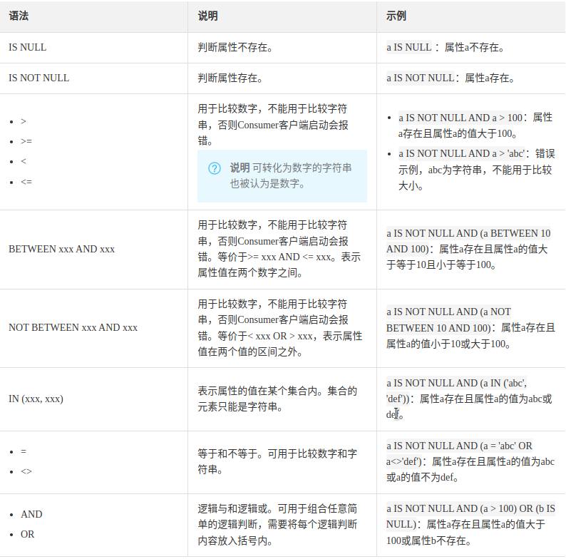
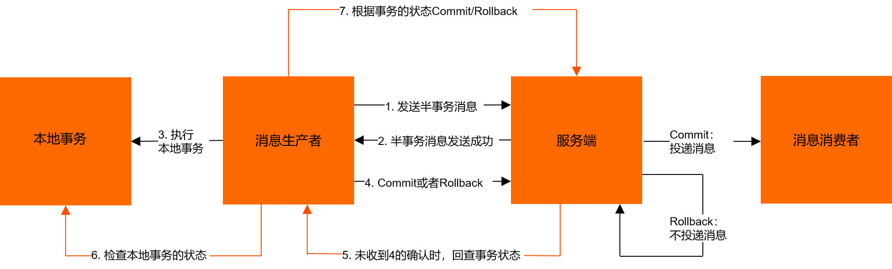

# 样例-Java

[GitHub](https://github.com/PPG007/rocketmq-demo-java)

## 添加依赖

```xml
<dependency>
    <groupId>org.apache.rocketmq</groupId>
    <artifactId>rocketmq-client</artifactId>
    <version>4.9.1</version>
</dependency>
```

## 基本样例

### 发送同步消息

同步消息发送比较可靠，会等待 Broker 的响应。

```java
public class SyncProducer {
	public static void main(String[] args) throws Exception {
    	// 实例化消息生产者Producer
        DefaultMQProducer producer = new DefaultMQProducer("test");
    	// 设置NameServer的地址
    	producer.setNamesrvAddr("localhost:9876");
    	// 启动Producer实例
        producer.start();
    	for (int i = 0; i < 100; i++) {
    	    // 创建消息，并指定Topic，Tag和消息体
    	    Message msg = new Message("TopicTest" /* Topic */,
        	"TagA" /* Tag */,
        	("Hello RocketMQ " + i).getBytes(RemotingHelper.DEFAULT_CHARSET) /* Message body */
        	);
        	// 发送消息到一个Broker
            SendResult sendResult = producer.send(msg);
            // 通过sendResult返回消息是否成功送达
            System.out.printf("%s%n", sendResult);
    	}
    	// 如果不再发送消息，关闭Producer实例。
    	producer.shutdown();
    }
}
```

### 发送异步消息

异步消息通常用在对响应时间敏感的业务场景，即发送端不能容忍长时间地等待 Broker 的响应。

```java
public class AsyncProducer {
	public static void main(String[] args) throws Exception {
    	// 实例化消息生产者Producer
        DefaultMQProducer producer = new DefaultMQProducer("test");
    	// 设置NameServer的地址
        producer.setNamesrvAddr("192.168.2.147:9876");
    	// 启动Producer实例
        producer.start();
        producer.setRetryTimesWhenSendAsyncFailed(0);

	int messageCount = 100;
        // 根据消息数量实例化倒计时计算器
	final CountDownLatch2 countDownLatch = new CountDownLatch2(messageCount);
    	for (int i = 0; i < messageCount; i++) {
                final int index = i;
            	// 创建消息，并指定Topic，Tag和消息体
                Message msg = new Message("TopicTest",
                    "TagA",
                    "OrderID188",
                    "Hello world".getBytes(RemotingHelper.DEFAULT_CHARSET));
                // SendCallback接收异步返回结果的回调
                producer.send(msg, new SendCallback() {
                    @Override
                    public void onSuccess(SendResult sendResult) {
                        countDownLatch.countDown();
                        System.out.printf("%-10d OK %s %n", index,
                            sendResult.getMsgId());
                    }
                    @Override
                    public void onException(Throwable e) {
                        countDownLatch.countDown();
      	                System.out.printf("%-10d Exception %s %n", index, e);
      	                e.printStackTrace();
                    }
            	});
    	}
	// 等待5s
	countDownLatch.await(5, TimeUnit.SECONDS);
    	// 如果不再发送消息，关闭Producer实例。
    	producer.shutdown();
    }
}
```

### 单向发送消息

单向发送中，发送者只负责发送，没有发送结果。

```java
public class OnewayProducer {
	public static void main(String[] args) throws Exception{
    	// 实例化消息生产者Producer
        DefaultMQProducer producer = new DefaultMQProducer("test");
    	// 设置NameServer的地址
        producer.setNamesrvAddr("192.168.2.147:9876");
    	// 启动Producer实例
        producer.start();
    	for (int i = 0; i < 10; i++) {
        	// 创建消息，并指定Topic，Tag和消息体
        	Message msg = new Message("TopicTest",
                "TagA" ,
                ("send one way  " + i).getBytes(RemotingHelper.DEFAULT_CHARSET)
        	);
        	// 发送单向消息，没有任何返回结果
        	producer.sendOneway(msg);

    	}
    	// 如果不再发送消息，关闭Producer实例。
    	producer.shutdown();
    }
}
```

### 消费消息

```java
public class Consumer {

	public static void main(String[] args) throws InterruptedException, MQClientException {

    	// 实例化消费者
        DefaultMQPushConsumer consumer = new DefaultMQPushConsumer("consumer1");

    	// 设置NameServer的地址
        consumer.setNamesrvAddr("192.168.2.147:9876");

    	// 订阅一个或者多个Topic，以及Tag来过滤需要消费的消息
        consumer.subscribe("TopicTest", "*");
    	// 注册回调实现类来处理从broker拉取回来的消息
        consumer.registerMessageListener((MessageListenerConcurrently) (msgs, context) -> {
            msgs.forEach((msg) -> {
                String msgString = new String(msg.getBody(), StandardCharsets.UTF_8);
                System.out.println(msgString);
            });
            // 标记该消息已经被成功消费
            return ConsumeConcurrentlyStatus.CONSUME_SUCCESS;
        });
        // 启动消费者实例
        consumer.start();
        System.out.printf("Consumer Started.%n");
	}
}
```

## 顺序消息样例

消息有序指的是可以按照消息的发送顺序来消费(FIFO)。RocketMQ 可以严格的保证消息有序，可以分为分区有序或者全局有序。

顺序消费的原理解析，在默认的情况下消息发送会采取 Round Robin 轮询方式把消息发送到不同的 queue(分区队列)；而消费消息的时候从多个 queue 上拉取消息，这种情况发送和消费是不能保证顺序。但是如果控制发送的顺序消息只依次发送到同一个 queue 中，消费的时候只从这个 queue 上依次拉取，则就保证了顺序。当发送和消费参与的 queue 只有一个，则是全局有序；如果多个 queue 参与，则为分区有序，即相对每个 queue，消息都是有序的。

下面用订单进行分区有序的示例。一个订单的顺序流程是：创建、付款、推送、完成。订单号相同的消息会被先后发送到同一个队列中，消费时，同一个 OrderId 获取到的肯定是同一个队列。

### 生产顺序消息

```java
public class Producer {

   public static void main(String[] args) throws Exception {
       DefaultMQProducer producer = new DefaultMQProducer("test");

       producer.setNamesrvAddr("192.168.2.147:9876");

       producer.start();

       String[] tags = new String[]{"TagA", "TagC", "TagD"};

       // 订单列表
       List<OrderStep> orderList = new Producer().buildOrders();

       Date date = new Date();
       SimpleDateFormat sdf = new SimpleDateFormat("yyyy-MM-dd HH:mm:ss");
       String dateStr = sdf.format(date);
       for (int i = 0; i < orderList.size(); i++) {
           // 加个时间前缀
           String body = dateStr + " Hello RocketMQ " + orderList.get(i);
           Message msg = new Message("TopicTest", tags[i % tags.length], "KEY" + i, body.getBytes());

           SendResult sendResult = producer.send(msg, (mqs, msg1, arg) -> {
               Long id = (Long) arg;  //根据订单id选择发送queue
               long index = id % mqs.size();
               return mqs.get((int) index);
           }, orderList.get(i).getOrderId());

           System.out.printf("SendResult status:%s, queueId:%d, body:%s%n",
               sendResult.getSendStatus(),
               sendResult.getMessageQueue().getQueueId(),
               body);
       }

       producer.shutdown();
   }

   /**
    * 订单的步骤
    */
   private static class OrderStep {
       private long orderId;
       private String desc;

       public long getOrderId() {
           return orderId;
       }

       public void setOrderId(long orderId) {
           this.orderId = orderId;
       }

       public String getDesc() {
           return desc;
       }

       public void setDesc(String desc) {
           this.desc = desc;
       }

       @Override
       public String toString() {
           return "OrderStep{" +
               "orderId=" + orderId +
               ", desc='" + desc + '\'' +
               '}';
       }
   }

   /**
    * 生成模拟订单数据
    */
   private List<OrderStep> buildOrders() {
       List<OrderStep> orderList = new ArrayList<>();

       OrderStep orderDemo = new OrderStep();
       orderDemo.setOrderId(15103111039L);
       orderDemo.setDesc("创建");
       orderList.add(orderDemo);

       orderDemo = new OrderStep();
       orderDemo.setOrderId(15103111065L);
       orderDemo.setDesc("创建");
       orderList.add(orderDemo);

       orderDemo = new OrderStep();
       orderDemo.setOrderId(15103111039L);
       orderDemo.setDesc("付款");
       orderList.add(orderDemo);

       orderDemo = new OrderStep();
       orderDemo.setOrderId(15103117235L);
       orderDemo.setDesc("创建");
       orderList.add(orderDemo);

       orderDemo = new OrderStep();
       orderDemo.setOrderId(15103111065L);
       orderDemo.setDesc("付款");
       orderList.add(orderDemo);

       orderDemo = new OrderStep();
       orderDemo.setOrderId(15103117235L);
       orderDemo.setDesc("付款");
       orderList.add(orderDemo);

       orderDemo = new OrderStep();
       orderDemo.setOrderId(15103111065L);
       orderDemo.setDesc("完成");
       orderList.add(orderDemo);

       orderDemo = new OrderStep();
       orderDemo.setOrderId(15103111039L);
       orderDemo.setDesc("推送");
       orderList.add(orderDemo);

       orderDemo = new OrderStep();
       orderDemo.setOrderId(15103117235L);
       orderDemo.setDesc("完成");
       orderList.add(orderDemo);

       orderDemo = new OrderStep();
       orderDemo.setOrderId(15103111039L);
       orderDemo.setDesc("完成");
       orderList.add(orderDemo);

       return orderList;
   }
}
```

### 顺序消费消息

```java
public class ConsumerInOrder {

   public static void main(String[] args) throws Exception {
       DefaultMQPushConsumer consumer = new DefaultMQPushConsumer("test");
       consumer.setNamesrvAddr("192.168.2.147:9876");
       /**
        * 设置Consumer第一次启动是从队列头部开始消费还是队列尾部开始消费<br>
        * 如果非第一次启动，那么按照上次消费的位置继续消费
        */
       consumer.setConsumeFromWhere(ConsumeFromWhere.CONSUME_FROM_FIRST_OFFSET);

       consumer.subscribe("TopicTest2", "TagA || TagC || TagD");

       consumer.registerMessageListener(new MessageListenerOrderly() {

           final Random random = new Random();

           @Override
           public ConsumeOrderlyStatus consumeMessage(List<MessageExt> msgs, ConsumeOrderlyContext context) {
               context.setAutoCommit(true);
               for (MessageExt msg : msgs) {
                   // 可以看到每个queue有唯一的consume线程来消费, 订单对每个queue(分区)有序
                   System.out.println("consumeThread=" + Thread.currentThread().getName() + "queueId=" + msg.getQueueId() + ", content:" + new String(msg.getBody()));
               }

               try {
                   //模拟业务逻辑处理中...
                   TimeUnit.SECONDS.sleep(random.nextInt(10));
               } catch (Exception e) {
                   e.printStackTrace();
               }
               return ConsumeOrderlyStatus.SUCCESS;
           }
       });

       consumer.start();

       System.out.println("Consumer Started.");
   }
}
```

## 延时消息样例

延时消息的消费时间会比 broker 受到并存储消息的时间中存在间隔，在订单系统中，可以为下单事件发送一个延时消息，过一段时间后消息的消费者收到消息后去检查这个订单是否支付，如果没有可以取消。

首先启动一个消费者客户端等待传入消息：

```java
public class ScheduledMessageConsumer {
   public static void main(String[] args) throws Exception {
      // 实例化消费者
      DefaultMQPushConsumer consumer = new DefaultMQPushConsumer("ExampleConsumer");
      // 设置NameServer的地址
      consumer.setNamesrvAddr("192.168.2.147:9876");
      // 订阅Topics
      consumer.subscribe("TestTopic", "*");
      // 注册消息监听者
      consumer.registerMessageListener(new MessageListenerConcurrently() {
          @Override
          public ConsumeConcurrentlyStatus consumeMessage(List<MessageExt> messages, ConsumeConcurrentlyContext context) {
              for (MessageExt message : messages) {
                  // Print approximate delay time period
                  System.out.println("Receive message[msgId=" + message.getMsgId() + "] " + (System.currentTimeMillis() - message.getBornTimestamp()) + "ms later");
              }
              return ConsumeConcurrentlyStatus.CONSUME_SUCCESS;
          }
      });
      // 启动消费者
      consumer.start();
  }
}
```

然后发送延时消息：

```java
public class ScheduledMessageProducer {
   public static void main(String[] args) throws Exception {
      // 实例化一个生产者来产生延时消息
      DefaultMQProducer producer = new DefaultMQProducer("ExampleProducerGroup");
      // 设置NameServer的地址
      producer.setNamesrvAddr("192.168.2.147:9876");
      // 启动生产者
      producer.start();
      int totalMessagesToSend = 100;
      for (int i = 0; i < totalMessagesToSend; i++) {
          Message message = new Message("TestTopic", ("Hello scheduled message " + i).getBytes());
          // 设置延时等级3,这个消息将在10s之后发送(现在只支持固定的几个时间,详看delayTimeLevel)
          message.setDelayTimeLevel(3);
          // 发送消息
          producer.send(message);
      }
       // 关闭生产者
      producer.shutdown();
  }
}
```

::: warning

RocketMQ 不支持任意延时时间，存在着预设置的固定延时，具体可见 org/apache/rocketmq/store/config/MessageStoreConfig.java 文件中的定义：

`private String messageDelayLevel = "1s 5s 10s 30s 1m 2m 3m 4m 5m 6m 7m 8m 9m 10m 20m 30m 1h 2h";`

:::

## 批量消息样例

批量发送消息能显著提高传递小消息的性能。限制是这些批量消息应该有相同的 topic，相同的 waitStoreMsgOK，而且不能是延时消息。此外，这一批消息的总大小不应超过 **4MB**。

### 发送批量消息

```java
public static void main(String[] args) throws MQClientException {
    DefaultMQProducer producer = new DefaultMQProducer("test");
    // 设置NameServer的地址
    producer.setNamesrvAddr("192.168.2.147:9876");
    // 启动Producer实例
    producer.start();
    String topic = "BatchTest";
    List<Message> messages = new ArrayList<>();
    messages.add(new Message(topic, "TagA", "OrderID001", "Hello world 0".getBytes()));
    messages.add(new Message(topic, "TagA", "OrderID002", "Hello world 1".getBytes()));
    messages.add(new Message(topic, "TagA", "OrderID003", "Hello world 2".getBytes()));
    try {
        producer.send(messages);
    } catch (Exception e) {
        e.printStackTrace();
    }
    producer.shutdown();
}
```

上述代码中没有指定消息存储的 queue,所以消费时和上面的顺序可能不同。

### 批量消息分割

如果一批消息大小超过了 4MB，那么就需要对消息进行分割、分批发送。

利用迭代器实现对于一批消息的分割遍历：

```java
public class ListSplitter implements Iterator<List<Message>> {
    private final int SIZE_LIMIT = 1024 * 1024 * 4;
    private final List<Message> messages;
    private int currIndex;
    public ListSplitter(List<Message> messages) {
        this.messages = messages;
    }
    @Override public boolean hasNext() {
        return currIndex < messages.size();
    }
    @Override public List<Message> next() {
        int startIndex = getStartIndex();
        int nextIndex = startIndex;
        int totalSize = 0;
        for (; nextIndex < messages.size(); nextIndex++) {
            Message message = messages.get(nextIndex);
            int tmpSize = calcMessageSize(message);
            if (tmpSize + totalSize > SIZE_LIMIT) {
                break;
            } else {
                totalSize += tmpSize;
            }
        }
        List<Message> subList = messages.subList(startIndex, nextIndex);
        currIndex = nextIndex;
        return subList;
    }
    private int getStartIndex() {
        Message currMessage = messages.get(currIndex);
        int tmpSize = calcMessageSize(currMessage);
        while(tmpSize > SIZE_LIMIT) {
            currIndex += 1;
            Message message = messages.get(currIndex);
            tmpSize = calcMessageSize(message);
        }
        return currIndex;
    }
    private int calcMessageSize(Message message) {
        int tmpSize = message.getTopic().length() + message.getBody().length;
        Map<String, String> properties = message.getProperties();
        for (Map.Entry<String, String> entry : properties.entrySet()) {
            tmpSize += entry.getKey().length() + entry.getValue().length();
        }
        // 增加⽇志的开销20字节
        tmpSize = tmpSize + 20;
        return tmpSize;
    }
}
```

然后发送消息：

```java
public class Main {
    public static void main(String[] args) throws MQClientException {
        DefaultMQProducer producer = new DefaultMQProducer("test");
        // 设置NameServer的地址
        producer.setNamesrvAddr("192.168.2.147:9876");
        // 启动Producer实例
        producer.start();
        String topic = "BatchTest";
        List<Message> messages = new ArrayList<>();
        for (int i = 0; i < 100; i++) {
            messages.add(new Message(topic, "TagA", String.format("OrderID%03d", i), String.format("Hello world %d", i).getBytes()));
        }
        ListSplitter listSplitter = new ListSplitter(messages);
        while (listSplitter.hasNext()) {
            try {
                producer.send(listSplitter.next());
            } catch (Exception e) {
                e.printStackTrace();
            }
        }
        producer.shutdown();
    }
}
```

## 过滤消息样例

### 利用 Tag 过滤消息

要利用 Tag 进行过滤只需要在消费端订阅 topic 时使用 `consumer.subscribe("FilterTest", "A || B");` 即可。

::: warning

用 tag 过滤时如果是批发送消息会导致实际的 tag 值与设置的不同，进而导致消费端过滤错误。

:::

### 使用 property 过滤消息

可以利用 `putUserProperty` 方法为消息设置属性，可以使用 SQL92 标准的 SQL 语句实现过滤。

RocketMQ 只定义了一些基本语法来支持这个特性：

- 数值比较，比如：>，>=，<，<=，BETWEEN，=；
- 字符比较，比如：=，<>，IN；
- IS NULL 或者 IS NOT NULL；
- 逻辑符号 AND，OR，NOT；

常量支持类型为：

- 数值，比如：123，3.1415；
- 字符，比如：'abc'，必须用单引号包裹起来；
- NULL，特殊的常量
- 布尔值，TRUE 或 FALSE

::: warning

只有使用 push 模式的消费者才能用使用 SQL92 标准的 sql 语句。

:::

发送带有属性的消息：

```java
public class Main {
    public static void main(String[] args) throws MQClientException {
        DefaultMQProducer producer = new DefaultMQProducer("test");
        // 设置NameServer的地址
        producer.setNamesrvAddr("192.168.2.147:9876");
        // 启动Producer实例
        producer.start();
        String topic = "FilterTest";
        List<Message> messages = new ArrayList<>();
        String[] levels = {"A", "B", "C"};
        Random random = new Random(System.currentTimeMillis());
        for (int i = 0; i < 10; i++) {
            Message message = new Message(topic, String.format("Hello world %d", i).getBytes());
            message.putUserProperty("Level", levels[random.nextInt(3)]);
            messages.add(message);
        }
        messages.forEach(message -> {
            System.out.println(message.getTags());
        });
        ListSplitter listSplitter = new ListSplitter(messages);
        while (listSplitter.hasNext()) {
            try {
                producer.send(listSplitter.next());
            } catch (Exception e) {
                e.printStackTrace();
            }
        }
        producer.shutdown();
    }
}
```

消费端进行过滤：

```java
public class Consumer {

	public static void main(String[] args) throws InterruptedException, MQClientException {

    	// 实例化消费者
        DefaultMQPushConsumer consumer = new DefaultMQPushConsumer("consumer1");

    	// 设置NameServer的地址
        consumer.setNamesrvAddr("192.168.2.147:9876");

    	// 订阅一个或者多个Topic，以及Tag来过滤需要消费的消息
        consumer.subscribe("FilterTest", MessageSelector.bySql("Level IN ('A', 'B')"));
    	// 注册回调实现类来处理从broker拉取回来的消息
        consumer.registerMessageListener((MessageListenerConcurrently) (msgs, context) -> {
            msgs.forEach((msg) -> {
                System.out.println(msg);
                String msgString = new String(msg.getBody(), StandardCharsets.UTF_8);
                System.out.println(msgString);
                System.out.println(msg.getTags());
            });
            // 标记该消息已经被成功消费
            return ConsumeConcurrentlyStatus.CONSUME_SUCCESS;
        });
        // 启动消费者实例
        consumer.start();
        System.out.printf("Consumer Started.%n");
	}
}
```

Docker 镜像中的 RocketMQ 默认是不开启对于使用自定义属性进行过滤的支持的，即 enablePropertyFilter 的值为 false，可以将 RocketMQ 的 conf 目录中的一个配置文件进行修改并挂载到容器中，例如可以使用下面的配置文件：

```properties
brokerClusterName=DefaultCluster
brokerName=broker-a
brokerId=0
deleteWhen=04
fileReservedTime=48
brokerRole=ASYNC_MASTER
flushDiskType=ASYNC_FLUSH
enablePropertyFilter=true
```

然后使用下面的命令挂载并使用这个配置文件启动 Broker：

```shell
docker run -dit --rm --mount type=bind,source=$(pwd)/custom-config,target=/home/custom-config --net=host apache/rocketmq ./mqbroker -n localhost:9876 -c /home/custom-config/broker-a.properties
```

其中 custom-config 是自定义配置文件所在的目录。

RocketMQ 中 SQL 的语法及示例如下图所示：



## 消息事务样例

### 概念介绍

- 事务消息：消息队列 RocketMQ 提供的分布式事务功能，通过消息队列 RocketMQ 事务消息能达到分布式事务的最终一致。
- 半事务消息：暂不能投递的消息，生产者已经成功地将消息发送到了消息队列 RocketMQ 版服务端，但是消息队列 RocketMQ 版服务端未收到生产者对该消息的二次确认，此时该消息被标记成“暂不能投递”状态，处于该种状态下的消息即半事务消息。
- 消息回查：由于网络闪断、生产者应用重启等原因，导致某条事务消息的二次确认丢失，消息队列 RocketMQ 版服务端通过扫描发现某条消息长期处于“半事务消息”时，需要主动向消息生产者询问该消息的最终状态（Commit 或是 Rollback），该询问过程即消息回查。

事务消息共有三种状态，提交状态、回滚状态、中间状态：

- TransactionStatus.CommitTransaction: 提交事务，它允许消费者消费此消息。
- TransactionStatus.RollbackTransaction: 回滚事务，它代表该消息将被删除，不允许被消费。
- TransactionStatus.Unknown: 中间状态，它代表需要检查消息队列来确定状态。

事务消息交互流程如图所示：



下面是消息生产者的代码示例：

```java
public class TransactionProducer {
   public static void main(String[] args) throws MQClientException, InterruptedException {
       TransactionListener transactionListener = new TransactionListenerImpl();
       TransactionMQProducer producer = new TransactionMQProducer("test");
       ExecutorService executorService = new ThreadPoolExecutor(2, 5, 100, TimeUnit.SECONDS, new ArrayBlockingQueue<>(2000), r -> {
           Thread thread = new Thread(r);
           thread.setName("client-transaction-msg-check-thread");
           return thread;
       });
       producer.setExecutorService(executorService);
       producer.setTransactionListener(transactionListener);
       producer.start();
       String[] tags = new String[] {"TagA", "TagB", "TagC", "TagD", "TagE"};
       for (int i = 0; i < 10; i++) {
           try {
               Message msg =
                   new Message("TopicTest", tags[i % tags.length], "KEY" + i,
                       ("Hello RocketMQ " + i).getBytes(RemotingHelper.DEFAULT_CHARSET));
               SendResult sendResult = producer.sendMessageInTransaction(msg, null);
               System.out.printf("%s%n", sendResult);
               Thread.sleep(10);
           } catch (MQClientException | UnsupportedEncodingException e) {
               e.printStackTrace();
           }
       }
       producer.shutdown();
   }
}
```

由上面的流程图我们可以知道，事务消息的生产者需要能够对消息回查做出响应且能够执行自身事务，因此需要一个 `TransactionListener` 接口的实现类，这个接口具有两个方法，其中 `executeLocalTransaction` 方法用来执行本地的事务并且返回事务消息的三种状态的其中一种，`checkLocalTransaction` 方法用于响应消息回查并且也返回一个状态。同时，这个接口的实现类的两个方法的执行需要一个线程池，于是就像上面那样创建一个线程池。

```java
public class TransactionListenerImpl implements TransactionListener {
  private final AtomicInteger transactionIndex = new AtomicInteger(0);
  private final ConcurrentHashMap<String, Integer> localTrans = new ConcurrentHashMap<>();
  @Override
  public LocalTransactionState executeLocalTransaction(Message msg, Object arg) {
      int value = transactionIndex.getAndIncrement();
      int status = value % 3;
      localTrans.put(msg.getTransactionId(), status);
      return LocalTransactionState.UNKNOW;
  }
  @Override
  public LocalTransactionState checkLocalTransaction(MessageExt msg) {
      Integer status = localTrans.get(msg.getTransactionId());
      if (null != status) {
          switch (status) {
              case 0:
                  return LocalTransactionState.UNKNOW;
              case 1:
                  return LocalTransactionState.COMMIT_MESSAGE;
              case 2:
                  return LocalTransactionState.ROLLBACK_MESSAGE;
              default:
                  return null;
          }
      }
      return LocalTransactionState.COMMIT_MESSAGE;
  }
}
```

::: tip 事务消息的一些限制

- 事务消息不支持延时消息和批量消息。
- 为了避免单个消息被检查太多次而导致半队列消息累积，默认将单个消息的检查次数限制为 15 次，但是用户可以通过 Broker 配置文件的 transactionCheckMax 参数来修改此限制。如果已经检查某条消息超过 N 次的话（ N = transactionCheckMax ） 则 Broker 将丢弃此消息，并在默认情况下同时打印错误日志。用户可以通过重写 AbstractTransactionalMessageCheckListener 类来修改这个行为。
- 事务消息将在 Broker 配置文件中的参数 transactionTimeout 这样的特定时间长度之后被检查。当发送事务消息时，用户还可以通过设置用户属性 CHECK_IMMUNITY_TIME_IN_SECONDS 来改变这个限制，该参数优先于 transactionTimeout 参数。
- 事务性消息可能不止一次被检查或消费。
- 提交给用户的目标主题消息可能会失败，目前这依日志的记录而定。它的高可用性通过 RocketMQ 本身的高可用性机制来保证，如果希望确保事务消息不丢失、并且事务完整性得到保证，建议使用同步的双重写入机制。
- 事务消息的生产者 ID 不能与其他类型消息的生产者 ID 共享。与其他类型的消息不同，事务消息允许反向查询、MQ 服务器能通过它们的生产者 ID 查询到消费者。

:::
