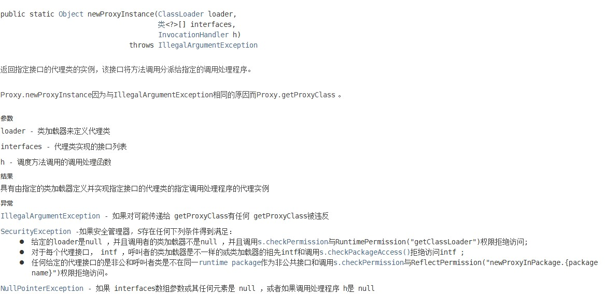

# 代理模式

## 静态代理

### 角色

- 抽象角色：一般用抽象类或接口。
- 真实角色：被代理的角色。
- 代理角色：代理真实角色的角色，一般有附属操作。
- 客户：访问代理对象的人。

### 代码过程

- 接口。
- 真实角色。
- 代理角色。
- 客户端访问代理角色。

### 代理模式优点

- 使真实角色的操作更加纯粹，不用去关注一些公共的业务。
- 实现了业务的分工。
- 公共业务发生扩展时，便于集中管理。

### 静态代理模式缺点

每个真实角色都会有一个代理角色，代码量翻倍，开发效率降低。

## 动态代理

- 动态代理的代理类是动态生成的。
- 动态代理分类：
  - 基于接口的动态代理：JDK动态代理。[InvocationHandler](https://docs.oracle.com/javase/8/docs/api/java/lang/reflect/InvocationHandler.html)
  - 基于类的动态代理：[CGLIB](https://www.runoob.com/w3cnote/cglibcode-generation-library-intro.html)。
  - Java字节码实现：[Javassist](https://www.javassist.org/)。

InvocationHandler 是由代理实例的调用处理程序实现的接口。

每个代理实例都有一个关联的调用处理程序。 当在代理实例上调用方法时，方法调用将被编码并分派到其调用处理程序的 **invoke** 方法。

实现类：Proxy.

```java
InvocationHandler handler = new MyInvocationHandler(...);
Class<?> proxyClass = Proxy.getProxyClass(Foo.class.getClassLoader(), Foo.class);
Foo f = (Foo) proxyClass.getConstructor(InvocationHandler.class).newInstance(handler);
```

或

```java
Foo f = (Foo) Proxy.newProxyInstance(Foo.class.getClassLoader(),new Class<?>[] { Foo.class },handler);
```

方法：


### 示例代码（中介租房）

- 要代理的接口：

```java
public interface Rent {

    /**
     * test
     */
    void rent();
}
```

- 被代理的真实角色（要实现被代理的接口）：

```java
public class Host implements Rent{

    public void rent() {
        System.out.println("房东出租");
    }
}
```

- 代理类：

```java
public class ProxyInvocationHandler implements InvocationHandler {

    //要被代理的真实角色
    private Object target;

    public void setTarget(Object target) {
        this.target = target;
    }

    //动态生成代理类
    public Object getProxy(){
        return Proxy.newProxyInstance(this.getClass().getClassLoader(),target.getClass().getInterfaces(),this);
    }

    //处理代理的实例，返回结果
    public Object invoke(Object proxy, Method method, Object[] args) throws Throwable {
        see();
        System.out.println(method.getName());
        return method.invoke(target,args);
    }

    //自定义的方法
    public void see(){
        System.out.println("看房");
    }
}
```

- 入口方法：

```java
public class Client {
    public static void main(String[] args) {
        //要代理的真实角色
        Host host=new Host();
        //创建代理类对象
        ProxyInvocationHandler proxyInvocationHandler = new ProxyInvocationHandler();
        //设置要代理的对象
        proxyInvocationHandler.setTarget(host);
        //动态生成代理类
        Rent proxy= (Rent) proxyInvocationHandler.getProxy();
        //调用相关方法
        proxy.rent();
    }
}
```
