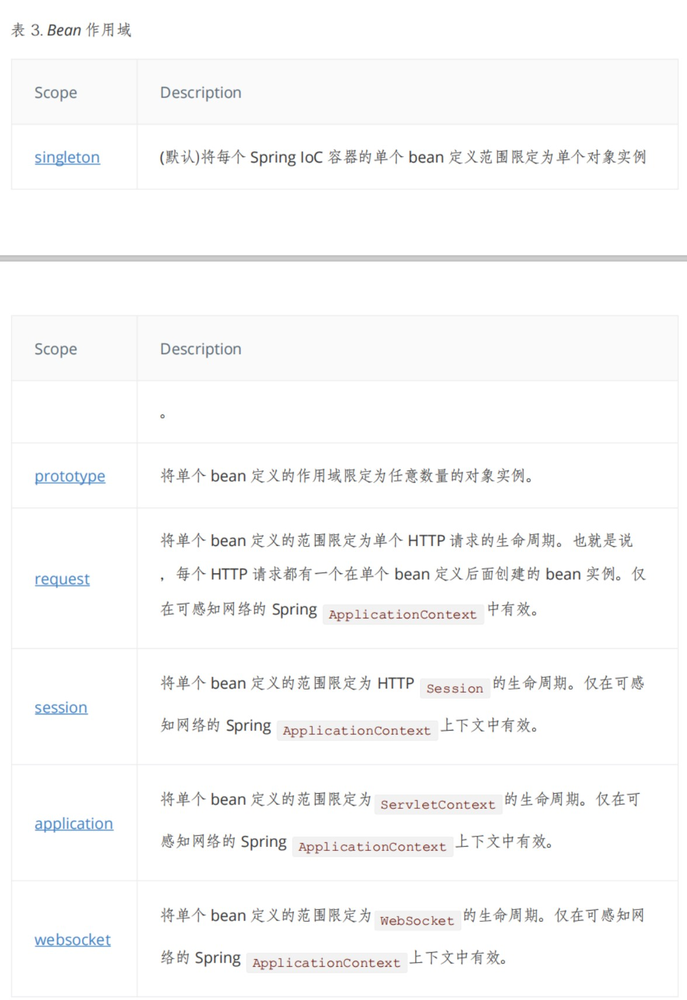

# Spring 配置

- 别名。

  - 通过 alias 标签起：

    ```xml
    <alias name="userService" alias="userService2"/>
    ```

  - 通过 bean 标签中的 name 属性起别名，可以用逗号或者空格或者分号进行分割起多个别名：

  ```xml
  <bean class="service.UserServiceImpl" id="userService" name="userService2,userService3">
          <constructor-arg ref="userDaoOracle"/>
  </bean>
  ```

- scope 作用域：

  

- import：

  一般用于团队开发，将多个配置文件导入合并为一个,允许多个相同别名。

  ```xml
  <!--在applicationContext.xml中添加import标签-->
  <import resource="beans.xml"/>
  ```

  ```java
  //测试代码只读取applicationContext.xml
  public class MyTest2 {
      public static void main(String[] args) {
          ApplicationContext context=new ClassPathXmlApplicationContext("applicationContext.xml");

          Object o=context.getBean("userService3");
          ((UserServiceImpl)o).getUser();
      }
  }
  ```
