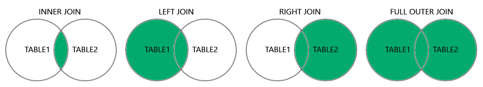

# 查询

## 准备数据

在 MySQL 中执行[init.sql](./init.sql.md)初始化数据。

## 基础查询

查询一个表的全部列：

```sql
SELECT * from customers;
```

查询指定列：

```sql
SELECT CustomerName, City from customers;
```

查询所有不重复的值：

```sql
-- 查询某一列的不重复的值
SELECT distinct Country from customers;
-- 查询多列组合的不重复的值
SELECT distinct City, Country from customers;
-- 计算不重复的值的数量
SELECT COUNT(distinct City, Country) from customers;
```

## 条件查询

在字符串字段上查询：

```sql
SELECT * from customers WHERE Country = 'Mexico';
```

在整型字段上查询：

```sql
SELECT * from customers WHERE CustomerID <> 2;
```

条件字句中可用的运算符：

|operator|描述|
|--------|---|
|`=`|等于|
|`>`|大于|
|`>=`|大于等于|
|`<`|小于|
|`<=`|小于等于|
|`<>`|不等于|
|`BETWEEN`|介于|
|`LIKE`|模糊匹配|
|`IN`|多个匹配值查询|

```sql
SELECT * from customers WHERE CustomerID IN (1, 5);
```

多条件查询：

```sql
-- and
SELECT * FROM customers WHERE Country = 'Spain' AND CustomerName LIKE 'G%';
-- or
SELECT * FROM customers WHERE Country = 'Norway' OR City = 'Berlin' OR CustomerName LIKE 'G%';
```

组合 AND 和 OR：

```sql
SELECT * FROM customers
WHERE Country = 'Spain' AND (CustomerName LIKE  'G%' OR CustomerName LIKE 'R%')
-- 如果不加括号，那么这个查询将会返回国家是 Spain 且名字开头是 G 的记录和名字开头是 R 的记录
SELECT *
FROM customers
WHERE Country = 'Spain' AND CustomerName LIKE 'G%'
   OR CustomerName LIKE 'R%'
```

查询条件不成立的数据：

```sql
SELECT * FROM customers WHERE NOT Country = 'Spain';
-- not like
SELECT * FROM customers WHERE CustomerName NOT LIKE 'A%';
-- not between
SELECT * FROM customers WHERE CustomerID NOT BETWEEN 10 AND 60;
-- not in
SELECT * FROM customers WHERE City NOT IN ('Paris', 'London');
-- not greater than
SELECT * FROM products WHERE NOT Price > 5;
-- not less than
SELECT * FROM products WHERE NOT Price < 5;
```

IN 查询：

```sql
SELECT * FROM customers WHERE Country IN ('Germany', 'UK')
-- NOT IN
SELECT * FROM customers WHERE Country NOT IN ('Germany', 'UK')
```

BETWEEN 查询：

```sql
SELECT * FROM products WHERE Price BETWEEN 10 AND 20;
-- NOT BETWEEN
SELECT * FROM products WHERE Price NOT BETWEEN 10 AND 20;
-- with IN
SELECT * FROM products WHERE Price BETWEEN 10 AND 20 AND CategoryID IN (1, 2, 3);
-- 字符串比较，按字典序比较
SELECT * FROM products WHERE ProductName BETWEEN 'Carnarvon Tigers' AND 'Mozzarella di Giovanni' ORDER BY ProductName;
-- 日期比较
SELECT * FROM orders WHERE OrderDate BETWEEN '1996-07-01' AND '1996-07-31';
```

## 排序查询

按照整型字段排序：

```sql
-- 从小到大
SELECT * FROM products ORDER BY Price;
-- 从大到小
SELECT * FROM products ORDER BY Price DESC;
```

对于字符串字段，排序将按照字典序进行：

```sql
-- 正序
SELECT * FROM products ORDER BY ProductName ASC;
-- 倒序
SELECT * FROM products ORDER BY ProductName DESC;
```

多个字段参与排序：

```sql
SELECT * FROM products ORDER BY Price, ProductName;
```

同时使用 ASC 和 DESC：

```sql
SELECT * FROM products ORDER BY Price ASC, ProductName DESC ;
```

## NULL

NULL 值不能使用比较运算符来筛选，而是 `IS NULL` 和 `IS NOT NULL`：

```sql
SELECT CustomerName, ContactName, Address FROM customers WHERE Address IS NULL
SELECT CustomerName, ContactName, Address FROM customers WHERE Address IS NOT NULL
```

为了避免在运算某些列时由于 NULL 值导致的问题，可以使用以下方法来处理：

```sql
-- 这会导致如果 ContactName 为 NULL，那么结果也为 NULL
SELECT CONCAT('name: ', ContactName) FROM customers;

SELECT CONCAT('name: ', IFNULL(ContactName, 'null')) FROM customers;
SELECT CONCAT('name: ', COALESCE(ContactName, 'null')) FROM customers;
```

IFNULL 会校验第一个表达式，如果第一个表达式为 NULL，那么将返回第二个值。

COALESCE 接收若干输入，返回第一个不是 NULL 的参数。

## LIMIT

要限制返回的数据的条数，可以使用 LIMIT 关键字，在 MSSQLServer 中，使用 SELECT TOP 代替，以 MySQL 为例：

```sql
SELECT * FROM customers LIMIT 5
```

## 别名

`AS` 关键字可以指定别名：

```sql
-- 为查询出的列指定别名
SELECT CustomerName AS customer FROM customers;
-- 指定包含空格的别名
SELECT CustomerName AS 'Space Name' FROM customers;
-- 为表起别名，通常在 JOIN 时使用
SELECT * FROM customers AS c;
```

## 聚合函数

聚合函数接收一个集合并返回一个单一值，聚合函数通常与 GROUP BY 一起使用，常用的聚合函数：

- `MIN()`：获取最小值。
- `MAX()`：获取最大值。
- `COUNT()`：获取集合中数据的数量。
- `SUM()`：获取一个数字类型列之和。
- `AVG()`：获取一个数字类型列的平均值。

### MIN MAX

```sql
-- 基础示例
SELECT MIN(Price) FROM products;
SELECT MAX(Price) FROM products;
-- 结合别名
SELECT MIN(Price) AS lowestPrice FROM products;
-- 和 GROUP BY 结合使用，查询各个类目中最高价商品
SELECT MAX(Price) AS highestPrice, CategoryID FROM products GROUP BY CategoryID
```

### COUNT

语法：

```sql
SELECT COUNT(column_name) FROM table_name;
```

统计结果数量，包含 NULL：

```sql
SELECT COUNT(*) FROM products;
```

统计结果数量，不包含指定列为 NULL 的：

```sql
SELECT COUNT(ProductName) FROM products;
```

统计不重复的值的数量：

```sql
SELECT COUNT(DISTINCT Price) FROM products;
```

分组统计：

```sql
SELECT COUNT(*) AS total, CategoryID FROM products GROUP BY CategoryID ;
```

### SUM

```sql
SELECT SUM(Quantity) FROM order_details;
-- 与 GROUP BY 组合
SELECT SUM(Quantity) AS total, OrderID FROM order_details GROUP BY OrderID ;
-- 使用运算符
SELECT SUM(Price * Quantity) FROM order_details LEFT JOIN products ON order_details.ProductID = products.ProductID
```

### AVG

```sql
SELECT AVG(Price) FROM products;
-- 与 GROUP BY 使用
SELECT AVG(Price), CategoryID FROM products GROUP BY CategoryID ;
-- 获取商品表中价格低于平均值的商品
SELECT * FROM products WHERE Price < (SELECT AVG(Price) FROM products);
```

### CONCAT

```sql
SELECT CONCAT(Address, ', ', PostalCode, ', ', City, ', ', Country) FROM customers;
```

## 模糊查询

使用 `LIKE` 关键字来进行模糊匹配，常用的通配符有以下两种：

- `%`：匹配零个、一个、或者多个字符。
- `_`：仅匹配一个字符。

```sql
SELECT * FROM customers WHERE CustomerName LIKE 'a%';
SELECT * FROM customers WHERE City LIKE 'L_nd__';
-- start with
SELECT * FROM customers WHERE CustomerName LIKE 'La%'
-- end with
SELECT * FROM customers WHERE CustomerName LIKE '%a'
-- contains
SELECT * FROM customers WHERE CustomerName LIKE '%or%'
-- 两个通配符组合使用，匹配第二个字母是 r 的
SELECT * FROM customers WHERE CustomerName LIKE '_r%'
```

## 连接查询

连接查询是将两个或两个以上的表的数据基于某种条件组合起来的查询，例如 orders 表和 customers 表，这两个表可以通过 orders.CustomerID = customers.CustomerID 组合起来。

连接查询有四种类型：

- `(INNER) JOIN`：返回两个表中符合条件的数据。
- `LEFT (OUTER) JOIN`：返回左表中的全部数据，以及右表中符合条件的数据。
- `RIGHT (OUTER) JOIN`：返回右表中的全部数据，以及左表中符合条件的数据。
- `FULL (OUTER) JOIN`：返回左表或右表中符合条件的数据。



### INNER JOIN

```sql
SELECT products.ProductID, products.ProductName, categories.CategoryName
FROM products JOIN categories
ON products.CategoryID = categories.CategoryID
-- 多表连接
SELECT orders.OrderID, customers.CustomerName, shippers.ShipperName
FROM (
    (orders JOIN customers ON orders.CustomerID = customers.CustomerID)
        JOIN shippers ON shippers.ShipperID = orders.ShipperID)
```

### LEFT JOIN

```sql
SELECT c.CustomerName, o.OrderID FROM orders AS o LEFT JOIN customers AS c ON o.CustomerID = c.CustomerID
```

### RIGHT JOIN

```sql
SELECT * FROM orders AS o RIGHT JOIN employees AS e ON o.EmployeeID = e.EmployeeID;
```

### FULL JOIN

```sql
SELECT customers.CustomerName, orders.OrderID
FROM customers
FULL OUTER JOIN orders ON customers.CustomerID=orders.CustomerID
ORDER BY customers.CustomerName;
```

::: info

MySQL 不支持 FULL JOIN（但是可以模拟）。

:::

### Self JOIN

Self JOIN 可以连接同一个表的不同行，例如下面的例子将查询出城市相同的 customer。

```sql
SELECT a.CustomerName AS name1, b.CustomerName AS name2, a.City
FROM customers AS a, customers AS b WHERE a.CustomerID <> b.CustomerID AND a.City = b.City ORDER BY a.City
```

## UNION

UNION 用来将多个 SELECT 语句的结果连接在一起：

- UNION 中的每个 SELECT 必须要有相同数量的列。
- 对应的列数据类型要一致。
- 每个 SELECT 中列的顺序要一致。

```sql
SELECT City FROM customers UNION SELECT City FROM suppliers
```

UNION 默认是 DISTINCT 的，如果不要去重，那么使用 UNION ALL：

```sql
SELECT City FROM customers UNION ALL SELECT City FROM suppliers ORDER BY City;
```

列出所有的 Customer 和 Supplier：

```sql
SELECT 'Customer' AS Type, ContactName, City, Country
FROM customers
UNION
SELECT 'Supplier', ContactName, City, Country
FROM suppliers;
```

## 分组

使用 `GROUP BY` 关键字来将结果分组，通常结合 `MIN()` 等函数使用。

```sql
-- 获取每个 Country 的客户数
SELECT COUNT(CustomerID), Country FROM customers GROUP BY Country ;
-- 获取每个 Country 的客户数，降序
SELECT COUNT(CustomerID), Country FROM customers GROUP BY Country ORDER BY COUNT(CustomerID);
-- 与连接一起使用
SELECT shippers.ShipperName, COUNT(orders.OrderID) AS total
FROM orders LEFT JOIN shippers ON orders.ShipperID = shippers.ShipperID GROUP BY shippers.ShipperName
```

## HAVING

WHERE 查询不能与聚合函数一起使用，这种情况可以使用 HAVING，用法与 WHERE 类似。

```sql
SELECT COUNT(CustomerID), Country FROM customers GROUP BY Country HAVING COUNT(CustomerID) > 5

SELECT COUNT(CustomerID), Country FROM customers
                                  GROUP BY Country
                                  HAVING COUNT(CustomerID) > 5 ORDER BY COUNT(CustomerID) DESC
```

## EXISTS、ANY、ALL

EXISTS 将会在子查询返回的结果大于等于 1 条时返回 TRUE。

```sql
SELECT SupplierName FROM suppliers WHERE EXISTS(SELECT * FROM products WHERE products.SupplierID = suppliers.SupplierID AND products.Price < 20);
```

ANY 和 ALL 能够在一列和一批数据上进行比较。

ANY 将会返回一个布尔值，当子查询的任一值符合条件时将返回 TRUE。

```sql
SELECT ProductName FROM products WHERE ProductID = ANY (
    SELECT ProductID
    FROM order_details WHERE Quantity = 10
)
```

ALL 同样返回一个布尔值，当子查询的所有结果都符合条件时返回 TRUE，与 SELECT、WHERE 和 HAVING 一起使用。

```sql
SELECT ALL ProductName FROM products

SELECT ProductName FROM products WHERE ProductID = ALL (
    SELECT ProductID FROM order_details WHERE Quantity = 10
)
```

## INSERT INTO SELECT

将查出来的数据插入一个已存在的表中：

```sql
INSERT INTO customers(CustomerName, City, Country) SELECT SupplierName, City, Country FROM suppliers WHERE Country = 'Germany'
```

## CASE

```sql
SELECT
    OrderID,
    Quantity,
    CASE
        WHEN Quantity > 30 THEN 'Good'
        WHEN Quantity = 30 THEN 'Normal'
        ELSE 'Bad'
    END AS t
FROM order_details;
```
