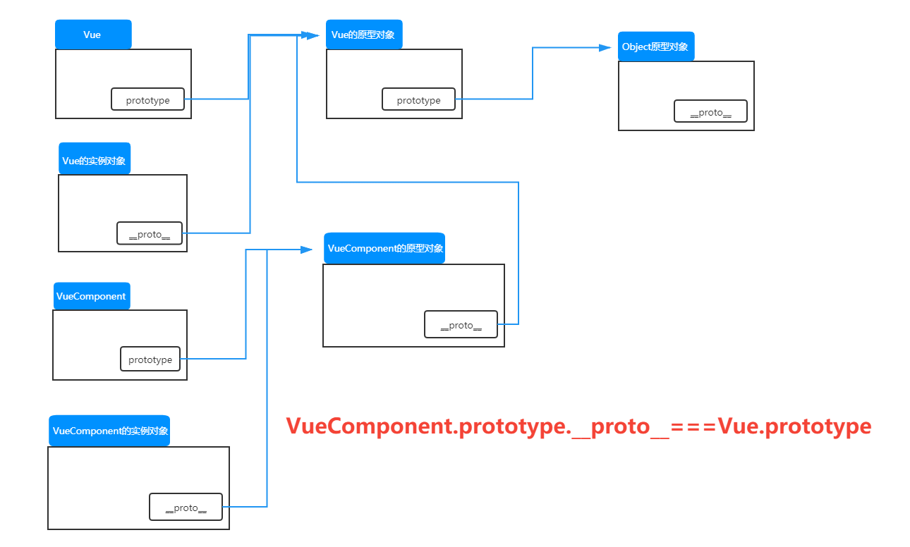

# Vue 组件

## 基本使用

Vue使用组件三大步骤：

- 定义组件。
- 注册组件。
- 使用组件。

如何定义一个组件：

使用 `Vue.extend(options)` 创建，options 与创建 Vue 实例对象时传入的几乎一致。

::: warning 注意

- 不要使用`el`。
- data必须写成函数。

:::

如何注册组件：

- 局部注册：创建 Vue 实例对象时传入 components 选项，使用键值对注册。
- 全局注册：使用 `Vue.component('组件名',组件)`。

```html
<!DOCTYPE html>
<html lang="en">
  <head>
    <meta charset="UTF-8" />
    <meta name="viewport" content="width=device-width, initial-scale=1.0" />
    <title>Document</title>
    <script src="../../js/vue.js"></script>
  </head>
  <body>
    <div id="root">
      <student></student>
      <hr />
      <school></school>
    </div>

    <script>
      const school = Vue.extend({
        template: `
            <div>
                <h2>name:{{name}}</h2>
                <h2>address:{{address}}</h2>
            </div>
        `,
        data() {
          return {
            name: 'SDUST',
            address: 'QD',
          };
        },
      });
      const student = Vue.extend({
        template: `
            <div>
                <h2>name:{{name}}</h2>
                <h2>age:{{age}}</h2>
            </div>
        `,
        data() {
          return {
            name: 'PPG',
            age: 21,
          };
        },
      });
      const vm = new Vue({
        el: '#root',
        components: {
          school,
          student,
        },
      });
      // 全局注册
      Vue.component('school', school);
    </script>
  </body>
</html>
```

## 几个注意点

- 关于组件名：

  - 一个单词组成：
    - 全小写。
    - 首字母大写。
  - 多个单词：
    - kebab-case 命名。
    - 驼峰命名(需要使用 Vue 脚手架)。

  ::: warning 注意

  - 组件名尽可能回避 HTML 中已有名称。
  - 可以使用 name 配置项指定组件在开发者工具中呈现的名字(定义组件时就起名字)。

  :::

- 关于组件标签：

  - 第一种写法：`<school></school>`。
  - 第二种写法：`<school/>`。

  ::: danger
  不使用脚手架时，第二种写法会导致后续组件不能渲染。
  :::

- 一个简写方式：

  `const school=Vue.extend(options)` 可简写为 `const school=options`。

## 组件嵌套

直接上代码：

```html
<!DOCTYPE html>
<html lang="en">
  <head>
    <meta charset="UTF-8" />
    <meta name="viewport" content="width=device-width, initial-scale=1.0" />
    <title>Document</title>
    <script src="../../js/vue.js"></script>
  </head>
  <body>
    <div id="root"></div>

    <script>
      const student = Vue.extend({
        template: `
            <div>
                <h2>name:{{name}}</h2>
                <h2>age:{{age}}</h2>
            </div>
        `,
        data() {
          return {
            name: 'PPG',
            age: 21,
          };
        },
      });
      const school = Vue.extend({
        template: `
                <div>
                    <h2>name:{{name}}</h2>
                    <h2>address:{{address}}</h2>
                    <student></student>
                </div>
            `,
        data() {
          return {
            name: 'SDUST',
            address: 'QD',
          };
        },
        components: {
          student,
        },
      });
      const hello = {
        template: `
                <div>
                    <h2>{{msg}}</h2>
                </div>
            `,
        data() {
          return {
            msg: 'Hello World',
          };
        },
      };
      const app = {
        components: {
          school,
          hello,
        },
        template: `
            <div>
                <school></school>
                <hello></hello>
            </div>
            `,
      };
      const vm = new Vue({
        el: '#root',
        components: {
          app,
        },
        template: '<app></app>',
      });
    </script>
  </body>
</html>
```

## 关于 VueComponent

- 上述代码中的 school 组件本质是一个名为 `VueComponent` 的构造函数，而且不是程序员定义的，是 `Vue.extend` 生成的。
- 我们只需要对应的标签，Vue 解析时会创建响应组件的实例对象，即 Vue 执行了 `new VueComponent(options)`。

::: tip
每次调用 `Vue.extend`，返回的都是一个*全新*的 `VueComponent`。
:::

- 关于this的指向：
  - 组件配置中：
    data 函数，methods 中的函数、watch 中的函数、computed 中的函数，它们的 this 都是 `VueComponent` 实例对象。
  - `new Vue(options)` 配置中：
    data 函数、methods 函数、watch 函数、computed 函数，它们的 this 均是 Vue 实例对象。
- VueComponent 的实例对象，简称 vc (也可称为组件实例对象)，Vue 实例对象简称 vm。
- vm 管理着所有的 vc，每个 vc 管理着自己的子组件。

## 一个重要的内置关系



`VueComponent.prototype.__proto__===Vue.prototype`。

所以组件实例对象也可以使用 Vue 原型上的属性。

## 单文件组件

单文件组件后缀名是 `.vue`。

定义两个组件：

School.vue：

```vue
<template>
  <div class="demo">
    <h2>name:{{ name }}</h2>
    <br />
    <h2>address:{{ address }}</h2>
  </div>
</template>

<script>
const school = Vue.extend({
  name: 'School',
  data() {
    return {
      name: 'SDUST',
      address: 'QD',
    };
  },
});
// 统一暴露
// export{school}
// 默认暴露
export default school;
</script>

<style>
.demo {
  color: skyblue;
  background-color: orange;
}
</style>
```

Student.vue：

```vue
<template>
  <div>
    <h2>name:{{ name }}</h2>
    <hr />
    <h2>age:{{ age }}</h2>
  </div>
</template>

<script>
const student = Vue.extend({
  data() {
    return {
      name: 'PPG',
      age: 21,
    };
  },
});
export default student;
</script>
```

所有的组件通过一个 `App.vue` 进行统一管理：

```vue
<template>
  <div>
    <Student></Student>
    <School></School>
  </div>
</template>

<script>
import School from './School';
import Student from './Student.vue';
export default {
  name: 'App',
  components: {
    School,
    Student,
  },
};
</script>

<style></style>
```

创建 `main.js` 以创建 Vue 实例：

```js
import App from './App.vue';
new Vue({
  el: '#root',
  components: {
    App,
  },
});
```

创建 `index.html` 做入口页面：

```html
<!DOCTYPE html>
<html lang="en">
  <head>
    <meta charset="UTF-8" />
    <meta name="viewport" content="width=device-width, initial-scale=1.0" />
    <title>Document</title>
  </head>
  <body>
    <div id="root">
      <App></App>
    </div>
    <script src="../../js/vue.js"></script>
    <script src="./main.js"></script>
  </body>
</html>
```
