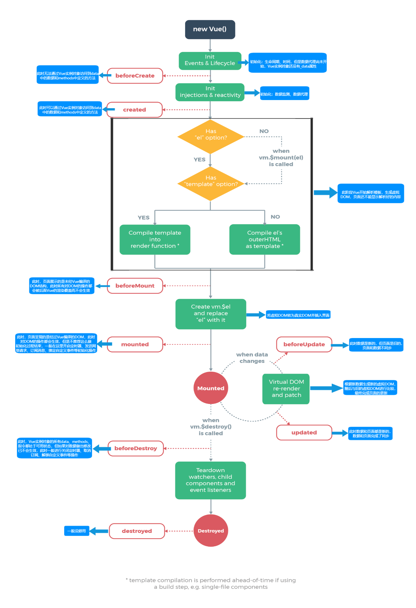

# 生命周期

常用生命周期钩子：

- mounted：发送网络请求，启动定时器、绑定自定义事件、订阅消息等**初始化操作**。
- beforeDestroy：清除定时器、解绑自定义事件、取消订阅消息等**收尾工作**。

关于`销毁`Vue实例：

- 销毁后自定义事件会失效，但原生 DOM 事件依然有效。
- 在 beforeDestroy 中操作数据不会再出发更新流程。

图中有三个钩子没有体现：

- `activated`：VueRouter 相关，激活组件对应路由时触发。
- `deactivated`：VueRouter 相关，离开组件对应路由(失活)时触发。
- `$nextTick`：Vue 渲染界面结束后调用，可以用来获取焦点等操作。
