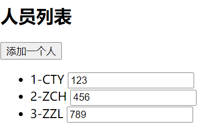
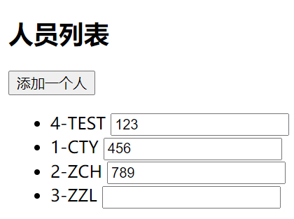

# 列表渲染

## 基本列表

现有如下数据：

```js
const vm = new Vue({
  el: '#root',
  data() {
    return {
      persons: [
        { id: '1', name: 'CTY' },
        { id: '2', name: 'ZCH' },
        { id: '3', name: 'ZZL' },
      ],
      admin: {
        name: 'PPG',
        age: 21,
        sex: 'male',
      },
      str: 'hello world',
    };
  },
});
```

- 遍历数组：

  ```html
  <!-- 遍历数组 -->
  <h2>人员列表</h2>
  <ul>
    <li v-for="(item,index) in persons" :key="index">{{item.id}}-{{item.name}}</li>
  </ul>
  ```

- 遍历对象：

  ```html
  <!-- 遍历对象 -->
  <h2>遍历对象</h2>
  <ul>
    <li v-for="(value,key,index) in admin" v-bind:key="index">{{value}}--{{key}}--{{index}}</li>
  </ul>
  ```

- 遍历字符串：

  ```html
  <!-- 遍历字符串 -->
  <h2>遍历字符串</h2>
  <ul>
    <li v-for="(char,index) in str" :key="index">{{char}}--{{index}}</li>
  </ul>
  ```

- 遍历指定次数：

  ```html
  <!-- 遍历指定次数 -->
  <h2>遍历指定次数</h2>
  <ul>
    <li v-for="(item,index) in 10">{{item}}--{{index}}</li>
  </ul>
  ```

## key 的作用和原理

### 示例

现有如下界面:

```html
<!DOCTYPE html>
<html lang="en">
  <head>
    <meta charset="UTF-8" />
    <meta name="viewport" content="width=device-width, initial-scale=1.0" />
    <title>Document</title>
    <script src="../js/vue.js"></script>
  </head>
  <body>
    <div id="root">
      <!-- 遍历数组 -->
      <h2>人员列表</h2>
      <button @click.once="addOne">添加一个人</button>
      <ul>
        <li v-for="(item,index) in persons" :key="index">
          {{item.id}}-{{item.name}}
          <input type="text" />
        </li>
      </ul>
      <hr />
    </div>

    <script>
      const vm = new Vue({
        el: '#root',
        data() {
          return {
            persons: [
              { id: '1', name: 'CTY' },
              { id: '2', name: 'ZCH' },
              { id: '3', name: 'ZZL' },
            ],
            admin: {
              name: 'PPG',
              age: 21,
              sex: 'male',
            },
            str: 'hello world',
          };
        },
        methods: {
          addOne() {
            const p = { id: '4', name: 'TEST' };
            this.persons.unshift(p);
          },
        },
      });
    </script>
  </body>
</html>
```

点击按钮后添加一个人，添加函数是将新人添加到原数组的头部，此时数组中所有元素的下标都发生了改变，若使用遍历 index 做 key 值，且已经在每行的输入框中输入了内容，点击添加按钮后，经过重新渲染，新人出现在了头部，但是原先的 input 却没有发生改变：

添加前：



添加后：



原因分析：

用户操作的是真实 DOM，Vue 渲染时是从虚拟 DOM 转换为真实 DOM，此时虚拟 DOM 中的 input 元素没有 value 值，使用 index 做 key 值的时候(key 值只对 Vue 内部可见，用于 DOM 比较算法)，添加新人后进行 DOM 比较，此时新人的 li 标签的 key 值成了 0，于是 Vue 去寻找此前的虚拟 DOM 中 key 值为 0 的元素，找到 1-CTY 这一条数据，经过比较，Vue 认为人物信息发生了变化，所以人物信息使用了新的人，而 li 中的第二个元素 input 输入框由于都没有 value 属性，Vue 认为输入框没有改变，于是使用之前的输入框，即不做修改直接保留，剩下的同理，也就是说更新 DOM 时只更新了一部分导致了问题，如果同样使用 index 做 key 值，但是添加的时候加在数组尾部就不会出现这个问题，因为其他元素没有受到影响。

::: warning 注意
使用 index 做 key 值时不一定会出问题，但是要注意如果原数据排序因为新数据发生了修改就会出现上面的问题。
:::

### 总结

虚拟 DOM 中 key 的作用：

key 值时虚拟 DOM 对象的标识，当数据发生变化时，Vue 会根据新数据生成新的虚拟 DOM，随后 Vue 进行新虚拟 DOM 与旧虚拟 DOM 的差异比较。

新旧虚拟 DOM 对比规则：

- 旧虚拟 DOM 中找到了与新虚拟 DOM 相同的 key：
  - 若虚拟 DOM 中的内容没变，直接使用之前已经渲染过的真实 DOM。
  - 若虚拟 DOM 内容改变了，则生成新的真实 DOM，随后替换掉页面中之前的真实 DOM。
- 旧虚拟DOM中未找到与新虚拟DOM相同的key：

  创建新的真实 DOM，渲染到页面。

用 index 做 key 会引发的问题：

- 如果对数据进行诸如逆序添加、逆序删除等破坏顺序的操作：

  会产生没有必要的真实 DOM 更新，导致页面效果正常，效率低。

- 如果结构中还包含输入类 DOM：

  会产生错误的 DOM 更新，导致页面有问题。

- 如何选择 key：
  - 最好使用每条数据的唯一标识做 key，例如 id、手机号、身份证号等。
  - 如果不存在对数据的逆序添加、逆序删除等破坏顺序的操作，仅用于渲染列表用于展示，使用 index 做为 key 也是可以的。

## 列表过滤

有如下页面，输入字符，模糊搜索。

```html
<!DOCTYPE html>
<html lang="en">
  <head>
    <meta charset="UTF-8" />
    <meta name="viewport" content="width=device-width, initial-scale=1.0" />
    <title>Document</title>
    <script src="../js/vue.js"></script>
  </head>
  <body>
    <div id="root">
      <!-- 列表过滤 -->
      <h2>人员列表</h2>
      <input type="text" placeholder="输入名字查询" v-model:value="keyWord" />
      <ul>
        <li v-for="(item,index) in persons" :key="index">{{item.id}}-{{item.name}}</li>
      </ul>
      <hr />
    </div>
  </body>
</html>
```

监视属性实现：

```js
const vm = new Vue({
  el: '#root',
  data() {
    return {
      persons_source: [
        { id: '1', name: 'CTY' },
        { id: '2', name: 'ZCH' },
        { id: '3', name: 'ZZL' },
      ],
      keyWord: '',
      persons: [],
    };
  },
  methods: {
    addOne() {
      const p = { id: '4', name: 'TEST' };
      this.persons.unshift(p);
    },
  },
  watch: {
    keyWord: {
      immediate: true,
      handler(newValue, oldValue) {
        if (newValue === '') {
          this.persons = this.persons_source;
        }
        this.persons = this.persons_source.filter(p => {
          return p.name.indexOf(newValue) !== -1;
        });
      },
    },
  },
});
```

计算属性实现：

```js
const vm = new Vue({
  el: '#root',
  data() {
    return {
      persons_source: [
        { id: '1', name: 'CTY' },
        { id: '2', name: 'ZCH' },
        { id: '3', name: 'ZZL' },
      ],
      keyWord: '',
    };
  },
  computed: {
    persons: {
      get() {
        return this.persons_source.filter(p => {
          return p.name.indexOf(this.keyWord) !== -1;
        });
      },
      set() {},
    },
  },
});
```

## 列表排序

```html
<!DOCTYPE html>
<html lang="en">
  <head>
    <meta charset="UTF-8" />
    <meta name="viewport" content="width=device-width, initial-scale=1.0" />
    <title>Document</title>
    <script src="../js/vue.js"></script>
  </head>
  <body>
    <div id="root">
      <!-- 列表过滤 -->
      <h2>人员列表</h2>
      <input type="text" placeholder="输入名字查询" v-model:value="keyWord" />
      <button @click="sortByScore(1)">成绩升序</button>
      <button @click="sortByScore(-1)">成绩降序</button>
      <button @click="sortByScore(0)">默认顺序</button>
      <ul>
        <li>id-姓名-成绩</li>
        <li v-for="(item,index) in persons" :key="index">
          {{item.id}}-{{item.name}}-{{item.grade}}
        </li>
      </ul>
      <hr />
    </div>
  </body>
</html>
```

JavaScript 代码：

```js
const vm = new Vue({
  el: '#root',
  data() {
    return {
      persons_source: [
        { id: '1', name: 'CTY', grade: '101' },
        { id: '2', name: 'ZCH', grade: '80' },
        { id: '3', name: 'ZZL', grade: '90' },
      ],
      keyWord: '',
      persons: [],
    };
  },
  methods: {
    sortByScore(a) {
      if (a === 0) {
        this.persons = this.persons_source;
      } else if (a > 0) {
        this.persons = this.persons.sort((p1, p2) => {
          return p1.grade - p2.grade;
        });
      } else {
        this.persons = this.persons.sort((p1, p2) => {
          return p2.grade - p1.grade;
        });
      }
    },
  },
  watch: {
    keyWord: {
      immediate: true,
      handler(newValue, oldValue) {
        if (newValue === '') {
          this.persons = this.persons_source;
        }
        this.persons = this.persons_source.filter(p => {
          return p.name.indexOf(newValue) !== -1;
        });
      },
    },
  },
});
```

### 变量更新时的一个问题

```html
<!DOCTYPE html>
<html lang="en">
  <head>
    <meta charset="UTF-8" />
    <meta name="viewport" content="width=device-width, initial-scale=1.0" />
    <title>Document</title>
    <script src="../js/vue.js"></script>
  </head>
  <body>
    <div id="root">
      <!-- 列表过滤 -->
      <h2>人员列表</h2>
      <button @click="updateCTY">更新CTY的信息</button>
      <ul>
        <li>id-姓名-成绩</li>
        <li v-for="(item,index) in persons_source" :key="index">
          {{item.id}}-{{item.name}}-{{item.grade}}
        </li>
      </ul>
      <hr />
    </div>

    <script>
      const vm = new Vue({
        el: '#root',
        data() {
          return {
            persons_source: [
              { id: '1', name: 'CTY', grade: '101' },
              { id: '2', name: 'ZCH', grade: '80' },
              { id: '3', name: 'ZZL', grade: '90' },
            ],
          };
        },
        methods: {
          updateCTY() {
            // 以下代码可以修改页面
            // this.persons_source[0].name="cty"
            // this.persons_source[0].grade="100"
            // 以下代码不会修改页面，但是信息已被修改
            this.persons_source[0] = { id: '1', name: 'cty', grade: '100' };
          },
        },
      });
    </script>
  </body>
</html>
```

::: warning 注意
如果不使用函数对数组或对象的某个元素或者属性进行修改，必须指明数组下标或者对象的某个键，不要做数组或对象的整体替换。
:::

## Vue监视数据改变的原理

Vue 会监视 data 中所有层次的数据。

如何监测‘对象’中的数据：

通过 setter 实现监视，且要在创建 Vue 实例时就传入要监测的数据。

- 对象中后追加的数据，Vue 默认不进行响应式处理。
- 如果要为后追加的数据添加响应式，要使用 Vue 提供的两个 API 的其中一个：

  ```javascript
  Vue.set(对象, 属性, 属性值);
  this.$set(对象, 属性, 属性值);
  ```

::: warning 特别注意
上文中 Vue 的两个 API 不能给 *Vue 实例*或 _Vue 实例根数据对象（vm.\_data 或 vm.data）_ 添加属性。
:::

如何监测‘数组’中的数据：

- 通过包裹了一部分数组更新方法，即使用了自己的数组修改方法，先修改数组，然后重新渲染界面，这些可以被监测到的被包裹方法包括：
  - `push()`。
  - `pop()`。
  - `shift()`。
  - `unshift()`。
  - `splice()`。
  - `sort()`。
  - `reverse()`。
- 使用以下非变更方法时，可以将新数组赋值给原数组实现响应式：
  - `filter()`。
  - `concat()`。
  - `slice()`。

示例代码：

```html
<!DOCTYPE html>
<html lang="en">
  <head>
    <meta charset="UTF-8" />
    <meta name="viewport" content="width=device-width, initial-scale=1.0" />
    <title>Document</title>
    <script src="../js/vue.js"></script>
    <style>
      button {
        border-radius: 10px;
        margin: 10px;
        padding: 10px;
        background-color: skyblue;
      }
      button:hover {
        border-radius: 10px;
        margin: 10px;
        padding: 10px;
        background-color: red;
      }
    </style>
  </head>
  <body>
    <div id="root">
      <button @click="student.age++">age plus 1</button>
      <button @click="addSex">add age attribute</button>
      <button @click="addFriend">addFriend</button>
      <button @click="updateNameOfFirstFriend">change name of first friend</button>
      <button @click="addOneHobby">add a hobby</button>
      <button @click="updateTheFirstHobby">change the first hobby</button>
      <h2>姓名：{{student.name}}</h2>
      <h2>年龄：{{student.age}}</h2>
      <h2 v-if="student.sex">性别：{{student.sex}}</h2>
      <hr />
      <h3>hobbies:</h3>
      <ul>
        <li v-for="(hobby,index) in student.hobbies" :key="index">{{hobby}}</li>
      </ul>
      <hr />
      <h3>friends</h3>
      <ul>
        <li v-for="(friend,index) in student.friends" :key="index">
          {{friend.name}}--{{friend.age}}
        </li>
      </ul>
    </div>

    <script>
      const vm = new Vue({
        el: '#root',
        data() {
          return {
            student: {
              name: 'PPG007',
              age: 21,
              hobbies: ['Java', 'Spring', 'Vue'],
              friends: [
                { name: 'ZZL', age: '20' },
                { name: 'CTY', age: '22' },
              ],
            },
          };
        },
        methods: {
          addSex() {
            // Vue.set(this.student,'sex','男');
            this.$set(this.student, 'sex', '男');
          },
          addFriend() {
            this.student.friends.unshift({ name: 'ABC', age: 69 });
          },
          updateNameOfFirstFriend() {
            this.student.friends[0].name = '张三';
          },
          addOneHobby() {
            this.student.hobbies.unshift('TEST');
          },
          updateTheFirstHobby() {
            // this.student.hobbies.splice(0,1,'hobby-after')
            Vue.set(this.student.hobbies, 0, 'another hobby');
          },
        },
      });
    </script>
  </body>
</html>
```
