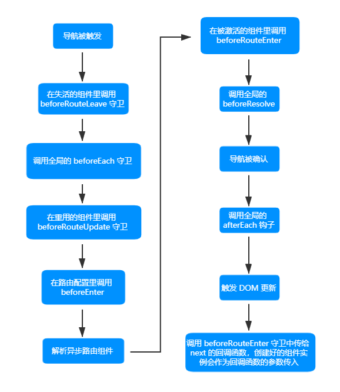

# Vue Router

## 安装 VueRouter

```sh
npm install vue-router
```

## 使用 VueRouter

在 `src` 目录下创建 `router` 文件夹，并在其中创建 `index.js`：

```js
import VueRouter from 'vue-router';
import Home from '@/components/Home';
import About from '@/components/About';
import News from '@/components/News';
import Message from '@/components/Message';
import Detail from '@/components/Detail';
export default new VueRouter({
  routes: [
    {
      //指定路径
      path: '/home',
      //对应组件
      component: Home,
    },
    {
      path: '/about',
      component: About,
    },
  ],
});
```

在 `main.js` 中引用 VueRouter 并使用上述配置：

```js
import Vue from 'vue';
import App from './App.vue';
import VueRouter from 'vue-router';
import router from './router';
Vue.config.productionTip = false;
Vue.use(VueRouter);
new Vue({
  render: h => h(App),
  router,
}).$mount('#app');
```

在 APP 组件中添加超链接：

```vue
<template>
  <div>
    <router-link active-class="active" to="/about">About</router-link>
    <router-link active-class="active" to="/home">Home</router-link>
    <div>
      <router-view></router-view>
    </div>
  </div>
</template>
```

通过 `router-link` 标签使用路由，`to` 属性指定要跳转的目的地，`active-class` 属性指定了当这个路径被触发时，这个超链接的样式，通过 `router-view` 标签指定链接到的组件的显示位置。

::: tip
切换时销毁前一个组件 vc，嵌套时先销毁外层组件，再销毁内层组件。
:::

## 多级路由

```js
import VueRouter from 'vue-router';
import Home from '@/components/Home';
import About from '@/components/About';
import News from '@/components/News';
import Message from '@/components/Message';
import Detail from '@/components/Detail';
export default new VueRouter({
  routes: [
    {
      path: '/home',
      component: Home,
    },
    {
      path: '/about',
      component: About,
      children: [
        {
          path: 'news',
          component: News,
        },
        {
          path: 'message',
          component: Message,
          children: [
            {
              path: 'detail',
              component: Detail,
            },
          ],
        },
      ],
    },
  ],
});
```

::: tip
使用 `children` 属性指定子路由，子路由 path *不能*加斜线，`router-link` 的 to 属性从根路径开始写到目的子路径。
:::

## query 参数

通过将参数拼接在 URL 中传递参数。

写法一：

```vue
<router-link
  :to="`/about/message/detail?id=${msg.id}&title=${msg.title}`"
>{{ msg.id }}-{{ msg.title }}</router-link>
```

通过反引号并将 to 属性改为绑定形式，使用`${}`取得要传递的参数。

写法二：

```vue
<router-link
  :to="{
    path: '/about/message/detail',
    query: {
      id: msg.id,
      title: msg.title,
    },
  }"
>
          {{ msg.id }}-{{ msg.title }}
        </router-link>
```

to 属性依然是绑定方式，写成对象形式。

::: tip
无论哪种写法，在目的组件中都要使用 `$route.query.XXX` 访问传递的参数。
:::

## 命名路由、重定向、别名、命名视图

### 命名路由

可以在创建 Router 实例的时候，在 `routes` 配置中给某个路由设置名称：

```js
routes: [
  {
    path: '/home',
    component: Home,
    name: 'home',
  },
  {
    path: '/about',
    component: About,
    name: 'about',
  },
];
```

在使用时通过绑定 `to` 属性并采用对象形式传递一个 `name` 参数指定要跳转到的路由。

### 重定向

从 `/a` 重定向到 `/b`：

```js
const router = new VueRouter({
  routes: [{ path: '/a', redirect: '/b' }],
});
```

重定向到命名路由：

```js
const router = new VueRouter({
  routes: [{ path: '/a', redirect: { name: 'foo' } }],
});
```

重定向到函数：

```js
const router = new VueRouter({
  routes: [
    {
      path: '/a',
      redirect: to => {
        // 方法接收 目标路由 作为参数
        // return 重定向的 字符串路径/路径对象
      },
    },
  ],
});
```

### 别名

`/a` 的别名是 `/b`，意味着，当用户访问 `/b` 时，URL 会保持为 `/b`，但是路由匹配则为 `/a`，就像用户访问 `/a` 一样：

```js
const router = new VueRouter({
  routes: [{ path: '/a', component: A, alias: '/b' }],
});
```

### 命名视图

你可以在界面中拥有多个单独命名的视图，而不是只有一个单独的出口。如果 `router-view` 没有设置名字，那么默认为 `default`：

```vue
<router-view class="view one"></router-view>
<router-view class="view two" name="a"></router-view>
<router-view class="view three" name="b"></router-view>
```

多个视图需要多个组件，路由配置中使用配置项 `components`：

```js
const router = new VueRouter({
  routes: [
    {
      path: '/',
      components: {
        default: Foo,
        a: Bar,
        b: Baz,
      },
    },
  ],
});
```

## params 参数(RestFul)

在 `index.js` 中修改：

```js
import VueRouter from 'vue-router';
import Home from '@/components/Home';
import About from '@/components/About';
import News from '@/components/News';
import Message from '@/components/Message';
import Detail from '@/components/Detail';
export default new VueRouter({
  routes: [
    {
      path: '/home',
      component: Home,
      name: 'home',
    },
    {
      path: '/about',
      component: About,
      name: 'about',
      children: [
        {
          path: 'news',
          component: News,
          name: 'news',
        },
        {
          path: 'message',
          component: Message,
          name: 'message',
          children: [
            {
              path: 'detail/:id/:title',
              component: Detail,
              name: 'detail',
            },
          ],
        },
      ],
    },
  ],
});
```

在 `path` 属性中的路径后使用`/`分隔参数，`:`后接参数键。

传递参数：

```vue
<router-link
  :to="{
    name: 'detail',
    params: {
      id: msg.id,
      title: msg.title,
    },
  }"
>
          {{ msg.id }}-{{ msg.title }}
        </router-link>
```

使用了 `params` 参数后必须使用 `name` 而不能使用 `path`。

获取参数：

```js
$route.params.id;
```

## props 配置

### 布尔模式

在 params 基础上，修改路由配置：

```js
{
    path:'message',
        component:Message,
            name:'message',
                children:[
                    {
                        path:'detail/:id/:title',
                        component:Detail,
                        name:'detail',
                        props:true
                    }
                ],
}
```

`props` 属性如果为 true，则使用 `params` 传递的参数都将变成 `props` 形式传递到目的地，即 `route.params` 将变成组件的属性，`router-link` 标签写法与 params 一致。

目的组件修改为：

```vue
<template>
  <div>
    <h3>Detail</h3>
    <h5>{{ id }}</h5>
    <h5>{{ title }}</h5>
  </div>
</template>

<script>
export default {
  name: 'Detail',
  mounted() {
    console.log(this.$route);
  },
  props: ['id', 'title'],
};
</script>
```

### 对象模式

props 写成：

```js
props:{id:'test',title:'test'}
```

此对象所有的键值对都会以 `props` 形式传递，当 `props` 是静态时是有用的，目的组件中用法与布尔模式相同。

### 函数模式

目的组件用法依然不变。

接收 params：

```js
props(route){
    return{
        id: route.params.id,
        title: route.params.title
    }
}
```

接收 query：

```js
props(route){
    return{
        id: route.query.id,
        title: route.query.title
    }
}
```

## router-link 的 replace 属性

浏览器的历史记录分为两种模式：`push` 模式和 `replace` 模式，`push` 模式是每访问一个链接，就把这个链接入栈，所以能够一直返回直到最开始的链接，`replace` 模式是每访问一个链接，就把这个链接替换掉上一条链接。

开启 `router-link` 的 replace 模式：

```vue
<router-link replace to="/about/news" active-class="active">News</router-link>
<router-link :replace="true" to="/about/message" active-class="active">Message</router-link>
```

开启 replace 模式后，后退跳转到的是最后一个不是 replace 的链接。

## 编程式路由

为其他控件实现跳转、跳转前处理数据等需要使用编程式路由。

### push 方法

用法如下，需要传递一个参数对象，参数对象与 `router-link` 标签 `to` 属性一致：

```js
this.$router.push({
  name: 'detail',
  query: {
    id: msg.id,
    title: msg.title,
  },
});
```

### replace 方法

传递一个参数对象，参数对象与 `router-link` 标签 `to` 属性一致：

```js
this.$router.replace({
  name: 'detail',
  query: {
    id: msg.id,
    title: msg.title,
  },
});
```

### back 方法

后退功能：

```js
this.$router.back();
```

### forward 方法

前进功能：

```js
this.$router.forward();
```

### go 方法

传递一个整数做参数，如果是正数就是前进对应的步数，负数则后退相应步数：

```js
this.$router.go(5);
this.$router.go(-19);
```

## 缓存路由组件

使不展示的组件保持挂载不销毁。

使用 `keep-alive` 标签包裹 `<router-view></router-view>`：

```vue
<keep-alive>
    <router-view></router-view>
</keep-alive>
```

要缓存哪个组件，就去哪个组件的对应的 `router-view` 组件，即最后这个组件的展示位置两边使用 `keep-alive` 标签。

`keep-alive` 默认缓存中间的所有组件，通过 `include` 属性指定仅缓存其中的某几个组件。

使用 `include` 属性指定要缓存的组件，值为*组件名*，如果是多个组件，使用逗号分隔，或者使用绑定传入数组。

```vue
<keep-alive include="News,Message">
    <router-view></router-view>
</keep-alive>
<keep-alive :include="['News', 'Message']">
    <router-view></router-view>
</keep-alive>
```

## 两个新的生命周期钩子

### activated

组件对应的路由被激活时触发，如果不使用缓存，这个钩子不会被执行，使用缓存后，一次激活对应路由以后 `mounted` 不会再次调用，但这个路由激活钩子会反复调用。

::: tip
这个钩子只有开启缓存后才会生效。
:::

### deactivated

组件对应的路由失活时触发，如果不使用缓存，这个钩子不会被执行，使用缓存后，`beforeDestroy` 不会调用。

::: tip
这个钩子只有开启缓存后才会生效。
:::

## 路由元信息

定义路由的时候可以配置 `meta` 字段。

一个路由匹配到的所有路由记录会暴露为 `$route` 对象 (还有在导航守卫中的路由对象) 的 `$route.matched` 数组。因此，我们需要遍历 `$route.matched` 来检查路由记录中的 `meta` 字段。

## 路由守卫

::: tip
参数或查询的改变并不会触发进入/离开的导航守卫。

导航守卫是应用在**目标**上的。
:::

### 全局前置守卫

每次路由切换之前调用、初始化时被调用。

```js
router.beforeEach((to, from, next) => {
  if (to.meta.authRequired) {
    if (localStorage.getItem('access') !== 'admin') {
      alert('403 Forbidden');
    } else {
      next();
    }
  } else {
    next();
  }
});
```

router 是创建的 VueRouter 对象，并在需要验证的路由规则的 `meta` 属性中使用标识符决定是否要进行鉴权。

- to: 目的地的路由对象。
- from: 起点的路由对象。
- next: 函数，执行效果依赖传入的参数。

- `next()`：进行下一个钩子，如果全部钩子执行完，就确认导航，达到目的地。
- `next(false)`：中断当前导航，如果 URL 改变，则会重置到 from 对应的地址。
- `next('/')` 或 `next({path:'/'})`：跳转到一个不同的地址，采用对象写法可以像编程式路由中的 `push` 等方法一样传递参数等。
- `next(error)`：传入 Error 实例，该导航被中断，错误被传递给 `router.onError()` 注册过的回调。

### 全局后置守卫

每次路由切换之后调用、初始化时被调用。

接收两个参数，不接收 `next` 函数。

```js
router.afterEach((to, from) => {
  //用于修改界面标题
  document.title = to.meta.title || 'VueRouter';
  console.log(from);
});
```

上述代码用于修改页面标题，每个路由规则的 `meta` 属性都配置一个 title，进入不同路由显示不同标题。

### 独享路由守卫

::: tip
独享路由守卫只有前置路由守卫。
:::

接收三个参数，和全局前置守卫相同：

```js
routes: [
  {
    path: '/home',
    component: Home,
    name: 'home',
    meta: { title: 'Home' },
    beforeEnter: (to, from, next) => {},
  },
];
```

### 组件内路由守卫

三种守卫都接收 `to`、`from`、`next` 三个参数。

- `beforeRouteEnter`：

  在渲染该组件的对应路由被 confirm 之前(调用 next() 会导致 confirm )，_不能获取组件实例 this_，因为此时组件还没有被创建。

- `beforeRouteUpdate`(2.2 新增)：

  当前路由改变但是该组件被复用时调用，举例来说，对于使用 `params` 动态路径传参，路径定义为 '/test/:id' 时，在 '/test/1' 和 '/test/2' 之间跳转时，由于渲染同样的组件，因此组件实例会被复用，这个钩子此时调用，_可以访问组件实例对象 this_。

- `beforeRouteLeave`：

  导航离开该组件的对应路由时调用，_可以访问组件实例对象 this_。

### 全局解析守卫

在 2.5.0+ 你可以用 `router.beforeResolve` 注册一个全局守卫。这和 `router.beforeEach` 类似，区别是在导航被确认之前，**同时在所有组件内守卫和异步路由组件被解析之后**，解析守卫就被调用。

### 完整的导航解析流程



## HTML5 History 模式

`vue-router` 默认 hash 模式 —— 使用 URL 的 hash 来模拟一个完整的 URL，于是当 URL 改变时，页面不会重新加载。

井号 `#` 后面的内容就是 hash 值。

hash 值不会包含在 HTTP 请求中，即 hash 值不会发送给服务器。

切换模式：

配置 VueRouter 时除了传递 `route` 参数，还可以传递一个 `mode` 参数指定工作模式。

```js
mode:'hash',
routes: []
```

history 模式由于会将路径发送给服务器，所以在部署时需要后端具有全路径资源匹配能力，防止 404 问题。

## 滚动行为

使用前端路由，当切换到新路由时，想要页面滚到顶部，或者是保持原先的滚动位置，就像重新加载页面那样。

当创建一个 Router 实例，提供一个 `scrollBehavior` 方法：

```js
const router = new VueRouter({
  routes: [...],
  scrollBehavior (to, from, savedPosition) {
    // return 期望滚动到哪个的位置
  }
})
```

返回值示例

- `{ x: number, y: number }`。
- `{ selector: string, offset? : { x: number, y: number }}`。

平滑滚动：

将 `behavior` 选项添加到 `scrollBehavior` 内部返回的对象中。

```js
scrollBehavior (to, from, savedPosition) {
  if (to.hash) {
    return {
      selector: to.hash,
      behavior: 'smooth',
    }
  }
}
```

## 导航故障

```js
router.onError(callback);
```

注册一个回调，该回调会在路由导航过程中出错时被调用。注意被调用的错误必须是下列情形中的一种：

- 错误在一个路由守卫函数中被同步抛出。
- 错误在一个路由守卫函数中通过调用 `next(err)` 的方式异步捕获并处理。
- 渲染一个路由的过程中，需要尝试解析一个异步组件时发生错误。
