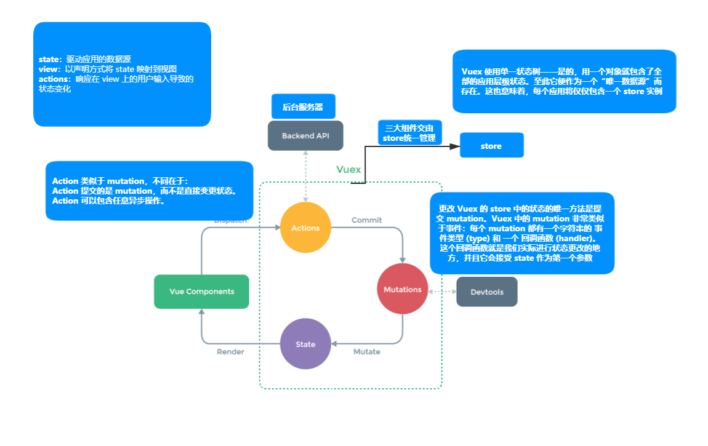

# Vuex

## Vuex 工作原理



## 配置 Vuex 环境

安装 Vuex：

```sh
npm install vuex --save
```

在 src 文件夹中创建 `store` 文件夹，并在其中创建 `index.js` 文件，编写如下内容：

```js
'use strict';
import Vuex from 'vuex';
import Vue from 'vue';
Vue.use(Vuex);
const actions = {};
const mutations = {};
const state = {};
export default new Vuex.Store({
  actions,
  mutations,
  state,
});
```

::: warning 注意
`Vue.use()` 必须要写在创建 store 对象前，如果写在 main.js 中然后引用 index.js，且使用了 Vue-CLI 脚手架，则脚手架会先执行所有的 import 语句，导致导入 index.js 前没有执行 `Vue.use()` 发生报错，所以要写在 index.js 中。
:::

main.js 引入 index.js：

```js
import Vue from 'vue';
import App from './App.vue';
import store from './store';
Vue.config.productionTip = false;

new Vue({
  render: h => h(App),
  store,
}).$mount('#app');
```

## 求和案例

求和子模块：

通过 `store` 的 `dispatch()` 方法触发 actions：

```vue
<template>
  <div>
    <h2>当前n为{{ n }}</h2>
    <select v-model.number="step">
      <option value="1">1</option>
      <option value="2">2</option>
      <option value="3">3</option>
    </select>
    <button @click="increment">+</button>
    <button @click="decrement">-</button>
    <button @click="incrementOdd">当前求和为奇数才加</button>
    <button @click="incrementWait">延迟两秒加</button>
  </div>
</template>

<script>
export default {
  name: 'Counter',
  data() {
    return {
      step: 1,
    };
  },
  methods: {
    increment() {
      this.$store.dispatch('add', this.step);
    },
    decrement() {
      this.$store.dispatch('sub', this.step);
    },
    incrementOdd() {
      this.$store.dispatch('addOdd', this.step);
    },
    incrementWait() {
      this.$store.dispatch('addWait', this.step);
    },
  },
  computed: {
    n: {
      get() {
        return this.$store.state.n;
      },
    },
  },
};
</script>
```

actions 和 mutations：

```js
const actions = {
  // context与 store 实例具有相同方法和属性
  add(context, data) {
    context.commit('ADD', data);
  },
  sub(context, data) {
    context.commit('SUB', data);
  },
  addOdd(context, data) {
    //在actions中再次分发给其他action并接受返回值，返回值是promise类型
    context.dispatch('isOdd', context.state.n).then(result => {
      console.log(result);
      if (result) {
        context.commit('ADD', data);
      }
    });
  },
  addWait(context, data) {
    setTimeout(() => {
      context.commit('ADD', data);
    }, 2000);
  },
  isOdd(context, data) {
    return data % 2 !== 0;
  },
};

const mutations = {
  ADD(state, data) {
    state.n += data;
  },
  SUB(state, data) {
    state.n -= data;
  },
};
const state = {
  n: 0,
};
```

## getters

当要获取加工后的 state 数据时使用：

```vue
<h2>当前n的算术平方根为{{sqrtN}}</h2>
<script>
export default {
  name: 'Counter',
  computed: {
    sqrtN: {
      get() {
        return this.$store.getters.process;
      },
    },
  },
};
</script>
```

index.js：

```js
const getters = {
  process(state) {
    return Math.sqrt(state.n);
  },
};
export default new Vuex.Store({
  actions,
  mutations,
  state,
  getters,
});
```

getters 定义与计算属性类似，但是能做到全局复用，计算属性只能组件内复用，都通过返回值获取属性值。

## mapState 与 mapGetters

在组件中频繁写 `this.$store.state` 过于繁琐，使用 `mapState` 与 `mapGetters` 可以简化代码。

首先在组件中引入 `mapState` 和 `mapGetters`：

```js
import { mapState, mapGetters } from 'vuex';
```

在计算属性中使用，前面加三个点表示以对象形式加入：

```js
computed: {
    // 对象写法
    // ...mapState({n:'n',name:'name',age:'age'})
    // ...mapState({n:state => state.n,name:state => state.name,age:state => state.age})
    ...mapState({
      n(state) {
        return state.n;
      },
      name(state) {
        return state.name;
      },
      age(state) {
        return state.age*100;
      }
    }),


    // 数组写法
    // ...mapState(['n','name','age'])

    ...mapGetters({sqrtN:'process'})

    // ...mapGetters(['process'])

  }
```

`mapState` 有四种写法：

- 对象写法，对象中是键值对，键为需要的计算属性名，_值必须用引号_，表示在 `state` 中对应数据的名字。
- 对象写法，对象中是键值对，键为需要计算的属性名，值为箭头函数，参数为 `state`。
- 对象写法，对象中是函数，函数参数为 `state`，可以进行复杂处理。
- 数组写法，仅适用于*需要的计算属性与 `state` 中属性重名*的情况。

`mapGetters` 有两种写法：

- 数组写法，仅适用于需要的计算属性与 `getters` 中函数*重名*的情况。
- 对象写法，对象中是键值对，键为需要的计算属性，值为 `getters` 中对应函数的名字。

## mapActions 与 mapMutations

在组件中频繁创建方法调用 actions 或 mutations 非常繁琐，使用 `mapActions` 和 `mapMutations` 可以简化代码。

首先在组件中引入 `mapActions` 和 `mapMutations`：

```js
import { mapActions, mapMutations } from 'vuex';
```

在 methods 中应用：

```js
methods: {
	// 调用时传参
    ...mapMutations({increment:'ADD',decrement:'SUB'}),
    // 调用时传参
    // ...mapMutations(['ADD','SUB']),


    // 调用时要传参数
    ...mapActions({incrementOdd:'addOdd', incrementWait:'addWait'})
    // 调用时要传参数
    // ...mapActions(['addWait','addOdd'])
},
```

`mapActions` 有两种写法：

- 对象写法，键为要定义的方法名，值为 actions 中定义的方法。
- 数组写法，仅适用于要定义的方法名和定义在 actions 中的方法*同名*的情况。

`mapMutations` 有两种写法：

- 对象写法，键为要定义的方法名，值为 mutations 中已定义的方法名。
- 数组写法，仅适用于要定义的方法名和定义在 mutations 中的方法*同名*的情况。

::: tip
`mapActions` 和 `mapMutations` 不论使用哪种写法，都必须在调用时传入参数，否则默认参数是 event。
:::

示例：

```html
<button @click="incrementOdd(step)"></button>
<button @click="incrementWait(step)"></button>
```

## 多组件共享数据

在此前计数器组件基础上，添加人员列表组件，完成人员列表组件能看到计数器当前值，计数器组件能看到人员列表长度。

在 index.js 中给 actions 添加方法：

```js
addPerson(context,data) {
	if (data.trim()===''){
	alert('请输入内容')
	}else {
	context.commit('ADD_PERSON',data)
	}
}
```

在mutations中添加：

```js
ADD_PERSON(state,data){
    state.people.unshift(data)
    alert('陈坤')
}
```

为 state 添加一个人员数组：

```js
const state = {
  n: 0,
  name: 'PPG',
  age: 21,
  people: [],
};
```

在计数器组件模板中添加：

```html
<h4>当前人员列表中人数为：{{number}}</h4>
```

其中 `number` 是计算属性，定义如下：

```js
computed: {
    ...mapState({
      n(state) {
        return state.n;
      },
      name(state) {
        return state.name;
      },
      age(state) {
        return state.age;
      },
      number(state) {
        return state.people.length;
      }
    }),
```

创建人员列表组件：

```vue
<template>
  <div>
    <div>
      <input
        v-model="temp"
        type="text"
        placeholder="输入姓名，回车确认"
        @keydown.enter="addPerson(temp)"
      />
    </div>
    <ul>
      <li v-for="(item, index) in people" :key="index">
        {{ item }}
      </li>
    </ul>
    <div>计数器组件的当前值为:{{ n }}</div>
  </div>
</template>

<script>
import { mapActions, mapState } from 'vuex';
export default {
  name: 'People',
  data() {
    return {
      temp: '',
    };
  },
  methods: {
    ...mapActions(['addPerson']),
  },
  computed: {
    ...mapState(['people', 'n']),
  },
  //通过监视people数组变化清空输入框
  watch: {
    people: {
      deep: true,
      handler() {
        this.temp = '';
      },
    },
  },
};
</script>
```

## 模块化

由于使用单一状态树，应用的所有状态会集中到一个比较大的对象。当应用变得非常复杂时，store 对象就有可能变得相当臃肿。为了解决以上问题，Vuex 允许我们将 store 分割成模块（module）。每个模块拥有自己的 state、mutation、action、getter、甚至是嵌套子模块——从上至下进行同样方式的分割。

将上一个部分中人员列表和计数器的 vuex 拆分，可以写在 index.js 中，也可以每个模块拆分出一个文件然后 index 中进行引用。

people.js：

```js
'use strict';
export default {
  namespaced: true,
  actions: {
    addPerson(context, data) {
      if (data.trim() === '') {
        alert('请输入内容');
      } else {
        context.commit('ADD_PERSON', data);
      }
    },
  },
  mutations: {
    ADD_PERSON(state, data) {
      state.people.unshift(data);
      alert('陈坤');
    },
  },
  getters: {},
  state: {
    people: [],
  },
};
```

counter.js：

```js
'use strict';
export default {
  namespaced: true,
  actions: {
    addOdd(context, data) {
      context.dispatch('isOdd', context.state.n).then(result => {
        if (result) {
          context.commit('ADD', data);
        }
      });
    },
    addWait(context, data) {
      setTimeout(() => {
        context.commit('ADD', data);
      }, 2000);
    },
    isOdd(context, data) {
      return data % 2 !== 0;
    },
  },
  mutations: {
    ADD(state, data) {
      state.n += data;
    },
    SUB(state, data) {
      state.n -= data;
    },
  },
  getters: {
    process(state) {
      return Math.sqrt(state.n);
    },
  },
  state: {
    n: 0,
    name: 'PPG',
    age: 21,
  },
};
```

index.js：

```js
'use strict';
import Vuex from 'vuex';
import Vue from 'vue';
import counterOptions from '@/store/counter';
import peopleOptions from '@/store/people';
Vue.use(Vuex);

export default new Vuex.Store({
  modules: {
    peopleOptions,
    counterOptions,
  },
});
```

在分模块中添加 `namespaced` 属性开启命名空间，如果不写，默认为 false，每个模块中的 actions 和 mutations 为全局可用，state 不是全局可用，要访问可以使用模块名前缀。

counter.vue：

```vue
<script>
import { mapState, mapGetters } from 'vuex';
import { mapActions, mapMutations } from 'vuex';

export default {
  name: 'Counter',
  data() {
    return {
      step: 1,
    };
  },
  methods: {
    ...mapMutations('counterOptions', { increment: 'ADD', decrement: 'SUB' }),
    ...mapActions('counterOptions', { incrementOdd: 'addOdd', incrementWait: 'addWait' }),
  },
  computed: {
    ...mapState('counterOptions', {
      n(state) {
        return state.n;
      },
      name(state) {
        return state.name;
      },
      age(state) {
        return state.age;
      },
    }),
    ...mapState('peopleOptions', {
      number(state) {
        return state.people.length;
      },
    }),
    ...mapGetters('counterOptions', { sqrtN: 'process' }),
  },
};
</script>
```

people.vue：

```vue
<script>
import { mapActions, mapState } from 'vuex';
export default {
  name: 'People',
  data() {
    return {
      temp: '',
    };
  },
  methods: {
    ...mapActions('peopleOptions', ['addPerson']),
  },
  computed: {
    ...mapState('peopleOptions', ['people']),
    ...mapState('counterOptions', ['n']),
  },
  watch: {
    people: {
      deep: true,
      handler() {
        this.temp = '';
      },
    },
  },
};
</script>
```

在所有的 map 辅助函数中第一个参数传入在 index.js 中注册的模块名即可。

如果不使用辅助函数，要注意访问的路径为`命名空间/getters 方法名`。

例如通过如下方式在 counter.vue 中访问。

```js
//返回值就是getters对应函数的结果
this.$store.getters['counterOptions/process'];
```

对于模块内部的 action，局部状态通过 `context.state` 暴露出来，根节点状态则为 `context.rootState`。

对于模块内部的 getter，根节点状态会作为第三个参数暴露出来。
