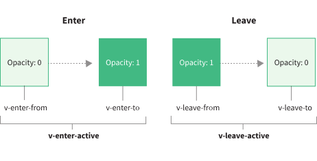

# Vue3 其他改变

## 全局 API 的转移

Vue2 中有很多全局 API 和配置，例如：全局组件、全局指令等，Vue3 进行了调整：将全局的 API，即 `Vue.xxx` 调整到应用实例 `app` 上。

| 2.x 全局 API               | 3.x 实例 API (`app`)                       |
| -------------------------- | ------------------------------------------ |
| Vue.config                 | app.config                                 |
| Vue.config.productionTip   | **已移除**                                 |
| Vue.config.ignoredElements | app.config.compilerOptions.isCustomElement |
| Vue.component              | app.component                              |
| Vue.directive              | app.directive                              |
| Vue.mixin                  | app.mixin                                  |
| Vue.use                    | app.use                                    |
| Vue.prototype              | app.config.globalProperties                |
| Vue.extend                 | **已移除**                                 |

## 其它改变

- 过渡 class：

  在进入/离开的过渡中，会有 6 个 class 切换：

  - `v-enter-from`：定义进入过渡的开始状态。在元素被插入之前生效，在元素被插入之后的下一帧移除。
  - `v-enter-active`：定义进入过渡生效时的状态。在整个进入过渡的阶段中应用，在元素被插入之前生效，在过渡/动画完成之后移除。这个类可以被用来定义进入过渡的过程时间，延迟和曲线函数。
  - `v-enter-to`：定义进入过渡的结束状态。在元素被插入之后下一帧生效 (与此同时 `v-enter-from` 被移除)，在过渡/动画完成之后移除。
  - `v-leave-from`：定义离开过渡的开始状态。在离开过渡被触发时立刻生效，下一帧被移除。
  - `v-leave-active`：定义离开过渡生效时的状态。在整个离开过渡的阶段中应用，在离开过渡被触发时立刻生效，在过渡/动画完成之后移除。这个类可以被用来定义离开过渡的过程时间，延迟和曲线函数。
  - `v-leave-to`：离开过渡的结束状态。在离开过渡被触发之后下一帧生效 (与此同时 `v-leave-from` 被删除)，在过渡/动画完成之后移除。

  

- 移除 keyCode 作为 v-on 的修饰符，同时也不再支持 `config.keyCodes`。

- 移除 `v-on.native` 修饰符：

  父组件中绑定事件：

  ```vue
  <A v-on:click="show" />
  ```

  子组件中声明自定义事件：

  ```vue
  <script>
  export default {
    name: 'A',
    components: { B },
    emits: ['click'], //声明自定义事件，不写在这里面会被视作原生事件，这里click不会被触发
  };
  </script>
  ```

- 移除过滤器。

- v-if 与 v-for 的优先级对比：

  - 2.x 版本中在一个元素上同时使用 `v-if` 和 `v-for` 时，`v-for` 会优先作用。
  - 3.x 版本中 `v-if` 总是优先于 `v-for` 生效。

- v-bind 合并行为：

  在 2.x，如果一个元素同时定义了 `v-bind="object"` 和一个相同的单独的 property，那么这个单独的 property 总是会覆盖 `object` 中的绑定。

  ```html
  <!-- template -->
  <div id="red" v-bind="{ id: 'blue' }"></div>
  <!-- result -->
  <div id="red"></div>
  ```

  在 3.x，如果一个元素同时定义了 `v-bind="object"` 和一个相同的单独的 property，那么声明绑定的==顺序==决定了它们如何合并。换句话说，相对于假设开发者总是希望单独的 property 覆盖 `object` 中定义的内容，现在开发者对自己所希望的合并行为有了更好的控制。

  ```html
  <!-- template -->
  <div id="red" v-bind="{ id: 'blue' }"></div>
  <!-- result -->
  <div id="blue"></div>

  <!-- template -->
  <div v-bind="{ id: 'blue' }" id="red"></div>
  <!-- result -->
  <div id="red"></div>
  ```
