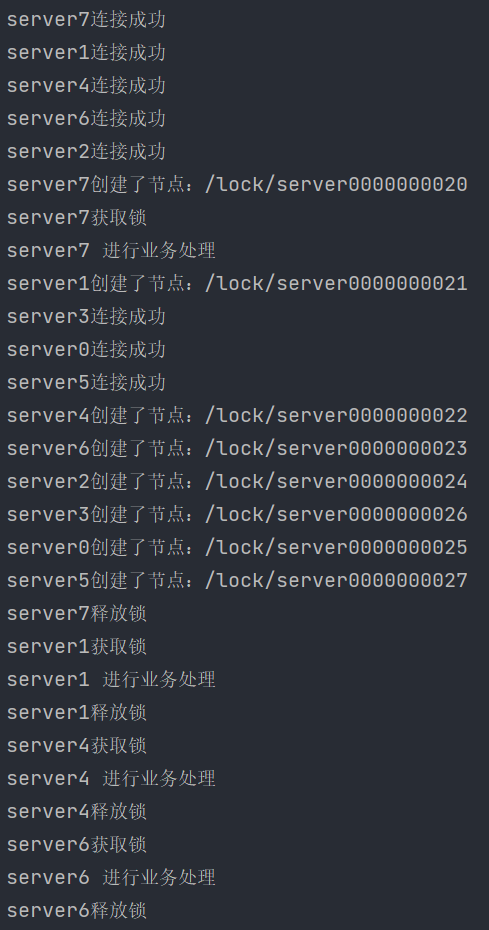
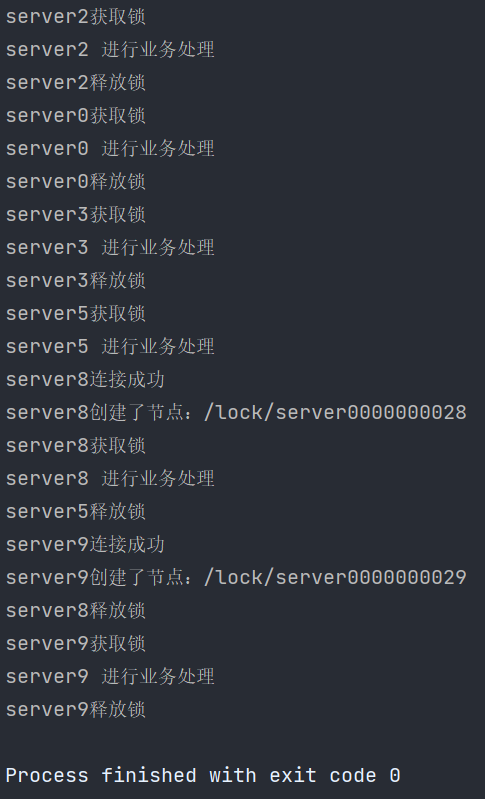

# 案例：分布式锁

## 案例描述

程序启动后以临时有序节点注册到 ZooKeeper 集群中，注册完毕后判断自己的编号是否是所有节点中最小的，若是，则继续执行业务代码，否则监听等待，知道自身编号是最小。

## 编码

```java
public class LockServer {
    private ZooKeeper zooKeeper;

    private static final String CONNECT_STR="150.158.153.216:2181,39.107.112.172:2181,115.28.211.227:2181";

    private static final int TIMEOUT=200000;

    private final String serverName;

    private final CountDownLatch countDownLatch=new CountDownLatch(1);//辅助类，用于获取锁后唤醒业务方法

    int time=0;//计数器，用于控制输出，避免多次输出同一内容

    private String path=null;//当前节点全路径

    public LockServer(String serverName) {
        this.serverName = serverName;
    }

    public static void main(String[] args) {
        ThreadPoolExecutor threadPoolExecutor = new ThreadPoolExecutor(Runtime.getRuntime().availableProcessors()
                , 2 * Runtime.getRuntime().availableProcessors()
                , 10
                , TimeUnit.SECONDS
                , new ArrayBlockingQueue<>(5),
                new ThreadPoolExecutor.CallerRunsPolicy());//创建线程池
        for (int i = 0; i < 10; i++) {
            int finalI = i;
            threadPoolExecutor.execute(()->{
                LockServer server = new LockServer("server"+ finalI);
                server.init();
            });
        }
        while (threadPoolExecutor.getActiveCount()!=0){
            Thread.yield();//等待所有线程结束
        }
        threadPoolExecutor.shutdownNow();//关闭线程池
    }

    public void init(){
        this.connect();
        this.register();
        this.process();
    }

    private void register() {
        try {
            path=zooKeeper.create("/lock/server",serverName.getBytes(), ZooDefs.Ids.OPEN_ACL_UNSAFE, CreateMode.EPHEMERAL_SEQUENTIAL);//创建带序号节点
            System.out.println(serverName+"创建了节点："+path);
        } catch (KeeperException | InterruptedException e) {
            e.printStackTrace();
        }
    }

    private void process() {

        try {
            countDownLatch.await();//等待获取锁
            System.out.println(serverName+" 进行业务处理");
            TimeUnit.SECONDS.sleep(5);//模拟业务处理
        } catch (InterruptedException e) {
            e.printStackTrace();
        }finally {
            remove();//处理完移除节点，释放锁，虽然创建的是临时节点，但为了保险还是手动释放
        }
    }

    private void remove() {
        try {
            zooKeeper.delete(this.path,-1);//释放节点
            path=null;
            System.out.println(serverName+"释放锁");
        } catch (InterruptedException | KeeperException e) {
            e.printStackTrace();
        }
    }

    private void connect() {
        try {
            zooKeeper=new ZooKeeper(CONNECT_STR,TIMEOUT,watchedEvent -> {
                if (watchedEvent.getState().equals(Watcher.Event.KeeperState.SyncConnected)&&time==0){//只输出一次连接成功提示
                    System.out.println(serverName+"连接成功");
                    ++time;
                }
                try {
                    List<String> children = zooKeeper.getChildren("/lock", true);
                    Collections.sort(children);
                    if (children.get(0)!=null&&children.get(0).equals(path.substring("/lock/".length()))&&time==1){
                        System.out.println(serverName+"获取锁");
                        countDownLatch.countDown();//唤醒业务方法，且只唤醒一次
                        ++time;
                    }
                } catch (KeeperException | InterruptedException e) {
                    e.printStackTrace();
                }
            });
        } catch (IOException e) {
            e.printStackTrace();
        }
    }
}
```

## 测试结果





通过结果发现，获取锁的顺序确实是按照创建节点的序号大小进行的。
