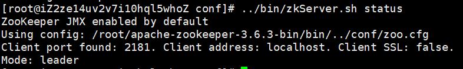

---
prev:
  text: 首页
  link: /zookeeper
---

# 安装 ZooKeeper

## 基础安装

下载ZooKeeper：[Zookeeper](https://www.apache.org/dyn/closer.lua/zookeeper/zookeeper-3.6.3/apache-zookeeper-3.6.3-bin.tar.gz)。

上传到服务器解压，进入解压后的目录，进入 conf 目录，编辑 `zoo-sample.cfg`：

修改数据快照目录：

```sh
dataDir=/opt/zookeeper
```

重命名配置文件为 `zoo.cfg`：

进入 bin 目录执行：

```sh
./zkServer.sh start#启动zookeeper
./zkServer.sh status#查看zookeeper状态
./zkServer.sh stop#停止zookeeper
```

启动客户端：

```sh
./zkCli.sh
```

## 配置参数

```sh
tickTime=2000#心跳时间，毫秒
initLimit=10#Leader和Follower初始连接时能容忍的最多心跳数
syncLimit=5#Leader和Follower建立连接后的通信最大心跳数
dataDir=/opt/zookeeper#数据目录
clientPort=2181#客户端连接端口号
```

## 集群安装

zookeeper 最好部署奇数台服务器，首先在每个服务器上都修改配置文件，指定数据目录并启动，启动后在指定的数据目录中创建 `myid` 文件，文件中输入一个整数，就像是数据库主键一样，每个服务器不同，例如这里将三台服务器分别配置为 1、2、3，停掉 zookeeper，修改配置文件，在配置文件中添加如下内容，这里以第三台服务器为例，格式为 `server.[id]=host:port1:port2`，host 是 IP 地址，端口号一是 Follower 与 Leader 交换信息端口，端口二是执行选举时的端口。

::: warning 注意
自身要使用 `0.0.0.0` 而不是 `127.0.0.1`。
:::

```sh
server.1=39.107.112.172:2888:3888
server.2=150.158.153.216:2888:3888
server.3=0.0.0.0:2888:3888
```

在三台服务器上分别执行启动命令然后查看状态可以看到：



1 号服务器此时成为 Leader。
